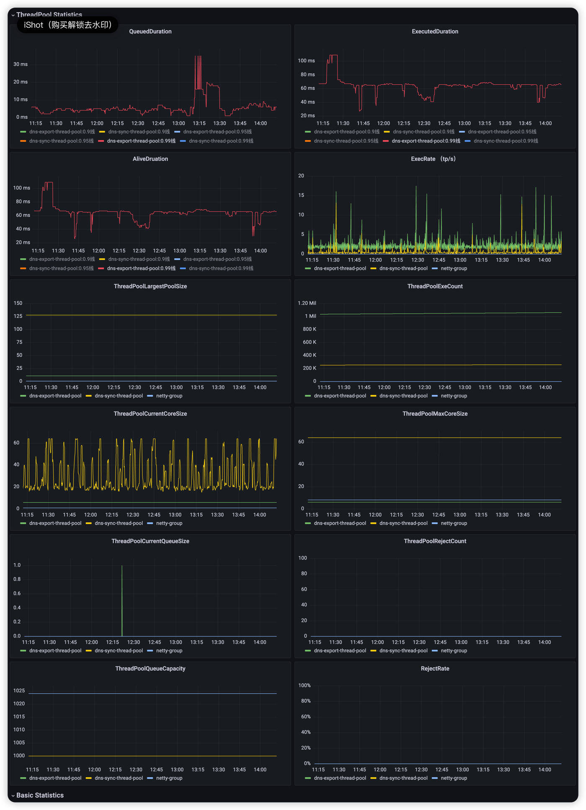

## fuled-component 组件包简介

```html
  此组件包是fuled-framework框架下的组件包，fuled-framework是一套
完整的应用开发脚手架。
包含众多实用组件。每个组件都可以单独引入使用，也可以使用如下方式使用。
使用框架的方式非常简单，只需两步：
1、替换应用的parent依赖为:
<parent>
    <groupId>com.fxz</groupId>
    <artifactId>fuled-framework</artifactId>
    <version>1.0.0.WaterDrop</version>
</parent>

2、修改启动类的@SpringBootApplication 为@EnableFuledBoot注解即可。

样例请参考：
1、https://github.com/fuxiuzhan/feign-plus (feign转netty实现)
2、https://github.com/fuxiuzhan/fuled-framework-demo/tree/1.1.1.mybatis（demo）
3、https://github.com/fuxiuzhan/dns-server/tree/1.0.0.skywalking （框架通用且清晰使用fuled-framework构建的项目）
如果需要阅读源码，需要添加私有maven仓库，组件所需依赖目前是使用私有仓库管理
https://github.com/fuxiuzhan/feign-plus/blob/master/example/resources/settings.xml

```
<b>已经增加了新的example[fuled-boot-example]模块，说明更加详细，手摸手教程</b>
模块依赖的中间件比较多，大家可以自行搭建，建议使用容器，以我自己的环境为例

### 包含模块说明

#### fuled-banner

- banner组件，用于显示框架logo

#### fuled-cat-starter

- cat 监控组件。可以实现spring组件，redis，数据库，feign等的自动监控，引入即可实现应用性能监控

```html
apm是应用性能监控。目前的定义更偏向于trace，既微服务间的服务调用关系
及耗时监控。但是apm其实应该分为两部分，一是传统的trace，另一个是单体应用的性能监控，
如应用内组件的方法执行耗时情况，错误情况，异常情况等，微服务自身的性能监控是我们更关心的
部分。
```

#### fuled-common

- 包含全局使用的工具类及通用pojo

#### fuled-config-starter

- 配置中心。使用nacos，结合Nacos-config和Apollo的优点。
- 实现更加优雅，不采用变更刷新容器的笨重方式，变更只重新绑定env变量即可，轻量且高效。
- [**⭐️⭐️⭐️⭐配置中心深度解析⭐️⭐⭐️⭐**](doc/deep-config.md)
- [**⭐️⭐️⭐️⭐配置中心深度解析(加载慢可使用备用链接)⭐️⭐⭐️⭐**](https://md.fuled.xyz:1234/archives/pei-zhi-zhong-xin-shen-du-jie-xi)
#### fuled-dynamic-datasource-starter

- 动态多数据源，简单配置即可。可以链接多个不同类型的数据源，且增加对加密字段的支持。

#### fuled-dynamic-redis-starter

- 动态redis组件，简单配置即可。可以使用配置链接多个redis，使用beandefine方式加载，与监控切面完美结合。

#### fuled-dynamic-threadpool-starter

- 动态线程池组件，可动态配置线程参数，实时生效，自动管理线程池的生命周期。最多只需一行代码即可完美管理
- 也可以接入监控告警中心，实现对接入应用内的注册线程池实时监控。而且对ThreadLocal的传递支持较好，不需要
- 额外使用TTL，实现方式另辟蹊径，吊打当前市面上主流的动态线程池管理工具。
- 可以兼容jdk8+的基本所有版本。

```html

<groupId>com.fxz.component.plugin.dynamic.threadpool.reporter</groupId>
<artifactId>reporter-prometheus</artifactId>
结合prometheus组件，可以实现对线程池的监控
```



#### fuled-env-encryptor-starter

- 配置中心加密组件。与fuled-config-starter完全解耦，也可单独与任何一款配置中心使用。实现应用按appId及环境隔离加密配置。
- 不同应用或者环境秘钥不同，不能互换配置。

#### fuled-gateway-zuul-starter

- zuul网关组件，支持route nacos直接配置，可以快速实现网关接入。

#### fuled-logger-starter

- 统一logger切面和通用logback日志

#### fuled-name-starter

- nacos注册中心，定制了注册中心各环境的地址，增加各依赖组件版本和部分系统的meta信息
- 可作为额外的负载均衡和灰度发布的路由实现。

#### fuled-oauth-server-starter

- 通用oauth组件，目前为空，计划做成通用的auth组件，数据源可定制可接入ladp

#### fuled-sentinel-starter

- sentinel组件，定制了不同环境的服务地址


#### fuled-simple-cache-starter

- cache组件，切面实现，用于与spring-cache基本一致，且支持单个key的任意过期时间
- 且对接口代理的key生成进行优化，解决spring-cache key generator的接口代理可能错误的问题

```java
public interface IProcess {
    @BatchCache(caches = {
            @Cache(key = "'key_prefix_'+#arg0+'~'+#arg1"),
            @Cache(key = "'key_prefix_'+#userName+'~'+#age"),
            @Cache(expr = 1, unit = TimeUnit.DAYS)
    })
    String process(@CacheParam("userName") String userName, @CacheParam("age") Integer age);
}
```

#### fuled-common-cache-starter
- fuled-simple-cache-starter 升级版本，功能用法一致，内部使用新的
责任链机制设计，内置本地lru和redis缓存，更加易于使用和扩展

#### fuled-skywalking-starter

- skywalking组件，skywalking使用agent接入，此处是增加通过web输出traceId的方式。


#### fuled-swagger-starter

- swagger 自动配置

#### fuled-dynamic-kafka-starter

- 实现动态kafka consumer和provider
- 非常适合多topic接入的场景，可动态变更kakfa的消费启停，配合动态线程池可以更大的发挥消费性能

#### fuled-component-tools

- fuled-dynamic-complie 实现java源代码动态编译，编译后的字节码可以在分布式环境下共享使用

#### fuled-tools-dependencies

- 额外依赖，后续会增加更多工具类，如validation,excel等的操作
