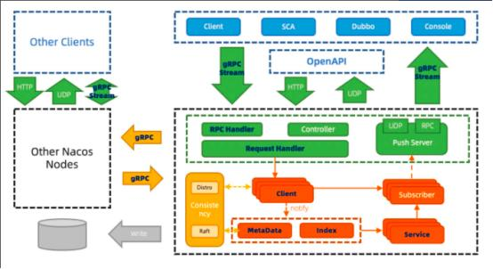
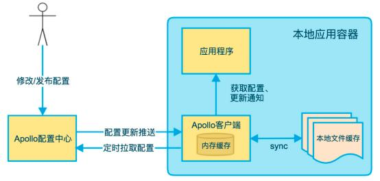
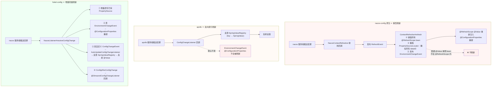
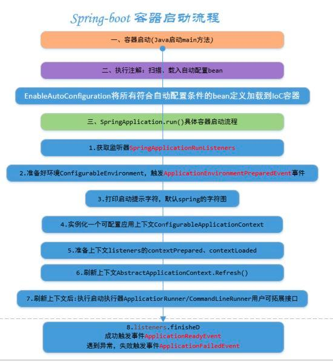
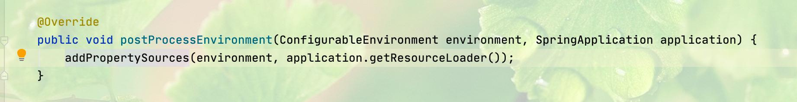
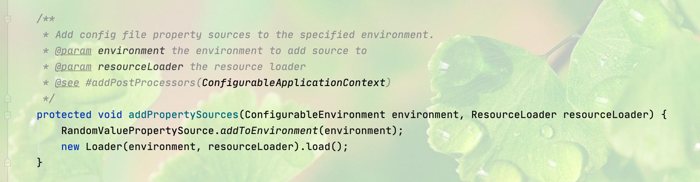
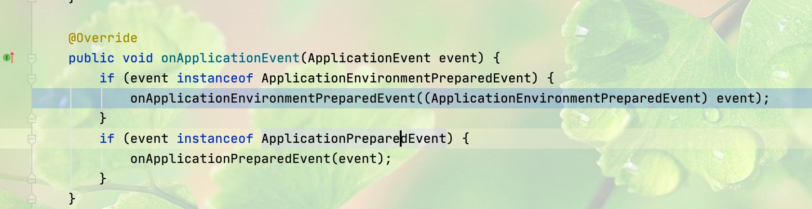
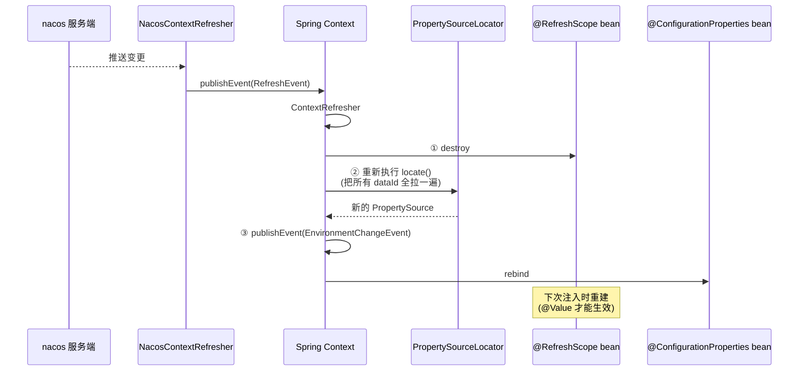
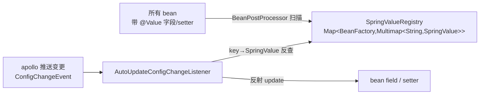
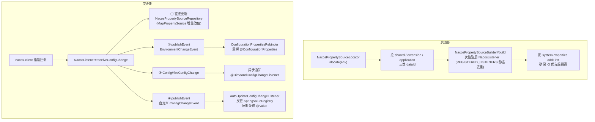

# 配置中心深度解析

[**⭐️⭐️⭐️⭐配置中心深度解析(图加载慢可使用备用链接)⭐️⭐⭐️⭐**](https://md.fuled.xyz:1234/archives/pei-zhi-zhong-xin-shen-du-jie-xi)

[**⭐️⭐️⭐️⭐动态线程池深度解析⭐️⭐⭐️⭐**](dynamic-threadpool.md)

---

## 阅读路线（带 Q&A 锚点）

带着问题读会更带劲，下面 8 个问题贯穿全文，章节末尾会显式回答。

| # | 问题 | 在哪一节正面回答 |
|---|---|---|
| Q1 | springboot 中的配置是怎么存储的？ | [§3 ConfigurableEnvironment 与 PropertySource](#configurableenvironment作用) |
| Q2 | springboot 配置文件加载顺序是怎么确定的？ | [§3 配置可在哪个步骤完成](#配置可以在哪个步骤完成) |
| Q3 | 启动参数为什么优先级比配置文件高？ | [§3 ConfigurableEnvironment 与 PropertySource](#configurableenvironment作用) |
| Q4 | 怎么扩展自己的配置文件？ | [§3 配置可在哪个步骤完成](#配置可以在哪个步骤完成) |
| Q5 | `/refresh` 端点是怎么实现动态刷新的？ | [§6 nacos-config 源码解析](#nacos-config-源码解析) |
| Q6 | `@Value` 注解什么情况下会失效？ | [§4 @Value vs @ConfigurationProperties](#value-注解与-configurationproperties-的差异) |
| Q7 | `@ConfigurationProperties` 为什么不能动态置 null？ | [§4 @Value vs @ConfigurationProperties](#value-注解与-configurationproperties-的差异) |
| Q8 | 为什么用 nacos-config 必须配 `@RefreshScope`？ | [§6 nacos-config 源码解析](#nacos-config-源码解析) / [§8 fuled-config 给出的另一种解](#fuled-config-源码解析) |

---

## 1. 配置中心的作用与位置
**作用**：管理"配置元数据"。这里说的元数据范围远不只是应用 `application.yml` 里的几个开关，而是包括：

- 应用级配置（DataSource、线程池、限流、开关等）
- 网关、Mesh sidecar 行为
- 集群编排参数、IDC / Region 拓扑
- 未来还会进一步扩到平台级（容量、灰度、计费）

**位置**（在整个系统框架中）：


### 主流配置中心简表

| 配置中心 | 推送机制 | 服务端实现 | 客户端缓存 | 服务端协议 |
|---|---|---|---|---|
| **nacos 1.x** | HTTP Long Polling（默认 30s） | Java + MySQL/Derby | 本地快照文件 | HTTP |
| **nacos 2.x** | gRPC 双向流 | Java + MySQL/Derby | 本地快照文件 | gRPC（兼容 HTTP） |
| **apollo** | HTTP Long Polling + 定时 fallback | Portal/Admin/Config 三件套 + MySQL | 内存 + 本地文件双缓存 | HTTP |

#### nacos 2.x（1.x 在 2.x 中保留 HTTP，并新增 gRPC 通道）



#### apollo


apollo 服务端的发布流程：

1. 用户在 Portal 操作配置发布
2. Portal 调用 Admin Service 的接口操作发布
3. Admin Service 发布配置后，发送 `ReleaseMessage` 给各个 Config Service
4. Config Service 收到 `ReleaseMessage` 后，通知对应的客户端



**上图描述了 apollo 客户端的实现原理：**

1. 客户端和服务端保持长连接，第一时间收到推送（HTTP Long Polling）
2. 客户端还会定时从服务端拉一次（**fallback 机制，防止推送丢失**）
    - 拉取时上报本地版本，无变化时服务端返回 `304 Not Modified`
    - 默认 5 分钟一次，可通过 `-Dapollo.refreshInterval` 覆盖（单位：分钟）
3. 拉到最新配置后保存在内存中
4. 同时落盘到本地文件，**服务/网络不可用时仍能从本地恢复**
5. 应用从客户端取值或订阅变更通知

> **小结**：apollo 与 nacos 在客户端形态上几乎对等（长轮询/长连接 + 本地缓存），最大差别在 **服务端架构**（apollo 三件套 vs nacos 单体）和 **配置维度**（apollo 的 `namespace` vs nacos 的 `group + dataId`）。这两个差别决定了客户端 SDK 的取值 API 形态。

### 三种客户端刷新链路对比（一图看懂）


```mermaid
flowchart TB
    subgraph A["nacos-config 原生 ＝ 重型刷新"]
        A1["nacos 服务端推送变更"] --> A2["NacosContextRefresher 收到回调"]
        A2 --> A3["发布 RefreshEvent"]
        A3 --> A4["ContextRefresher#refresh<br/>① 销毁所有 @RefreshScope bean<br/>② 重跑 PropertySourceLocator（重拉所有 dataId）<br/>③ 发布 EnvironmentChangeEvent"]
        A4 --> A5["@RefreshScope @Value 重新注入<br/>@ConfigurationProperties 重绑"]
        A4 -.->|普通 @Value 单例 bean<br/>不在 @RefreshScope 内| AX["❌ 不刷新"]
    end

    subgraph B["apollo ＝ 反向索引刷新"]
        B1["apollo 服务端推送变更"] --> B2["ConfigChangeListener 回调"]
        B2 --> B3["反查 SpringValueRegistry<br/>(key → SpringValue)"]
        B3 --> B4["反射设值"]
        B2 -.->|默认不发| BX["EnvironmentChangeEvent<br/>@ConfigurationProperties 不会被刷新"]
    end

    subgraph C["fuled-config ＝ 增量轻量刷新"]
        C1["nacos 服务端推送变更"] --> C2["NacosListener#receiveConfigChange"]
        C2 --> C3["① 增量改写已有 PropertySource"]
        C2 --> C4["② 发 EnvironmentChangeEvent<br/>→ @ConfigurationProperties 重绑"]
        C2 --> C5["③ 发自定义 ConfigChangeEvent<br/>→ AutoUpdateConfigChangeListener<br/>→ 反查 SpringValueRegistry → 反射 @Value"]
        C2 --> C6["④ Config#fireConfigChange<br/>→ @DimaondConfigChangeListener 回调"]
    end

    style AX fill:#fee
    style BX fill:#fee
    style A fill:#fff5f5
    style B fill:#fffaf5
    style C fill:#f0fff4
```

> **关键差异**：nacos-config 用"销毁 + 重建"换刷新，重；apollo 用"反向索引 + 反射"刷 `@Value`，但默认丢掉了 `@ConfigurationProperties` 的支持；fuled-config 把两者合一，发**一个**增量 `EnvironmentChangeEvent` + 一个自定义 `ConfigChangeEvent`，两条路径各得其所。下文逐个剖析。

---

## 2. springboot 动态配置基础：容器启动过程



### 2.1 springboot 的事件机制

与动态配置直接相关的事件：

| 事件 | 监听器 | 作用 |
|---|---|---|
| `ApplicationEnvironmentPreparedEvent` | `ConfigFileApplicationListener` | 加载本地 `application.yml` / `application.properties` |
| `ApplicationReadyEvent` | `RefreshEventListener` | 服务启动完毕，注册 nacos/apollo 监听 |
| `RefreshEvent` | `RefreshEventListener` → `ContextRefresher#refresh` | **重型刷新**：销毁 `@RefreshScope` bean、重跑 `PropertySourceLocator`、重新发布 `EnvironmentChangeEvent` |
| `EnvironmentChangeEvent` | `ConfigurationPropertiesRebinder` | **轻型刷新**：重绑 `@ConfigurationProperties` bean 的属性 |

启动过程中由 `EventPublishingRunListener` 依次发布：

```
ApplicationStartingEvent
  → ApplicationEnvironmentPreparedEvent   (此时 ConfigFileApplicationListener 加载本地配置)
  → ApplicationContextInitializedEvent
  → ApplicationPreparedEvent
  → ApplicationStartedEvent
  → ApplicationReadyEvent                 (此时 RefreshEventListener 完成监听注册)
  → ApplicationFailedEvent (异常分支)
```

> **Takeaway**：`RefreshEvent` 和 `EnvironmentChangeEvent` 是两条不同的链路——前者会销毁 `@RefreshScope` bean 重建，后者只重绑 `@ConfigurationProperties`。**这个差异是后面理解 nacos vs apollo vs fuled-config 三种刷新策略的钥匙**。

### 2.2 二/三方包注入目标容器的三种方式

springboot SPI 实际上指的不是 JDK SPI，而是"自动装配"。有三类形态：

1. **`spring.factories`**（如 `spring-data-redis`、`mybatis-plus-boot-starter`）——starter 包内必备 `META-INF/spring.factories`，启动时自动加载，缺配置就报错。
2. **`@Import`**（如 `@EnableAsync`、`@EnableFeignClients`、`@EnableApolloConfig`）——在启动类上加注解，注解通过 `@Import` 直接把 Configuration 类引入容器。
3. **`@Import` + `spring.factories` + `@ConditionalOn`**（如 `@EnableEurekaServer`）——加注解只引入一个**标记类**，真正的配置类通过 `spring.factories` 加载，再用 `@ConditionalOnBean(标记类)` 条件生效。这是"开关式"装配的常见做法。

> **Takeaway**：fuled-config 用的是第 2 种——`@EnableDiamondConfig` 通过 `@Import(DiamondConfigRegistrar.class)` 把配置中心相关 bean 注入容器；apollo 也是第 2 种；nacos-config 走的是第 1 种。

### 2.3 ConfigFileApplicationListener 的配置文件加载过程

`ConfigFileApplicationListener` 监听 `ApplicationEnvironmentPreparedEvent`，按照如下顺序遍历候选位置加载本地配置文件：

```text
搜索目录顺序（高优先级 → 低优先级）：
  ① classpath:/                    （jar 包内根目录）
  ② classpath:/config/
  ③ file:./                        （工作目录根）
  ④ file:./config/
  ⑤ file:./config/{profile}/

候选文件名（同目录内的优先级）：
  application-{profile}.{yml|yaml|properties|xml}
  application.{yml|yaml|properties|xml}
```

> 实际优先级 = 「目录顺序」× 「文件名顺序」× 「profile 加权」。spring-boot 通过 `Loader.load()` 把每个找到的文件包装成 `OriginTrackedMapPropertySource`，按上述顺序 `addLast` 到 `Environment` 的 PropertySource 链表中（profile 特化版用 `addBefore` 插到对应非 profile 文件的前面）。





加载完毕后，`ConfigFileApplicationListener` 通过 `EventPublishingRunListener` 继续触发后续事件链，让其他监听器（包括 `BootstrapApplicationListener`、各种 `EnvironmentPostProcessor`）能进一步操作 env：



---

## 3. ConfigurableEnvironment 与 PropertySource

### ConfigurableEnvironment作用

`org.springframework.core.env.ConfigurableEnvironment` 关键方法（源码节选）：

```java
public interface ConfigurableEnvironment extends Environment, ConfigurablePropertyResolver {

    void setActiveProfiles(String... profiles);
    void addActiveProfile(String profile);
    void setDefaultProfiles(String... profiles);

    /** 这个方法是配置链路的核心：拿到可写的 PropertySource 链表 */
    MutablePropertySources getPropertySources();

    Map<String, Object> getSystemProperties();
    Map<String, Object> getSystemEnvironment();

    void merge(ConfigurableEnvironment parent);
}

public class MutablePropertySources implements PropertySources {
    public void addFirst(PropertySource<?> propertySource);
    public void addLast(PropertySource<?> propertySource);
    public void addBefore(String relativePropertySourceName, PropertySource<?> propertySource);
    public void addAfter(String relativePropertySourceName, PropertySource<?> propertySource);
    public PropertySource<?> remove(String name);
    public PropertySource<?> replace(String name, PropertySource<?> propertySource);
}
```

配置保存在 `ConfigurableEnvironment` 的 `MutablePropertySources` 内的列表中，包括：

- 启动参数（`-Dxxx=yyy`、`--xxx=yyy`）
- 系统环境变量（`System.getenv()`）
- `application.yml`/`application.properties` 加载出来的配置
- 其他方式（apollo / nacos / 自定义 `PropertySourceLocator`）加载进来的配置

**既然是列表就是有序的，顺序就是优先级**——变量查找过程是从高 → 低逐个 `PropertySource` 找，命中第一个就返回。一般系统变量优先级高于配置文件。

> **🅰 回应 Q1 (springboot 配置怎么存的)**：所有配置都被打包成一个个 `PropertySource`，按优先级有序地放进 `ConfigurableEnvironment#getPropertySources()` 这个 `MutablePropertySources` 链表里。取值时 `Environment#getProperty(key)` 从前向后线性查找，命中即返回。

> **🅰 回应 Q3 (启动参数为何优先级最高)**：在 `SpringApplication#prepareEnvironment` 里，`commandLine` 是通过 `addFirst()` 加入到链表头部的，所以排在所有配置文件加载的 `PropertySource` 之前——线性查找当然先命中它。同样的机制也适用于 `OS_ENV`、`SystemProperties`，它们的相对顺序是 springboot 在启动时显式拼装的（见 `StandardEnvironment#customizePropertySources`）。

> **🅰 回应 Q2 (配置加载顺序怎么定的)**：本质上是各个 `EnvironmentPostProcessor` / `PropertySourceLocator` 在向 `MutablePropertySources` 调用 `addFirst` / `addLast` / `addBefore` / `addAfter` 时决定的——**写代码的人决定他这层加在哪**，没有全局的"优先级表"。下一节列出的 7 种插入时机，每种时机能拿到的 `Environment` 类型不同，决定了你能不能影响最终顺序。

### <a id="配置可以在哪个步骤完成"></a>配置可以在哪个步骤完成？

利用 springboot 提供的配置加载接口，按加载顺序由早到晚有 7 种方式：
| # | 时机/接口 | 拿到的 Environment 类型 | 能否设值 | 备注 |
|---|---|---|---|---|
| 1 | `EnvironmentPostProcessor` | `ConfigurableEnvironment` | ✅ | spring.factories 注册，最早期 |
| 2 | `PropertySourceLocator` | `Environment` (实际为 Configurable) | ✅ | spring-cloud-bootstrap 阶段，nacos/apollo 都走这条 |
| 3 | `ApplicationContextInitializer` | `ConfigurableApplicationContext` | ✅ | 容器初始化前 |
| 4 | `SpringApplicationRunListener` | `ConfigurableEnvironment` | ✅ | 启动监听器，能拦截每个生命周期阶段 |
| 5 | `BeanFactoryPostProcessor` | `ConfigurableEnvironment`（通过 `EnvironmentAware`） | ✅ | 容器 refresh 早期，**fuled-config 加密解密走这层** |
| 6 | `ApplicationContextAware` | `ConfigurableApplicationContext` | ✅ | bean 初始化后 |
| 7 | `EnvironmentAware` | `StandardEnvironment` (只读) | ❌ | **常见的"加进去不生效"陷阱** |

**1. 实现 `EnvironmentPostProcessor` 接口加载**

```java
@FunctionalInterface
public interface EnvironmentPostProcessor {
    /** application 启动初期被回调，最早期可设值的扩展点 */
    void postProcessEnvironment(ConfigurableEnvironment environment, SpringApplication application);
}
```

注册方式：在 `META-INF/spring.factories` 写入 `org.springframework.boot.env.EnvironmentPostProcessor=com.example.MyEnvPostProcessor`。

**2. 实现 `PropertySourceLocator` 接口加载**（见 nacos 解析）

```java
public interface PropertySourceLocator {
    PropertySource<?> locate(Environment environment);
}
```

注册方式：作为 `@Configuration` Bean 在 `bootstrap` 阶段被发现（需要引入 `spring-cloud-starter-bootstrap`）。**这是配置中心客户端最常走的扩展点**，nacos / apollo / fuled-config 全部走这条。

**3. `ApplicationContextInitializer` 方式加载**

```java
public interface ApplicationContextInitializer<C extends ConfigurableApplicationContext> {
    void initialize(C applicationContext);
}
```

注册方式：`SpringApplication#addInitializers()` 或在 `META-INF/spring.factories` 注册。比 `EnvironmentPostProcessor` 稍晚，但能拿到 `ConfigurableApplicationContext`。

**4. `SpringApplicationRunListener` 方式加载**

```java
public interface SpringApplicationRunListener {
    default void starting(ConfigurableBootstrapContext bootstrapContext) {}
    default void environmentPrepared(ConfigurableBootstrapContext bootstrapContext,
                                     ConfigurableEnvironment environment) {}
    default void contextPrepared(ConfigurableApplicationContext context) {}
    default void contextLoaded(ConfigurableApplicationContext context) {}
    default void started(ConfigurableApplicationContext context) {}
    default void running(ConfigurableApplicationContext context) {}
    default void failed(ConfigurableApplicationContext context, Throwable exception) {}
}
```

注册方式：`META-INF/spring.factories`，`org.springframework.boot.SpringApplicationRunListener=...`。**整个启动生命周期都能拦截，能拿到 `ConfigurableEnvironment`**——`EventPublishingRunListener` 就是它的默认实现。

**5. `BeanFactoryPostProcessor` 方式加载**（fuled-env-encryptor 走这里）

```java
@FunctionalInterface
public interface BeanFactoryPostProcessor {
    void postProcessBeanFactory(ConfigurableListableBeanFactory beanFactory);
}
```

容器 `refresh()` 早期被回调，bean 还未实例化但 `BeanDefinition` 已就绪。**配合 `EnvironmentAware` 拿到 env 后，可以包装/代理已有的 PropertySource**——这就是配置加解密的常见时机。

> 6 和 7 比较特殊：执行得太晚（bean 已经创建出来），会出现 `@Value` 取不到但 `@ConfigurationProperties` 可以的情况。这两个 Aware **只适合"读取"配置而不适合"插入"配置**。

**6. `ApplicationContextAware` 方式加载**

```java
public interface ApplicationContextAware {
    void setApplicationContext(ApplicationContext applicationContext);
}
```

`bean` 初始化后回调。能拿到完整的 `ApplicationContext`，从它取出 env 是 `ConfigurableEnvironment`，**理论上可写**，但 `@Value` 字段已注入，再 add 也来不及。

**7. 实现 `EnvironmentAware` 接口加载**

```java
public interface EnvironmentAware {
    void setEnvironment(Environment environment);
}
```

⚠️ **注意拿到的是 `Environment` 不是 `ConfigurableEnvironment`**——具体实现一般是 `StandardEnvironment`，等价于"只读视图"。这是新人最容易踩的坑：以为 `Aware` 都能写，结果加进去的 PropertySource 没生效。

> **关键认知**：实现方式很多，但都需要在 spring 容器执行 `refresh()` **之前**完成，因为 refresh 之后 bean 的配置就会确定下来。**`Aware` 接口拿到的一般是 `StandardEnvironment`（只读，用于取值）；而其他接口大部分拿到的是 `ConfigurableEnvironment` 的实现（可以设值）**——所以那些可以加配置的位置，从实现接口的类型上一目了然，否则即使强行 `addFirst` 进去也可能不生效。

#### 时序总览


```mermaid
flowchart LR
    A1["spring.factories<br/>EnvironmentPostProcessor"] --> A2["bootstrap.yml<br/>PropertySourceLocator"]
    A2 --> A3["ApplicationContextInitializer"]
    A3 --> A4["SpringApplicationRunListener<br/>(贯穿全程)"]
    A4 --> A5["context.refresh()<br/>开始"]
    A5 --> A6["BeanFactoryPostProcessor"]
    A6 --> A7["EnvironmentAware"]
    A7 --> A8["bean 初始化"]
    A8 --> A9["ApplicationContextAware"]
    A9 --> A10["@Value / @ConfigurationProperties<br/>已经注入完毕"]
    style A5 stroke:#dd6,stroke-width:2px
    style A10 stroke:#888,stroke-dasharray:4 4
```

> **🅰 回应 Q4 (怎么扩展自己的配置文件)**：选上面 7 种之一即可，**最常见且最稳妥的做法是 `EnvironmentPostProcessor`**（spring.factories 注册）或者 `PropertySourceLocator`（spring-cloud-bootstrap 注册）。前者拿到的 `ConfigurableEnvironment` 可以直接 `addFirst/addLast` 自己的 `PropertySource`；后者更适合需要远程拉配置的场景（比如配置中心客户端）。

> **Takeaway**：能"插入"配置的位置不止一个，但选错位置会出现"加进去取不到"的玄学问题。一句话判断：**接口拿到的 Environment 类型是不是 `Configurable*`**，是就能写，不是就只能读。

---

## 4. <a id="value-注解与-configurationproperties-的差异"></a>@Value vs @ConfigurationProperties

| 维度 | `@Value` | `@ConfigurationProperties` |
|---|---|---|
| 注解位置 | 字段 / 方法参数 / setter | 类（一般配合 `@Component` 或 `@EnableConfigurationProperties`） |
| 初始化时机 | bean 实例化时反射设值 | bean 加载时整体 binding |
| 取值路径 | 从 `Environment` 取单 key + `Converter` 转换 | 整个 namespace 批量绑定 |
| 动态刷新 | 需要外部框架（apollo / fuled-config）维护 `key → SpringValue` 反向索引并反射重设 | 监听 `EnvironmentChangeEvent`，由 `ConfigurationPropertiesRebinder` 重绑 |
| 置 null | 设 `key=` 即可（空字符串经 Converter 转 null） | **置 null 失败**：删除 key 后，rebind 拿不到值就跳过赋值，旧值会保留 |

### 4.1 存储差异

`@Value` 一般注解在 bean 字段，初始化时从 env 取值，再通过 `org.springframework.core.convert.converter.Converter`（如 `StringToBooleanConverter`）做类型转换后设值。

`@ConfigurationProperties` 通常注解在类上，整个类作为 bean 加载到容器中，绑定走 `Binder`。

### 4.2 动态设值差异

`@Value` 标注在**单例 bean** 上时，正常情况下**只在初始化时设值一次**——动态配置框架要解决的就是这类问题。做法是在容器启动时扫描所有 bean，把带 `@Value` 的字段和 setter 收集成 `(key → 反射目标)` 的反向索引；当某个 key 变化时，用反射重新设值。

> 思考：`@Value` 还可以注解在**方法参数**上，那种参数怎么处理？答案是它通过 `BeanDefinition` 阶段被翻译成 `RuntimeBeanReference`/`TypedStringValue`，需要走 `SpringValueDefinitionProcessor` 这一层（见后面 fuled-config / apollo 的实现）。

`@ConfigurationProperties` 走 `EnvironmentChangeEvent` → `ConfigurationPropertiesRebinder#rebind`：销毁该 bean 的属性、重新走 binder。**注意**：这个注解标记的类属性由 `null → 有值` 可以正常赋值，但 `有值 → null`（在配置中心删 key）**实现不了**——删除后还是原值。能绕过去的方式是在配置中心把 value 置空（`xxx=`），让 binder 拿到空字符串再走 `null` 转换，但不太优雅。

```java
// spring-cloud-context: ConfigurationPropertiesRebinder#rebind
public boolean rebind(String name) {
    if (!this.beans.getBeanNames().contains(name)) return false;
    if (this.applicationContext != null) {
        try {
            Object bean = this.applicationContext.getBean(name);
            if (AopUtils.isAopProxy(bean)) bean = ProxyUtils.getTargetObject(bean);
            if (bean != null) {
                this.applicationContext.getAutowireCapableBeanFactory().destroyBean(bean);
                this.applicationContext.getAutowireCapableBeanFactory().initializeBean(bean, name);
                // ↑ 这里 initializeBean 走的是 Binder，找不到 key 就保留原值
                return true;
            }
        } catch (RuntimeException e) { ... }
    }
    return false;
}
```

> **🅰 回应 Q6 (`@Value` 什么情况下不生效)**：常见 4 种场景——
> 1. 在 `static` 字段上：spring 不处理 static 字段，直接 null。
> 2. 在 `@Configuration` 类的 `@Bean` 方法返回的对象的字段上但该对象不是 spring 创建的（手动 new 出来的）：spring 不会处理 `@Value`。
> 3. 在被 CGLIB 代理的子类里使用而 `@Value` 写在 final 字段：CGLIB 代理改不了 final。
> 4. 在 `EnvironmentAware`/`BeanFactoryPostProcessor` 之类的早期 bean 里：执行时机太早，`@Value` 处理器还没就绪，会拿到原始字符串占位符（如 `"${key}"`）甚至空。

> **🅰 回应 Q7 (`@ConfigurationProperties` 为什么不能动态置 null)**：因为 `ConfigurationPropertiesRebinder` 用 `Binder` 重绑时，"key 不存在"和"key 存在但等于 null" 在 `Environment#getProperty()` 里都返回 `null`——`Binder` 的语义是"找不到就跳过赋值"（保留原值），无法区分"显式 null"和"未提供"。绕过方式：在配置中心保留 key 但把 value 置空（让 `@ConfigurationProperties` 字段类型自己处理空字符串到 null 的转换）。

> **Takeaway**：动态配置的两类技术路径——`@Value` 走"反向索引 + 反射"；`@ConfigurationProperties` 走"事件 + 重绑"。两者刷新代价、刷新粒度、置 null 能力都不一样。**fuled-config 的核心创新就是把这两条路径合并到一个轻量级 `EnvironmentChangeEvent` 上**（详见第 7 节）。

---

## 5. <a id="配置加解密原理"></a>配置加解密原理

**原理**：对 env 中的 `PropertySource` 做代理，覆盖 `org.springframework.core.env.PropertySource#getProperty`，对返回值做后处理——如果 value 以 `ENC_` 开头，认为是密文，解密后返回。

- 加解密用对称加密（AES）
- 默认密钥由 `spring.application.name + 环境` 组合 hash 派生
- 生产强烈建议外部传入密钥，参考 `fuled-env-encryptor-starter` 的 `password` 字段

最小化实现 sketch（fuled-env-encryptor-starter 的核心代码示意）：

```java
public class EncryptedPropertySource extends PropertySource<PropertySource<?>> {
    private final ValueConverter converter;

    public EncryptedPropertySource(PropertySource<?> delegate, ValueConverter converter) {
        super(delegate.getName(), delegate);
        this.converter = converter;
    }

    @Override
    public Object getProperty(String name) {
        Object raw = source.getProperty(name);
        if (raw instanceof String && ((String) raw).startsWith("ENC_")) {
            return converter.convert((String) raw);   // AES 解密
        }
        return raw;
    }
}

@Component
public class EncryptingBeanFactoryPostProcessor
        implements BeanFactoryPostProcessor, EnvironmentAware {

    private ConfigurableEnvironment env;

    @Override
    public void setEnvironment(Environment environment) {
        this.env = (ConfigurableEnvironment) environment;
    }

    @Override
    public void postProcessBeanFactory(ConfigurableListableBeanFactory bf) {
        // 把每个 PropertySource 用代理包一层
        MutablePropertySources sources = env.getPropertySources();
        for (PropertySource<?> source : new ArrayList<>(sources)) {
            sources.replace(source.getName(),
                    new EncryptedPropertySource(source, converter));
        }
    }
}
```

```java
// AES/ECB/PKCS5Padding，从 password 派生 16 字节 key
private static SecretKeySpec deriveKey(String password) throws Exception {
    SecureRandom sr = SecureRandom.getInstance("SHA1PRNG");
    sr.setSeed(password.getBytes(StandardCharsets.UTF_8));
    KeyGenerator kg = KeyGenerator.getInstance("AES");
    kg.init(128, sr);
    return new SecretKeySpec(kg.generateKey().getEncoded(), "AES");
}
```

> **Takeaway**：加解密走的是 `BeanFactoryPostProcessor` 时机（上文 §3 第 5 种），早于 bean 实例化但晚于 `EnvironmentPostProcessor`，刚好可以包装所有 `PropertySource`（包括 nacos/apollo 拉来的）。代理的好处是**对上层完全透明**，`@Value` / `@ConfigurationProperties` 都不需要改。生产环境强制用外部 `-Dconfig.password=xxx` 传入 key，**不要**依赖默认派生（`spring.application.name + env` 是公开信息）。

---

## 6. <a id="nacos-config-源码解析"></a>nacos-config 源码解析

pom：

```xml
<dependency>
    <groupId>com.alibaba.cloud</groupId>
    <artifactId>spring-cloud-starter-alibaba-nacos-config</artifactId> 
</dependency>
```

spring.factories（关键节选）：

```properties
# org.springframework.cloud.bootstrap.BootstrapConfiguration
org.springframework.cloud.bootstrap.BootstrapConfiguration=\
com.alibaba.cloud.nacos.NacosConfigBootstrapConfiguration

# org.springframework.boot.autoconfigure.EnableAutoConfiguration
org.springframework.boot.autoconfigure.EnableAutoConfiguration=\
com.alibaba.cloud.nacos.NacosConfigAutoConfiguration,\
com.alibaba.cloud.nacos.endpoint.NacosConfigEndpointAutoConfiguration
```

主要关注两个配置类：

- **`NacosConfigBootstrapConfiguration`**：注入 `nacosManager` 和 `nacosPropertySourceLocator`

  ```java
  @Configuration(proxyBeanMethods = false)
  @ConditionalOnProperty(name = "spring.cloud.nacos.config.enabled", matchIfMissing = true)
  public class NacosConfigBootstrapConfiguration {
      @Bean public NacosConfigProperties nacosConfigProperties() { return new NacosConfigProperties(); }
      @Bean public NacosConfigManager nacosConfigManager(NacosConfigProperties p) { return new NacosConfigManager(p); }
      @Bean public NacosPropertySourceLocator nacosPropertySourceLocator(NacosConfigManager m) {
          return new NacosPropertySourceLocator(m);
      }
  }
  ```

- **`NacosConfigAutoConfiguration`**：注入 `NacosContextRefresher`，负责变更回调 → `RefreshEvent`

  ```java
  @Configuration(proxyBeanMethods = false)
  @ConditionalOnProperty(name = "spring.cloud.nacos.config.enabled", matchIfMissing = true)
  public class NacosConfigAutoConfiguration {
      @Bean public NacosContextRefresher nacosContextRefresher(
              NacosConfigManager nacosConfigManager,
              NacosRefreshHistory nacosRefreshHistory) {
          return new NacosContextRefresher(nacosConfigManager, nacosRefreshHistory);
      }
  }

  // NacosContextRefresher 关键代码：变更触发 RefreshEvent
  public class NacosContextRefresher implements ApplicationListener<ApplicationReadyEvent> {
      @Override
      public void onApplicationEvent(ApplicationReadyEvent event) {
          if (this.ready.compareAndSet(false, true)) {
              this.registerNacosListenersForApplications();   // 给每个 dataId 注册监听
          }
      }
      private void registerNacosListener(final String groupKey, final String dataKey) {
          configService.addListener(dataKey, groupKey, new AbstractSharedListener() {
              @Override public void innerReceive(String dataId, String group, String configInfo) {
                  applicationContext.publishEvent(new RefreshEvent(this, null, "Refresh Nacos config"));
              }
          });
      }
  }
  ```

### 6.1 主流程

1. 容器启动，SPI 加载 `spring.factories`
2. `NacosConfigBootstrapConfiguration` 注入 `NacosPropertySourceLocator`，spring-cloud-bootstrap 阶段执行 `com.alibaba.cloud.nacos.client.NacosPropertySourceLocator#locate`
3. 拉取 nacos 配置（共享配置 + 扩展配置 + 应用配置），全部装入 env
4. `EventPublishingRunListener` 发布 `ApplicationReadyEvent`
5. `NacosContextRefresher` 注册 nacos-client 监听
6. 服务端配置变更 → `NacosContextRefresher` 收到回调 → 发布 `RefreshEvent`
7. `RefreshEventListener` → `ContextRefresher#refresh`：
    - 销毁所有 `@RefreshScope` 注解的 bean
    - **重新执行 `NacosPropertySourceLocator#locate`，重新拉所有 dataId**
    - 发布 `EnvironmentChangeEvent`
8. `ConfigurationPropertiesRebinder` 收到事件，重绑所有 `@ConfigurationProperties` bean


```mermaid
sequenceDiagram
    participant N as nacos 服务端
    participant CR as NacosContextRefresher
    participant Ctx as Spring Context
    participant L as PropertySourceLocator
    participant Scope as @RefreshScope bean
    participant CP as @ConfigurationProperties bean

    N-->>CR: 推送变更
    CR->>Ctx: publishEvent(RefreshEvent)
    Ctx->>Ctx: ContextRefresher#refresh
    Ctx->>Scope: ① destroy
    Ctx->>L: ② 重新执行 locate()<br/>(把所有 dataId 全拉一遍)
    L-->>Ctx: 新的 PropertySource
    Ctx->>Ctx: ③ publishEvent(EnvironmentChangeEvent)
    Ctx->>CP: rebind
    Note over Scope: 下次注入时重建<br/>(@Value 才能生效)
```

### 6.2 设计上的几个问题

1. **每次变更都会重跑 `PropertySourceLocator`**——服务端被打一发请求，要把所有 dataId（包括 shared、extension、application）全拉一遍，无视真正变化的只是其中一个 key。
2. **`@RefreshScope` bean 销毁 + 重建**——下游用到该 bean 的字段必须是 prototype 调用，否则旧引用还在。这层重型代价让运维同学不敢"随便点更新"。
3. **`EnvironmentChangeEvent` 重绑只覆盖 `@ConfigurationProperties`**——纯 `@Value` 字段在不加 `@RefreshScope` 的前提下**不会刷新**（这就是 Q8 的根源）。
4. **手动调用 `RefreshScope#refresh(beanName)` / `refreshAll()`** 可以更精细地控制销毁哪个 bean，但要求 bean 必须用过的位置都是 lazy 取值（每次都从容器拿），改造成本高。

(`@Value` 类型的注解下面详解)

> **🅰 回应 Q5 (`/refresh` 端点怎么实现的)**：actuator 暴露的 `POST /actuator/refresh` 路径调用的就是 `ContextRefresher#refresh()`——和上面第 7 步走同一条链路：销毁 `@RefreshScope` bean → 重跑 `PropertySourceLocator` → 发 `EnvironmentChangeEvent`。底层依赖 `spring-cloud-context` 这个包；只引入 `spring-cloud-starter-bootstrap` 也会传递这个能力。

> **🅰 回应 Q8 (为什么 nacos-config 必须 `@RefreshScope`)**：因为 nacos-config 没有 `key → bean field` 的反向索引，它能做的"刷新"只有两条：(a) 销毁 `@RefreshScope` 标注的 bean 在下次注入时重建 → 重新走 `@Value` 解析；(b) 发 `EnvironmentChangeEvent` 让 `@ConfigurationProperties` 重绑。**普通 `@Value` 单例 bean 既不属于 (a) 也不属于 (b)，所以不刷新**。要让它生效就得给所在 bean 加 `@RefreshScope` 让它走 (a)。下文 fuled-config / apollo 都通过引入反向索引让 `@Value` 不需要 `@RefreshScope` 也能刷新。

> **Takeaway**：nacos-config "**笨重 + 范围广 + 但不覆盖 @Value**" 三件套，是这个模块在生产里最容易被吐槽的几点。fuled-config 后面的设计动机就是为了解决其中前两条，外加引入反向索引解决第三条。

---

## <a id="apollo-config-源码解析"></a>7. apollo-config 源码解析
apollo 与 nacos-config 最大的区别：**它不依赖 `@RefreshScope`，纯 `@Value` 字段也能动态刷新**——因为它内置了 `key → SpringValue` 反向索引。这一节重点看它怎么实现这个索引、怎么响应变更。

### 7.1 注解入口

apollo 通过注解 `@EnableApolloConfig` 上的 `@Import` 引入需要注入容器的类：

```java
@Retention(RetentionPolicy.RUNTIME)
@Target(ElementType.TYPE)
@Import(ApolloConfigRegistrar.class)
public @interface EnableApolloConfig {
    String[] value() default {ConfigConsts.NAMESPACE_APPLICATION};
    int order() default Ordered.LOWEST_PRECEDENCE;
}

public class ApolloConfigRegistrar implements ImportBeanDefinitionRegistrar, EnvironmentAware {
    @Override
    public void registerBeanDefinitions(AnnotationMetadata md, BeanDefinitionRegistry registry) {
        // 注册 PropertySourcesProcessor / ApolloAnnotationProcessor /
        // SpringValueProcessor / SpringValueDefinitionProcessor
        BeanRegistrationUtil.registerBeanDefinitionIfNotExists(registry,
            PropertySourcesProcessor.class.getName(), PropertySourcesProcessor.class);
        BeanRegistrationUtil.registerBeanDefinitionIfNotExists(registry,
            ApolloAnnotationProcessor.class.getName(), ApolloAnnotationProcessor.class);
        BeanRegistrationUtil.registerBeanDefinitionIfNotExists(registry,
            SpringValueProcessor.class.getName(), SpringValueProcessor.class);
        BeanRegistrationUtil.registerBeanDefinitionIfNotExists(registry,
            SpringValueDefinitionProcessor.class.getName(), SpringValueDefinitionProcessor.class);
    }
}
```

`PropertySourcesPlaceholderConfigurer` 是 spring 自带的，主要处理本地环境变量；apollo 默认会把它的优先级提升（`order=0`）以保证 `@Value` 占位符解析时优先走 spring 的链路。

由 `PropertySourcesPlaceholderConfigurer` 的源码可以看出，`environmentProperties` 中的变量其实是从 `EnvironmentAware` 接口注入进来的 `environment` 中获取的——**这是 apollo 之所以能让 `@Value` 占位符解析到远程配置的根本原因**。

### 7.2 PropertySourcesProcessor：把 apollo 配置接入 env

`PropertySourcesProcessor` 是 apollo 的类，主要作用有两个：把对应的配置加入到 env 中；对相应的配置增加监听。它实现了 `BeanFactoryPostProcessor + EnvironmentAware + PriorityOrdered`，在容器 refresh 早期被回调（注意：apollo 这里不是走 `PropertySourceLocator`）。

```java
private void initializePropertySources() {
    if (environment.getPropertySources().contains(PropertySourcesConstants.APOLLO_PROPERTY_SOURCE_NAME)) {
      //already initialized
      return;
    }
    CompositePropertySource composite;
    if (configUtil.isPropertyNamesCacheEnabled()) {
      composite = new CachedCompositePropertySource(PropertySourcesConstants.APOLLO_PROPERTY_SOURCE_NAME);
    } else {
      composite = new CompositePropertySource(PropertySourcesConstants.APOLLO_PROPERTY_SOURCE_NAME);
    }

    //sort by order asc
    ImmutableSortedSet<Integer> orders = ImmutableSortedSet.copyOf(NAMESPACE_NAMES.keySet());
    Iterator<Integer> iterator = orders.iterator();

    while (iterator.hasNext()) {
      int order = iterator.next();
      for (String namespace : NAMESPACE_NAMES.get(order)) {
        Config config = ConfigService.getConfig(namespace);

        composite.addPropertySource(configPropertySourceFactory.getConfigPropertySource(namespace, config));
      }
    }

    // clean up
    NAMESPACE_NAMES.clear();

    // add after the bootstrap property source or to the first
    if (environment.getPropertySources()
        .contains(PropertySourcesConstants.APOLLO_BOOTSTRAP_PROPERTY_SOURCE_NAME)) {

      // ensure ApolloBootstrapPropertySources is still the first
      ensureBootstrapPropertyPrecedence(environment);

      environment.getPropertySources()
          .addAfter(PropertySourcesConstants.APOLLO_BOOTSTRAP_PROPERTY_SOURCE_NAME, composite);
    } else {
      environment.getPropertySources().addFirst(composite);
    }
  }

```
其中 `NAMESPACE_NAMES` 的来源是从 `@EnableApolloConfig` 注解中获取：

```java
// PropertySourcesProcessor 的字段
private static final Multimap<Integer, String> NAMESPACE_NAMES =
        Multimaps.synchronizedSetMultimap(TreeMultimap.create());

// ApolloConfigRegistrar 解析注解时写入
public static boolean addNamespaces(Collection<String> namespaces, int order) {
    return NAMESPACE_NAMES.putAll(order, namespaces);
}

// 即 @EnableApolloConfig({"app", "redis"}) → addNamespaces(["app","redis"], DEFAULT)
```

> 这是 apollo 自定义的 `multimap`，按 `order` 收集 namespace。`order` 越小越优先，`PropertySourcesProcessor#initializePropertySources` 中按 order 升序遍历，逐个 `composite.addPropertySource`。

### 7.3 ApolloAnnotationProcessor：扫描 apollo 自身的注解

`ApolloAnnotationProcessor` 扫描所有 bean 中使用 `@ApolloConfig` 和 `@ApolloConfigChangeListener` 两个注解的字段和方法。获取 bean 信息的过程在父类 `ApolloProcessor` 中实现。

#### 父类 `ApolloProcessor`（5 行说清）

```java
public abstract class ApolloProcessor implements BeanPostProcessor, PriorityOrdered {
    @Override
    public Object postProcessBeforeInitialization(Object bean, String beanName) {
        Class<?> clazz = bean.getClass();
        for (Field f : findAllField(clazz))   processField(bean, beanName, f);    // 子类实现
        for (Method m : findAllMethod(clazz)) processMethod(bean, beanName, m);   // 子类实现
        return bean;
    }
}
```

子类只需要实现 `processField` / `processMethod` 即可——`ApolloAnnotationProcessor` 处理 `@ApolloConfig` / `@ApolloConfigChangeListener`，`SpringValueProcessor` 处理 `@Value`。**两个 Processor 共用同一套扫描骨架**。

#### `processApolloConfigChangeListener`：把方法包装成 ConfigChangeListener

最关键的一段——把用户写的 `@ApolloConfigChangeListener` 方法包装成 apollo 的 `ConfigChangeListener` 注册到 `Config` 上：

```java
private void processApolloConfigChangeListener(Object bean, Method method) {
    ApolloConfigChangeListener annotation = AnnotationUtils.findAnnotation(method, ApolloConfigChangeListener.class);
    if (annotation == null) return;

    // 校验：必须 1 个参数，且参数必须是 ConfigChangeEvent 或子类
    Preconditions.checkArgument(method.getParameterTypes().length == 1, ...);
    Preconditions.checkArgument(ConfigChangeEvent.class.isAssignableFrom(method.getParameterTypes()[0]), ...);
    ReflectionUtils.makeAccessible(method);

    String[] namespaces = annotation.value();
    Set<String> interestedKeys = ...;
    Set<String> interestedKeyPrefixes = ...;

    // 把方法包装成 listener
    ConfigChangeListener listener = changeEvent ->
        ReflectionUtils.invokeMethod(method, bean, changeEvent);

    for (String namespace : namespaces) {
        Config config = ConfigService.getConfig(environment.resolveRequiredPlaceholders(namespace));
        if (interestedKeys == null && interestedKeyPrefixes == null) {
            config.addChangeListener(listener);
        } else {
            config.addChangeListener(listener, interestedKeys, interestedKeyPrefixes);
        }
    }
}
```

#### `ConfigChangeEvent` 的两个关键 API

```java
public class ConfigChangeEvent extends ApplicationEvent {
    private final String m_namespace;
    private final Map<String, ConfigChange> m_changes;

    /** 返回所有变更的配置项 */
    public Set<String> changedKeys() { return m_changes.keySet(); }

    /** 只返回感兴趣的 keys——与 nacos 有明显区别，nacos 返回所有变更的 keys */
    public Set<String> interestedChangedKeys() { return Collections.emptySet(); }
}
```

> **设计差异**：apollo 把"过滤感兴趣 key"做在 SDK 层；nacos 是把整个 changes 推给监听器，由用户自己过滤。两种风格各有利弊：apollo 简洁，但接收者要自己实现 `interestedChangedKeys` 才能高效；nacos 灵活，但每个 listener 都要写一段 filter。

> **完整源码**（带注释）请参考 GitHub：[apollo-client/.../ApolloAnnotationProcessor.java](https://github.com/apolloconfig/apollo/blob/master/apollo-client/src/main/java/com/ctrip/framework/apollo/spring/annotation/ApolloAnnotationProcessor.java)。

### 7.4 SpringValueProcessor：建立 `@Value` 反向索引

通过 `SpringValueProcessor` 处理后会将所有 `@Value` 注解的方法和字段注册到 `SpringValueRegistry`。变更发生时通过 key 找到对应的 `SpringValue`，调用 `update` 反射设值。


```mermaid
flowchart LR
    A["所有 bean<br/>带 @Value 字段/setter"] -->|BeanPostProcessor 扫描| B["SpringValueRegistry<br/>Map&lt;BeanFactory,Multimap&lt;String,SpringValue&gt;&gt;"]
    C["apollo 推送变更<br/>ConfigChangeEvent"] --> D["AutoUpdateConfigChangeListener"]
    D -->|key→SpringValue 反查| B
    D -->|反射 update| E["bean field / setter"]
```

#### 关键类签名

```java
// ① 扫描 @Value 字段/setter，包装为 SpringValue 注册
public class SpringValueProcessor extends ApolloProcessor
        implements BeanFactoryPostProcessor, BeanFactoryAware {
    @Override protected void processField(Object bean, String beanName, Field field);
    @Override protected void processMethod(Object bean, String beanName, Method method);
    // 处理 XML 占位符场景的 @Value（构造函数参数等通过 BeanDefinition 传入的）
    private void processBeanPropertyValues(Object bean, String beanName);
}

// ② 反向索引：Map<BeanFactory, Multimap<key, SpringValue>>
public class SpringValueRegistry {
    public void register(BeanFactory beanFactory, String key, SpringValue springValue);
    public Collection<SpringValue> get(BeanFactory beanFactory, String key);
    // 后台 5 秒一跑：扫 WeakReference，清理失效 bean 的注册项
    private void scanAndClean();
}

// ③ 反射设值的载体（持有目标 bean 的弱引用，避免内存泄漏）
public class SpringValue {
    private WeakReference<Object> beanRef;
    private Field field;                  // 字段反射设值
    private MethodParameter methodParameter;  // setter 反射调用
    public void update(Object newVal);    // 内部分发到 injectField/injectMethod
}
```

#### 变更联动：`AutoUpdateConfigChangeListener`

apollo 的 listener，监听 `ConfigChangeEvent` 后反查 `SpringValueRegistry` 完成反射：

```java
public class AutoUpdateConfigChangeListener implements ConfigChangeListener {

    @Override
    public void onChange(ConfigChangeEvent changeEvent) {
        for (String key : changeEvent.changedKeys()) {
            // ① 查反向索引
            Collection<SpringValue> targetValues = springValueRegistry.get(beanFactory, key);
            if (CollectionUtils.isEmpty(targetValues)) continue;

            // ② 类型转换 + 反射设值
            for (SpringValue val : targetValues) {
                updateSpringValue(val);
            }
        }
    }

    private void updateSpringValue(SpringValue springValue) {
        try {
            Object value = resolvePropertyValue(springValue);  // 走 spring 的 ConversionService
            springValue.update(value);
        } catch (Throwable ex) {
            logger.error("Auto update apollo changed value failed, {}", springValue, ex);
        }
    }

    private Object resolvePropertyValue(SpringValue sv) {
        Object value = placeholderHelper.resolvePropertyValue(beanFactory, sv.getBeanName(), sv.getPlaceholder());
        if (sv.isJson()) {
            return gson.fromJson((String) value, sv.getGenericType());
        }
        // 用 beanFactory 的 TypeConverter，与 @Value 初始化时同一套类型转换逻辑
        return typeConverter.convertIfNecessary(value, sv.getTargetType(),
                sv.isField() ? sv.getField() : sv.getMethodParameter());
    }
}
```

> **细节**：`SpringValue` 持有 bean 的 **`WeakReference`**——bean 被销毁后 `WeakReference.get()` 返回 null，update 静默跳过。这避免了"bean 已经销毁但 SpringValueRegistry 还引用它"的内存泄漏，但要求 listener 自己处理 null 情况。`SpringValueRegistry#scanAndClean` 5 秒一次清理失效项就是兜底。
### 7.5 本地配置兜底

至此 apollo 加载配置到配置更新的主流程已经清楚。剩下一块是配置解析和本地兜底：

```
registerBeanDefinitions (注解引入)
  → PropertySourcesProcessor (注入容器)
  → ConfigPropertySource (注入 env 的 PropertySource 类型)
  → 获取 Config (包装远程 RemoteConfigRepository + 本地 LocalFileConfigRepository)
  → 从 config 中获取变量
```

细节不再赘述，主要是了解原理。**如果自己实现配置中心，要尽可能简单。**

`com.ctrip.framework.apollo.internals.DefaultConfig` 获取本地配置（关键代码节选）：

```java
public class DefaultConfig extends AbstractConfig implements RepositoryChangeListener {
    private final ConfigRepository m_configRepository;     // 远程
    private final AtomicReference<Properties> m_configProperties;
    private volatile ConfigSourceType m_sourceType = ConfigSourceType.NONE;

    @Override
    public String getProperty(String key, String defaultValue) {
        // 1) JVM 系统属性（-D 优先级最高）
        String value = System.getProperty(key);

        // 2) apollo 远程配置（配置中心）
        if (value == null && m_configProperties.get() != null) {
            value = m_configProperties.get().getProperty(key);
        }

        // 3) OS 环境变量
        if (value == null) {
            value = System.getenv(key);
        }

        // 4) resource 默认值
        if (value == null && m_resourceProperties != null) {
            value = (String) m_resourceProperties.get(key);
        }

        return value == null ? defaultValue : value;
    }

    @Override
    public synchronized void onRepositoryChange(String namespace, Properties newProperties) {
        // 配置变更：算 diff、更新 m_configProperties、回调 ConfigChangeListener
        Map<String, ConfigChange> actualChanges = updateAndCalcConfigChanges(newProperties, sourceType);
        this.fireConfigChange(namespace, actualChanges);
    }
}
```

> **Takeaway**：apollo 三段式 = `RemoteConfigRepository`（HTTP 长轮询） + `LocalFileConfigRepository`（落盘） + `DefaultConfig`（合并 + 通知）。`getProperty` 的取值顺序固化在代码里：**`-D` > 远程 > 环境变量 > resource 默认值**——这条死序列对运维很友好（出问题时优先看启动参数）。**让 apollo 真正"好用"的不是这个三段式，而是 `SpringValueRegistry` 这个反向索引**——它让 `@Value` 不需要 `@RefreshScope` 就能动态刷新。

---

## <a id="fuled-config-源码解析"></a>8. fuled-config 源码解析

> fuled-config 是基于 nacos 服务端的配置中心客户端框架，**不依赖 `spring-cloud-starter-alibaba-nacos-config`，只依赖 nacos-client**。它把 nacos（服务端 + 本地拉取）和 apollo（`@Value` 反向索引 + 轻量刷新）的优势结合起来，目标是在不改变开发者使用习惯的前提下：
>
> - **`@Value` 不需要 `@RefreshScope` 也能刷新**（来自 apollo）
> - **变更只更新增量 key，不重跑 `PropertySourceLocator`、不销毁 `@RefreshScope`**（避开 nacos-config 的笨重）
> - **保留 `@DiamondConfig`/`@DimaondConfigChangeListener` 注解** 让用户像用 apollo 一样按 namespace 注入 `Config` 对象 / 注册回调

### 8.1 整体架构

```mermaid
flowchart TB
    EDC["@EnableDiamondConfig<br/>(包含在 @EnableFuledBoot)"] -->|@Import| DCR["DiamondConfigRegistrar<br/>ImportBeanDefinitionRegistrar"]
    DCR --> Helper["DefaultApolloConfigRegistrarHelper"]

    Helper --> R1["PropertySourcesPlaceholderConfigurer<br/>(order=0，覆盖默认)"]
    Helper --> R2["DiamondAnnotationProcessor<br/>(扫 @DiamondConfig / @DimaondConfigChangeListener)"]
    Helper --> R3["SpringValueProcessor<br/>(扫 @Value，写入 SpringValueRegistry)"]
    Helper --> R4["SpringValueDefinitionProcessor<br/>(XML 占位符场景)"]
    Helper --> R5["NacosConfigBootstrapConfiguration<br/>(注入 NacosConfigManager + Locator)"]
    Helper --> R6["AutoUpdateConfigChangeListener<br/>(监听 ConfigChangeEvent)"]
    Helper --> R7["ApplicationContextUtil<br/>(全局拿 ctx)"]
```


```mermaid
flowchart TB
    subgraph "启动期"
        S1["NacosPropertySourceLocator<br/>#locate(env)"]
        S1 --> S2["拉 shared / extension / application<br/>三类 dataId"]
        S2 --> S3["NacosPropertySourceBuilder#build<br/>一次性注册 NacosListener<br/>(REGISTERED_LISTENERS 静态去重)"]
        S3 --> S4["把 systemProperties addFirst<br/>确保 -D 优先级最高"]
    end

    subgraph "变更期"
        C0["nacos-client 推送回调"] --> C1["NacosListener#receiveConfigChange"]
        C1 --> CA["① 直接更新<br/>NacosPropertySourceRepository<br/>(MapPropertySource 增量改值)"]
        C1 --> CB["② publishEvent<br/>EnvironmentChangeEvent"]
        CB --> CB1["ConfigurationPropertiesRebinder<br/>重绑 @ConfigurationProperties"]
        C1 --> CC["③ Config#fireConfigChange"]
        CC --> CC1["异步通知<br/>@DimaondConfigChangeListener"]
        C1 --> CD["④ publishEvent<br/>自定义 ConfigChangeEvent"]
        CD --> CD1["AutoUpdateConfigChangeListener<br/>反查 SpringValueRegistry<br/>反射设值 @Value"]
    end
```

> **三件法宝**：① 增量更新 PropertySource（不重跑 Locator）；② 同时发 `EnvironmentChangeEvent` + 自定义 `ConfigChangeEvent`，让 `@ConfigurationProperties` 和 `@Value` 都能刷；③ `REGISTERED_LISTENERS` 静态集合避免一变更触发多次回调。

### 8.2 入口：`@EnableDiamondConfig`

```java
@Retention(RetentionPolicy.RUNTIME)
@Target(ElementType.TYPE)
@Import(DiamondConfigRegistrar.class)
public @interface EnableDiamondConfig {
    String[] value() default {ConfigConsts.NAMESPACE_APPLICATION};
    int order() default Ordered.LOWEST_PRECEDENCE;
}
```

`DiamondConfigRegistrar` 实现 `ImportBeanDefinitionRegistrar`，把所有需要的 bean 一次性注册进容器：

```java
public class DefaultApolloConfigRegistrarHelper implements ApolloConfigRegistrarHelper {
    @Override
    public void registerBeanDefinitions(AnnotationMetadata md, BeanDefinitionRegistry registry) {
        // PropertySourcesPlaceholderConfigurer order=0，确保比默认 PlaceholderConfigurer 优先
        Map<String, Object> props = new HashMap<>();
        props.put("order", 0);
        BeanRegistrationUtil.registerBeanDefinitionIfNotExists(registry,
            PropertySourcesPlaceholderConfigurer.class.getName(),
            PropertySourcesPlaceholderConfigurer.class, props);

        // 扫 @DiamondConfig / @DimaondConfigChangeListener
        BeanRegistrationUtil.registerBeanDefinitionIfNotExists(registry,
            DiamondAnnotationProcessor.class.getName(), DiamondAnnotationProcessor.class);

        // 扫 @Value，建立 key → SpringValue 反向索引
        BeanRegistrationUtil.registerBeanDefinitionIfNotExists(registry,
            SpringValueProcessor.class.getName(), SpringValueProcessor.class);

        // XML 占位符 → SpringValueDefinition
        BeanRegistrationUtil.registerBeanDefinitionIfNotExists(registry,
            SpringValueDefinitionProcessor.class.getName(), SpringValueDefinitionProcessor.class);

        // 注入 NacosConfigManager + NacosPropertySourceLocator
        BeanRegistrationUtil.registerBeanDefinitionIfNotExists(registry,
            NacosConfigBootstrapConfiguration.class.getName(), NacosConfigBootstrapConfiguration.class);

        // 监听自定义 ConfigChangeEvent，反射更新 @Value
        BeanRegistrationUtil.registerBeanDefinitionIfNotExists(registry,
            AutoUpdateConfigChangeListener.class.getName(), AutoUpdateConfigChangeListener.class);

        // 全局拿 ctx
        BeanRegistrationUtil.registerBeanDefinitionIfNotExists(registry,
            ApplicationContextUtil.class.getName(), ApplicationContextUtil.class);
    }
}
```

> 注意类文件头还保留着 `Copyright 2021 Apollo Authors` 的 license—— `DiamondConfigRegistrar` / `SpringValueProcessor` / `SpringValueRegistry` / `SpringValue` / `AutoUpdateConfigChangeListener` 这一组都是从 apollo 移植过来的，作者在保留语义的前提下把 namespace 概念替换成了"以 `appId` 为单一 namespace"的简化模型。

### 8.3 启动期：`NacosPropertySourceLocator#locate`

走的是 spring-cloud-bootstrap 的 `PropertySourceLocator` 时机：

```java
@Order(0)
public class NacosPropertySourceLocator implements PropertySourceLocator {
    @Override
    public PropertySource<?> locate(Environment env) {
        nacosConfigProperties.setEnvironment(env);
        ConfigUtil.environment = env;
        nacosConfigProperties.setGroup(ConfigUtil.getAppId());
        ConfigService configService = nacosConfigManager.getConfigService();
        // ...

        CompositePropertySource composite = new CompositePropertySource("NACOS");
        loadSharedConfiguration(composite);                    // shared dataId
        loadExtConfiguration(composite);                       // extension dataId
        loadApplicationConfiguration(composite, dataIdPrefix, ...); // app + profile

        // 一个可写 MapPropertySource，用于变更时增量写入
        HashMap hashMap = new HashMap<String, Object>();
        MapPropertySource mapPropertySource = new MapPropertySource(
            NacosPropertySourceRepository.WRITEABLE_PROPERTIES, hashMap);
        SpringInjector.envMap = hashMap;
        composite.addFirstPropertySource(mapPropertySource);

        // 把 systemProperties 提升优先级（让 -Dxxx 生效）
        if (env instanceof ConfigurableEnvironment) {
            PropertySource<?> systemProperties = ((ConfigurableEnvironment) env)
                .getPropertySources().get(SYSTEM_PROPERTY);
            if (systemProperties != null) {
                composite.addFirstPropertySource(systemProperties);
            }
        }
        return composite;
    }
}
```

监听器的注册放在 `NacosPropertySourceBuilder#loadNacosData`：

```java
private static final Set<String> REGISTERED_LISTENERS = ConcurrentHashMap.newKeySet();

private List<PropertySource<?>> loadNacosData(String dataId, String group, String fileExtension) {
    // ...
    data = configService.getConfig(dataId, group, timeout);
    // 仅在首次注册时安装监听器，避免 refresh 触发 locate() 重复调用导致一个变更触发多次回调
    String listenerKey = dataId + "|" + group;
    if (REGISTERED_LISTENERS.add(listenerKey)) {
        configService.addListener(dataId, group, new NacosListener(group, dataId));
    }
    return NacosDataParserHandler.getInstance().parseNacosData(dataId, data, fileExtension);
}
```

> **细节**：`REGISTERED_LISTENERS` 必须是**静态**——`NacosPropertySourceBuilder` 每次 `locate` 都会 new 一个新实例，但 nacos-client 的监听器集合是进程级的，重复 `addListener` 等于一个变更触发多次回调。这一段是从生产事故里学到的去重。

### 8.4 变更期：`NacosListener#receiveConfigChange`

这是整个框架的核心——nacos-client 推送变更时会调用这里：

```java
public class NacosListener extends AbstractConfigChangeListener {
    @Override
    public void receiveConfigChange(ConfigChangeEvent configChangeEvent) {
        String appId = ConfigUtil.getAppId();
        Map<String, ConfigChange> changeMap = new HashMap<>();
        Set<String> changeSet = new HashSet<>();

        configChangeEvent.getChangeItems().forEach(c -> {
            ConfigChange configChange = new ConfigChange(
                group, c.getKey(), c.getOldValue(), c.getNewValue(), c.getType());
            changeMap.put(c.getKey(), configChange);

            // ① 增量更新 PropertySource，不重跑 locate()
            NacosPropertySourceRepository.updateExistsValue(group, dataId,
                c.getKey(), c.getNewValue(), c.getType());
            changeSet.add(c.getKey());
        });

        Config config = ConfigService.getConfig(appId);
        ConfigurableApplicationContext ctx = ApplicationContextUtil.getConfigurableApplicationContext();
        if (ctx == null) {
            // 容器还没就绪 / 已销毁的边界场景
            if (config != null) config.fireConfigChange(appId, changeMap);
            return;
        }

        // ② 发 EnvironmentChangeEvent，触发 @ConfigurationProperties 重绑
        //    （比 RefreshEvent 轻得多，不会销毁 @RefreshScope bean、不会重跑 Locator）
        ctx.publishEvent(new EnvironmentChangeEvent(changeSet));

        // ③ 通知 @DimaondConfigChangeListener 标记的方法
        if (config != null) config.fireConfigChange(appId, changeMap);

        // ④ 发自定义 ConfigChangeEvent，由 AutoUpdateConfigChangeListener 处理 @Value
        ctx.publishEvent(new com.fxz.fuled.config.starter.model.ConfigChangeEvent(group, changeMap));
    }
}
```

四步关键路径：

| 步骤 | 动作 | 覆盖范围 |
|---|---|---|
| ① | `NacosPropertySourceRepository.updateExistsValue` 改写已有 PropertySource | 让 `Environment#getProperty` 立即拿到新值 |
| ② | `ctx.publishEvent(new EnvironmentChangeEvent(changeSet))` | 触发 `ConfigurationPropertiesRebinder` 重绑 `@ConfigurationProperties` |
| ③ | `config.fireConfigChange(appId, changeMap)` | 触发 `@DimaondConfigChangeListener` 注解的方法 |
| ④ | `ctx.publishEvent(new ConfigChangeEvent(...))` | 触发 `AutoUpdateConfigChangeListener` 反查 `SpringValueRegistry`，反射重设所有 `@Value` 字段 |

### 8.5 `AutoUpdateConfigChangeListener`：刷 `@Value`（apollo 同款）

```java
public class AutoUpdateConfigChangeListener implements ApplicationListener<ConfigChangeEvent> {
    public void onChange(ConfigChangeEvent changeEvent) {
        for (String key : changeEvent.changedKeys()) {
            Collection<SpringValue> targetValues = springValueRegistry.get(beanFactory, key);
            if (targetValues == null || targetValues.isEmpty()) continue;
            for (SpringValue val : targetValues) {
                updateSpringValue(val);   // 反射 / setter 设值，含类型转换
            }
        }
    }
}
```

`SpringValueRegistry` 内部就是 apollo 那套 `Map<BeanFactory, Multimap<String, SpringValue>>`，外加一个 5 秒一跑的 `WeakReference` 清理任务。

### 8.6 注解：`@DiamondConfig` / `@DimaondConfigChangeListener`

仿照 apollo 提供两个用户级注解：

```java
@DiamondConfig("someNamespace")
private Config config;        // 注入 Config 对象，可主动取值

@DimaondConfigChangeListener(interestedKeys = {"db.password"})
public void onChange(ConfigChangeEvent event) {
    // 配置变更回调
}
```

由 `DiamondAnnotationProcessor`（继承自 apollo 移植的 `DiamondProcessor`）扫描并接入。

### 8.7 与 nacos-config / apollo 的横向对比

| 维度 | nacos-config（原生） | apollo | **fuled-config** |
|---|---|---|---|
| 服务端 | nacos | apollo 三件套 | nacos（仅 nacos-client） |
| 注入容器方式 | `spring.factories` | `@Import` 注解 | `@Import` 注解（仿 apollo） |
| 启动加载 | `NacosPropertySourceLocator#locate` | `PropertySourcesProcessor` | `NacosPropertySourceLocator#locate` |
| 变更触发链 | `RefreshEvent` → `ContextRefresher#refresh` → 重跑 Locator + 销毁 `@RefreshScope` + 发 `EnvironmentChangeEvent` | `ConfigChangeListener` → 反查 `SpringValueRegistry` + 发自家事件 | **直接增量改 PropertySource → 发 `EnvironmentChangeEvent` + 发自家 `ConfigChangeEvent`，跳过 `RefreshEvent`** |
| `@Value` 是否需要 `@RefreshScope` | ✅ 必须 | ❌ 不需要 | ❌ 不需要 |
| `@ConfigurationProperties` 刷新 | ✅ | ❌（apollo 默认不发 `EnvironmentChangeEvent`） | ✅ |
| 拉数据范围（变更时） | 全量重拉所有 dataId | 增量 | **增量**（只更新变化的 key） |
| 销毁 `@RefreshScope` bean | ✅ | ❌ | ❌ |
| 服务端压力（变更时） | 高 | 低 | 低 |
| 监听器去重 | nacos-client 内部去重 | 框架内部 | `REGISTERED_LISTENERS` 静态集合 |

> **🅰 再次回应 Q8 (`@RefreshScope` 的必要性)**：fuled-config 正是通过引入 apollo 的反向索引 + 跳过 `RefreshEvent`，把 `@RefreshScope` 这个"不友好"的限制彻底去掉。**`@Value` 单例 bean 在 fuled-config 下也能动态刷新**。

> **Takeaway**：`fuled-config` 这个组合的真正价值不在"造轮子"，而在**"把 nacos 服务端 + apollo 客户端机制 + 跳过 RefreshEvent"这三件事拼到一起**。代码上 70% 移植自 apollo，30% 自实现 nacos 接入层；本质是一次有品味的组合创新。

---

## 9. 全文小结

回到开头的 Q&A，给出一句话答案：

| # | 一句话答案 |
|---|---|
| Q1 | 配置以一组有序的 `PropertySource` 形式存放在 `ConfigurableEnvironment` 的 `MutablePropertySources` 链表里。 |
| Q2 | 加载顺序由各个 `EnvironmentPostProcessor` / `PropertySourceLocator` 调用 `addFirst/addLast` 时决定，没有全局优先级表。 |
| Q3 | springboot 启动时 `commandLine` 通过 `addFirst` 加在链表头部，线性查找时最先命中。 |
| Q4 | 用 `EnvironmentPostProcessor`（早期）或 `PropertySourceLocator`（spring-cloud-bootstrap）；务必拿到 `Configurable*` 类型的 Environment 才能写入。 |
| Q5 | actuator `POST /actuator/refresh` → `ContextRefresher#refresh()` → 销毁 `@RefreshScope` bean + 重跑 Locator + 发 `EnvironmentChangeEvent`。 |
| Q6 | 4 种典型："static 字段 / 非 spring 创建的 bean / final 字段被 CGLIB 代理 / 在 BFPP/Aware 等过早时机使用"。 |
| Q7 | `Binder` 把"key 不存在"和"value 显式 null"都当成"跳过赋值"——保留旧值。绕过：保留 key 但 value 置空。 |
| Q8 | 因为 nacos-config 没有 `key → bean field` 的反向索引，普通 `@Value` 单例 bean 不会被刷新；`@RefreshScope` 是它能让 `@Value` 生效的唯一手段。fuled-config / apollo 通过引入反向索引避免了这个限制。 |

---

## 10. 演示项目

GitHub - [fuxiuzhan/fuled-framework-demo at 1.1.1.waterdrop](https://github.com/fuxiuzhan/fuled-framework-demo)（注意替换 mvn settings，否则依赖无法下载）

- **fuled-config 源码**：https://github.com/fuxiuzhan/fuled-component
- **fuled-framework 主仓**：https://github.com/fuxiuzhan/fuled-framework
- **配套：动态线程池深度解析**：[dynamic-threadpool.md](dynamic-threadpool.md)
  


