# 配置中心深度解析
Q&A
- 1、springboot中的配置是怎么存储的?
- 2、springboot配置文件加载顺序是怎么确定的?
- 3、springboot中为什么启动参数中的配置优先级比配置文件高?
- 4、springboot怎么扩展自己的配置文件?
- 5、springboot应用提供的refresh接口可以动态刷新是怎么实现的?
- 6、springboot中@value注解那些情况下会不生效?
- 7、springboot@ConfigurationProperties为什么不能动态配置null值?
- 8、为什么使用nacos-config必须要加@RefreshScope才能生效?
## 配置中心的作用与位置
配置中心的作用 配置元数据(什么是元数据?应用配置，网关配置，限流配置，未来不局限于应用 相关的配置，会扩展至更大范围的配置，如集群相关配置，sildecar 行为控制，集群 编排，IDC配置等) 管理及配置
配置中心的位置(整个系统框架的位置)
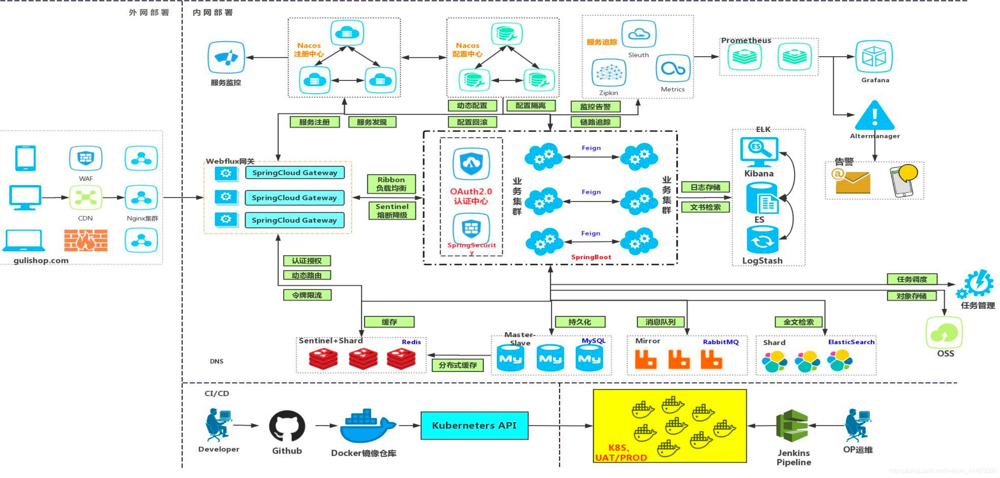
目前主流的配置中心
- nacos
2.x(1.x 去掉 gRpc):

- apollo
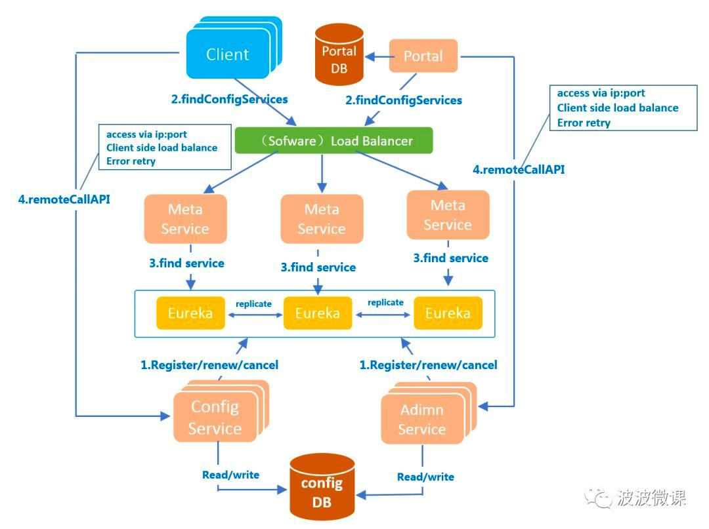
- 1、 用户在Portal操作配置发布
- 2、 Portal 调用 Admin Service 的接口操作发布
- 3、 Admin Service 发布配置后，发送 ReleaseMessage 给各个 Config Service
- 4、 Config Service 收到 ReleaseMessage 后，通知对应的客户端


**上图简要描述了Apollo客户端的实现原理：**
- 1、客户端和服务端保持了一个长连接，从而能第一时间获得配置更新的推送（通过Http Long Polling实现）
- 2、客户端还会定时从Apollo配置中心服务端拉取应用的最新配置
这是一个fallback机制，为了防止推送机制失效导致配置不更新
客户端定时拉取会上报本地版本，所以一般情况下，对于定时拉取的操作，服务端都会返回304 - Not Modified
定时频率默认为每5分钟拉取一次，客户端也可以通过在运行时指定System Property：apollo.refreshInterval来覆盖，单位为分钟
- 3、客户端从Apollo配置中心服务端获取到应用的最新配置后，会保存在内存中
- 4、客户端会把从服务端获取到的配置在本地文件系统缓存一份
在遇到服务不可用，或网络不通的时候，依然能从本地恢复配置
- 5、应用程序可以从Apollo客户端获取最新的配置、订阅配置更新通知

## springboot 动态配置基础 springboot 容器启动过程


**springboot 的事件机制** 
springboot 常⻅事件解析 与动态配置直接相关的事件:
- org.springframework.cloud.endpoint.event.RefreshEvent -> org.springframework.cloud.endpoint.event.RefreshEventListener(容器 刷新事件，主要是容器刷新，会重新创建一个新容器，新容器启动还是会发布 相关事件。)
-  org.springframework.boot.context.event.ApplicationEnvironmentPreparedEvent -> org.springframework.boot.context.config.ConfigFileApplicationListener(主要是加载配置文件)
- org.springframework.cloud.context.environment.EnvironmentChangeEvent->org.springframework.cloud.context.properties.ConfigurationPropertiesRebinder(环境变更事件，主要是重新绑定 @ConfigurationProperties 相关的 bean 的属性)
  以下事件由 org.springframework.boot.context.event.EventPublishingRunListener( 启动过程监控) 发布
-  org.springframework.boot.context.event.ApplicationStartingEvent
-  org.springframework.boot.context.event.ApplicationEnvironmentPreparedEvent
-  org.springframework.boot.context.event.ApplicationContextInitializedEvent
-  org.springframework.boot.context.event.ApplicationPreparedEvent
-  org.springframework.boot.context.event.ApplicationStartedEvent
-  org.springframework.boot.context.event.ApplicationReadyEvent ->org.springframework.cloud.endpoint.event.RefreshEventListener
-  org.springframework.boot.context.event.ApplicationFailedEvent
## springboot SPI 机制
### 二(三)方包自动注入目标容器的方式
- 1、spring.factories (如 spring-redis，mybatis-plus 自动注入，缺少配置就报错)
- 2、@Import (@EnableAsync，@EnableFeignClients，@EnableApolloConfig 在 启动类上增加注解直接注入目标容器)
- 3、@Import+spring.factories +ConditionalOn 机制 (@EnableEurekaServer，在启 动类上增加注解，但是并不是直接把目标 class 注入容器，而是注入一个标记类，主 配置类通过 SPI+ 标记类条件注入)
springboot 配置文件加载过程
**ConfigFileApplicationListener 配置文件的加载过程**
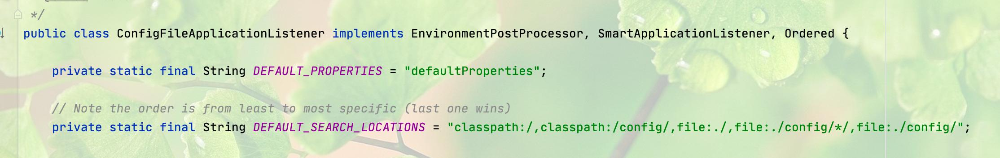


事件发布:

**ConfigurableEnvironment作用**
org.springframework.core.env.ConfigurableEnvironment

配置保存在 ConfigurableEnvironment 的 MutablePropertySources 内的列表中， 包括系启动参数，系统变量，配置文件配置，其他方式加载的配置，既然是列表就 是有序的，顺序就是优先级，变量查过过程是从优先级高->低进行查找，直到找到第一个即为此变量的值。一般系统变量会比配置文件的优先级要高。 配置可以在哪个步骤完成?
利用 springboot 提供的配置加载接口，其实还可以使用如下方式 (按加载顺序排 序):
**1.实现 EnvironmentPostProcessor 接口进行加载**

**2.实现 PropertySourceLocator 接口进行加载 ⻅ nacos 解析**
**3.ApplicationContextInitializer 方式加载**

**4.SpringApplicationRunListener 方式进行加载**

**5.BeanFactoryPostProcessor 方式进行加载**
⻅配置加解密解析
(6&7 较为特殊，会出现 @Value 注解注解不到但是 @ConfigurationProperties 可 以的情况)
**6.ApplicationContextAware 方式进行加载**
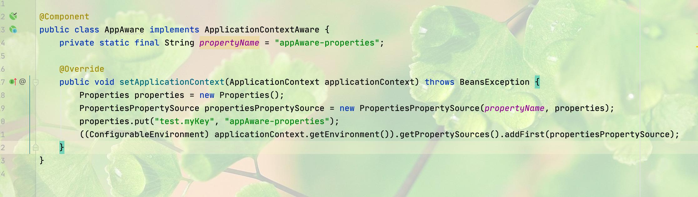
**7.实现 EnvironmentAware 接口进行加载**
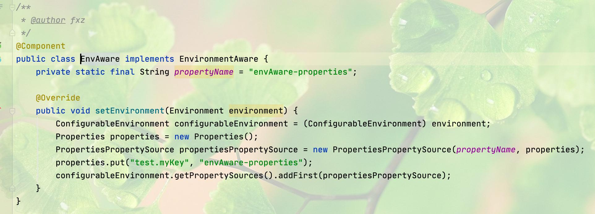
其实实现的方式很多，但都是在 spring 容器执行 refresh 之前进行就可以，因为 refresh 后 bean 的配置就会确定下来了。(Aware 接口拿到的实现一般是 StandardEnvironment，一般用于 env 取值，而其他接口大部分拿到的是 ConfigurableEnvironment 的实现，此实现可以设值，所以那些可以加入配置从实现上一目了然，不然即使加进去也有不生效的可能)


## @value 注解与 @ConfigurationProperties 的差异
- 初始化时机的差异
  如上总结
-  存储的差异
   @Value 一般注解在 bean 中的字段，在初始化的时候会从 env 获取变量值，然后通 过 org.springframework.core.convert.converter.Converter 接口进行类型转换然后 进行设置。(如: org.springframework.core.convert.support.StringToBooleanConverter)， @ConfigurationProperties 一般注解在类上，会以 bean 的方式加载到容器中
-  动态设值的差异
   @Value 对于单例的 bean 正常情况下只会在初始化的时候才进行设置，动态配置主
   要解决的就是这类问题。对于 @Value 注解需要在容器启动的时候进行扫描，将每 个 bean 中 @Value 注解的 filed 和 @Value 注解的 set 方法扫描出来进行存储，在对应 的 key 变化的时候取出相关的 bean filed 和 set 方法反射设值。(@Value 还可以注 解在参数中，参数中的 @Value 标记的参数要怎么处理?) @ConfigurationProperties 是以 bean 的形式加载到容器中，在收到 EnvironmentChangeEvent 事件后，进行属性的重新绑定(注意点:此注解标记的 类属性由 null->有值是可以正常复制，但是如果想要有值->null 从配置中心删除是实 现不了的，删除后还是原值，不过可以把 value 置空解决，有点不太优雅)
   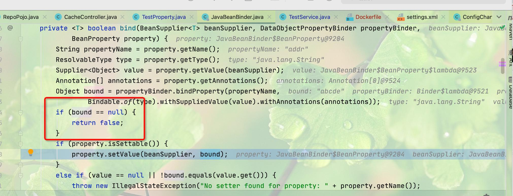
## 配置加解密原理
代理 env 中的 properties 及实现方式解析
原理:对 env 中的 properties 进行代理，在 org.springframework.core.env.PropertySource#getProperty 的过程中对出入参进行额外处理，如value的格式为 ENC_开头，则表示此配置为加密配置，需要进行解 密处理，加解密使用对称加密，一般使用 AES，password 由 spring.application.name+ 环境组合 hash
源码展示:


## nacos-config 源码解析
pom:
```xml
<dependency>
    <groupId>com.alibaba.cloud</groupId>
    <artifactId>spring-cloud-starter-alibaba-nacos-config</artifactId> 
</dependency>
```
spring.factories:

主要注意一下两个配置: NacosConfigBootstrapConfiguration:注入 nacosManager 和 nacosPropertySourceLocator

NacosConfigAutoConfiguration:注入 NacosContextRefresher


注册各个 dataId 的监听
**总结一下流程:**
- 容器启动通过 SPI 加载 springfactoies 中的配置->
- 加载 NacosConfigBootstrapConfiguration 中的 nacosPropertySourceLocator-> 执行 com.alibaba.cloud.nacos.client.NacosPropertySourceLocator#locate->
- 加载 nacos 的配置，包括共享配置，扩展配置到 env 中-> org.springframework.boot.context.event.EventPublishingRunListener 发布 Ready 事件->
- NacosContextRefresher 注册监听->
- 触发变更发布 RefreshEvent- >org.springframework.cloud.endpoint.event.RefreshEventListener->
- org.springframework.cloud.context.refresh.ContextRefresher#refresh-> 初始化新的容器并启动第一步->
- 发布 EnvironmentChangeEvent 事件，触发 @ConfigurationProperties 类的属性重新绑定
  问题:
  1、每次有变更就会发布refreshEvent ，并执行 NacosPropertySourceLocator ，需 要重新拉取所有配置并加载到当前context中的env中，会销毁@RefreshScope 注解的bean并重新初始化，还要发布EnvironmentChangeEvent事件触发重新绑定，动作笨重，服务端压力变大(使用 @Autowired RefreshScope 调用 refresh(beanName) 或者 refreshAll 只会销毁相关的 bean，使用时再重新初始化， 参数也就在初始化时重新绑定，如果配置可以动态更新，无需使用此方式显示处理 bean)。
  
  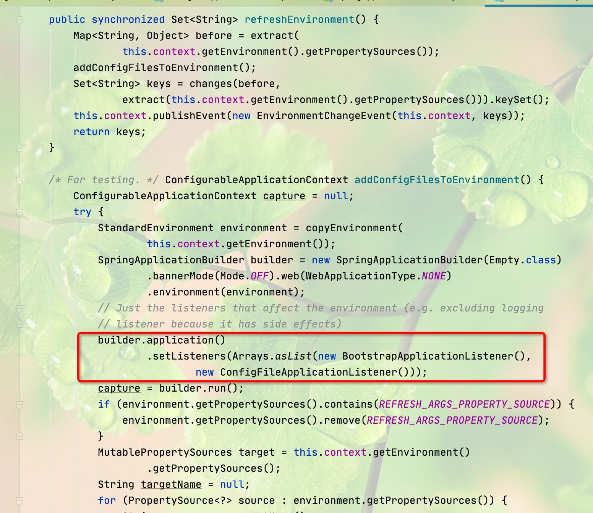
  (@Value 类型的注解下边详解)
## apollo-config 源码解析
apollo 是通过注解 @EnableApolloConfig 注解上的 import 注解引入需要注入容器的 类


PropertySourcesPlaceholderConfigurer:spring 提供的类，主要处理本地环境 变量

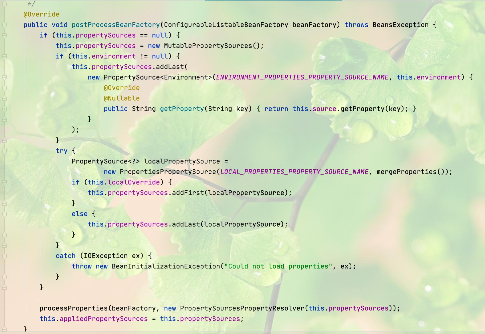
由代码可以看出，environmentProperties 配置的变量其实是从 EnvironmentAware 接口注入进来的 environment 中获取的。
PropertySourcesProcessor:apollo 的类，主要作用有两个，一个是把对应的配 置加入到 env 中，另一个是对相应的配置增加监听。
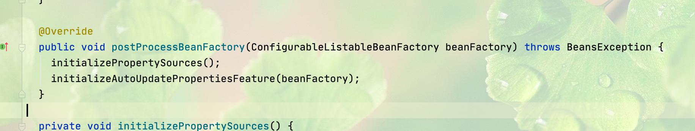
```java
private void initializePropertySources() {
    if (environment.getPropertySources().contains(PropertySourcesConstants.APOLLO_PROPERTY_SOURCE_NAME)) {
      //already initialized
      return;
    }
    CompositePropertySource composite;
    if (configUtil.isPropertyNamesCacheEnabled()) {
      composite = new CachedCompositePropertySource(PropertySourcesConstants.APOLLO_PROPERTY_SOURCE_NAME);
    } else {
      composite = new CompositePropertySource(PropertySourcesConstants.APOLLO_PROPERTY_SOURCE_NAME);
    }

    //sort by order asc
    ImmutableSortedSet<Integer> orders = ImmutableSortedSet.copyOf(NAMESPACE_NAMES.keySet());
    Iterator<Integer> iterator = orders.iterator();

    while (iterator.hasNext()) {
      int order = iterator.next();
      for (String namespace : NAMESPACE_NAMES.get(order)) {
        Config config = ConfigService.getConfig(namespace);

        composite.addPropertySource(configPropertySourceFactory.getConfigPropertySource(namespace, config));
      }
    }

    // clean up
    NAMESPACE_NAMES.clear();

    // add after the bootstrap property source or to the first
    if (environment.getPropertySources()
        .contains(PropertySourcesConstants.APOLLO_BOOTSTRAP_PROPERTY_SOURCE_NAME)) {

      // ensure ApolloBootstrapPropertySources is still the first
      ensureBootstrapPropertyPrecedence(environment);

      environment.getPropertySources()
          .addAfter(PropertySourcesConstants.APOLLO_BOOTSTRAP_PROPERTY_SOURCE_NAME, composite);
    } else {
      environment.getPropertySources().addFirst(composite);
    }
  }

```
其中 NAMESPACE_NAMES 的来源如下(从 @EnableApolloConfig 注解中获取):

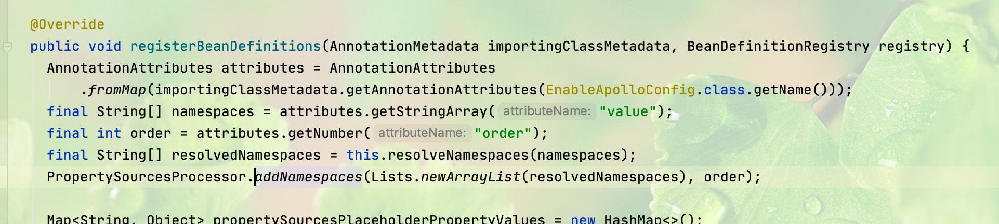

ApolloAnnotationProcessor:主要作用是扫描所有 bean 中使用 @ApolloConfig 和 @ApolloConfigChangeListener 两个 apollo 支持的注解的属性及方法。
// 获取 bean 信息的过程在父类中实现(ApolloProcessor)
```java

public class ApolloAnnotationProcessor extends ApolloProcessor implements BeanFactoryAware, EnvironmentAware {
    private static final Logger logger = LoggerFactory.getLogger(ApolloAnnotationProcessor.class);
    private static final Gson GSON = new Gson();
    private final ConfigUtil configUtil;
    private final PlaceholderHelper placeholderHelper;
    private final SpringValueRegistry springValueRegistry;
    /**
     * resolve the expression.
     */
    private ConfigurableBeanFactory configurableBeanFactory;

    private Environment environment;

    public ApolloAnnotationProcessor() {
        configUtil = ApolloInjector.getInstance(ConfigUtil.class);
        placeholderHelper =
                SpringInjector.getInstance(PlaceholderHelper.class);
        springValueRegistry =
                SpringInjector.getInstance(SpringValueRegistry.class);
    }

    // 处理 @ApolloConfig 注解的属性
    @Override
    protected void processField(Object bean, String beanName, Field field) {
        this.processApolloConfig(bean, field);
        this.processApolloJsonValue(bean, beanName, field);
    }

    // 处理 @ApolloConfigChangeListener 注解的方法 @Override
    protected void processMethod(final Object bean, String
            beanName, final Method method) {
        this.processApolloConfigChangeListener(bean, method);
        this.processApolloJsonValue(bean, beanName, method);
    }

    // 主要需要关注的方法，此方法是讲 @ApolloConfigChangeListener 注解的方法包装成一个 ConfigChangeListener
    // 在感兴趣的配置项变更时进行调用
    private void processApolloConfigChangeListener(final Object bean, final Method method) {
        ApolloConfigChangeListener annotation = AnnotationUtils.findAnnotation(method, ApolloConfigChangeListener.class);
        if (annotation == null) {
            return;
        }
    //检查注解方法的参数，主要检查两点:1.必须是一个参数 2.这个参数 必须是 ConfigChangeEvent 或者其子类
        Class<?>[] parameterTypes = method.getParameterTypes();
        Preconditions.checkArgument(parameterTypes.length == 1,
                "Invalid number of parameters: %s for method: %s, should be 1", parameterTypes.length, method);
        Preconditions.checkArgument(ConfigChangeEvent.class.isAssignableFrom(parameterTypes[0]),
                "Invalid parameter type: %s for method: %s, should be ConfigChangeEvent", parameterTypes[0], method);
        ReflectionUtils.makeAccessible(method);
    // 拿到对应的 namespace，与 nacos 中的 dataId 对应 String[] namespaces = annotation.value(); //感兴趣的keys
        String[] annotatedInterestedKeys = annotation.interestedKeys();
    // 感兴趣的 key 前缀
        String[] annotatedInterestedKeyPrefixes = annotation.interestedKeyPrefixes();
    // 初始化一个 listener 包装起来
        ConfigChangeListener configChangeListener = new
                ConfigChangeListener() {
                    // 当变更时直接反射调用此方法
                    @Override
                    public void onChange(ConfigChangeEvent changeEvent) {
                        ReflectionUtils.invokeMethod(method, bean, changeEvent);
                    }
                };
        Set<String> interestedKeys = annotatedInterestedKeys.length > 0 ? Sets.newHashSet(annotatedInterestedKeys) : null;
        Set<String> interestedKeyPrefixes = annotatedInterestedKeyPrefixes.length > 0 ? Sets.newHashSet(annotatedInterestedKeyPrefixes) : null;
        for (String namespace : namespaces) {
            final String resolvedNamespace = this.environment.resolveRequiredPlaceholders(namespace);
            Config config = ConfigService.getConfig(resolvedNamespace);
            if (interestedKeys == null && interestedKeyPrefixes == null) {
                config.addChangeListener(configChangeListener);
            } else {
                config.addChangeListener(configChangeListener,
                        interestedKeys, interestedKeyPrefixes);
            }
        }
    }

}
```
//ConfigChangeEvent 结构如下:
```java
public class ConfigChangeEvent extends ApplicationEvent {
    private final String m_namespace;
    private final Map<String, ConfigChange> m_changes;

    /**
     * Get the keys changed.
     *
     * @return the list of the keys
     */
    // 重点:此方法会返回搜索变更的配置项 
    public Set<String> changedKeys() {
        return m_changes.keySet();
    }

    /**
     * Maybe subclass override this method. *
     *
     * @return interested and changed keys
     */
    // 重点:此方法只会返回感兴趣的 keys，与 nacos 有明显区别， nacos 返回搜索变更的 keys
    // 只要变更项中有一个是感兴趣的则全部返回 
    public Set<String> interestedChangedKeys() {
        return Collections.emptySet();
    }
}
```

```java
public abstract class ApolloProcessor implements BeanPostProcessor, PriorityOrdered {
    // 实现 BeanPostProcessor 在每个 bean 初始化过程中进行处理 @Override
    public Object postProcessBeforeInitialization(Object bean, String beanName) throws BeansException {
        Class clazz = bean.getClass();
        for (Field field : findAllField(clazz)) { // 处理 bean 的所有属性
            processField(bean, beanName, field);
        }
        for (Method method : findAllMethod(clazz)) { // 处理 bean 的所有方法
            processMethod(bean, beanName, method);
        }
        return bean;
    }

    //SpringValueProcessor:重点关注对象。主要实现对 @Value 注解的扫描和注册。
    public class SpringValueProcessor extends ApolloProcessor implements BeanFactoryPostProcessor, BeanFactoryAware {
        private static final Logger logger = LoggerFactory.getLogger(SpringValueProcessor.class);
        private final ConfigUtil configUtil;
        private final PlaceholderHelper placeholderHelper;
        private final SpringValueRegistry springValueRegistry;
        private BeanFactory beanFactory;
        private Multimap<String, SpringValueDefinition> beanName2SpringValueDefinitions;

        public SpringValueProcessor() {
            configUtil = ApolloInjector.getInstance(ConfigUtil.class);
            placeholderHelper =
                    SpringInjector.getInstance(PlaceholderHelper.class);
            springValueRegistry =
                    SpringInjector.getInstance(SpringValueRegistry.class);
            beanName2SpringValueDefinitions =
                    LinkedListMultimap.create();
        }

        @Override
        public void postProcessBeanFactory(ConfigurableListableBeanFactory beanFactory)
                throws BeansException {
            if (configUtil.isAutoUpdateInjectedSpringPropertiesEnabled()
                    && beanFactory instanceof BeanDefinitionRegistry) {
                beanName2SpringValueDefinitions =
                        SpringValueDefinitionProcessor.getBeanName2SpringValueDefinitions((BeanDefinitionRegistry) beanFactory);
            }
        }

        @Override
        public Object postProcessBeforeInitialization(Object bean, String beanName)
                throws BeansException {
            if (configUtil.isAutoUpdateInjectedSpringPropertiesEnabled()) {
                super.postProcessBeforeInitialization(bean, beanName);
                processBeanPropertyValues(bean, beanName);
            }
            return bean;
        }

        // 跟扫描 apollo 自身提供的注解逻辑是一样的，处理 @Value 标记的属 性
        @Override
        protected void processField(Object bean, String beanName, Field field) {
            // register @Value on field
            Value value = field.getAnnotation(Value.class);
            if (value == null) {
                return;
            }
            Set<String> keys = placeholderHelper.extractPlaceholderKeys(value.value());
            if (keys.isEmpty()) {
                return;
            }
            for (String key : keys) {
                // 把此属性包装成 SpringValue 注册到 springValueRegistry 中
                SpringValue springValue = new SpringValue(key, value.value(), bean, beanName, field, false);
                springValueRegistry.register(beanFactory, key, springValue);
                logger.debug("Monitoring {}", springValue);
            }
        }

        // 对于 Method 处理与属性基本一致，同样是包装成 SpringValue 进行 注册。
        @Override
        protected void processMethod(Object bean, String beanName, Method method) {
            //register @Value on method
            Value value = method.getAnnotation(Value.class);
            if (value == null) {
                return;
            }
            //skip Configuration bean methods
            if (method.getAnnotation(Bean.class) != null) {
                return;
            }
            if (method.getParameterTypes().length != 1) {
                logger.error("Ignore @Value setter {}.{}, expecting 1 parameter, actual {}parameters ", bean.getClass().getName(), method.getName(),
                method.getParameterTypes().length);
                return;
            }
            Set<String> keys = placeholderHelper.extractPlaceholderKeys(value.value());
            if (keys.isEmpty()) {
                return;
            }
            for (String key : keys) {
                SpringValue springValue = new SpringValue(key, value.value(), bean, beanName, method, false);
                springValueRegistry.register(beanFactory, key, springValue);
                logger.info("Monitoring {}", springValue);
            }
        }

        private void processBeanPropertyValues(Object bean, String beanName) {
            Collection<SpringValueDefinition> propertySpringValues = beanName2SpringValueDefinitions
                    .get(beanName);
            if (propertySpringValues == null ||
                    propertySpringValues.isEmpty()) {
                return;
            }
            for (SpringValueDefinition definition : propertySpringValues) {
                try {
                    PropertyDescriptor pd = BeanUtils.getPropertyDescriptor(bean.getClass(),
                            definition.getPropertyName());
                    Method method = pd.getWriteMethod();
                    if (method == null) {
                        continue;
                    }
                    SpringValue springValue = new

                            SpringValue(definition.getKey(), definition.getPlaceholder(), bean, beanName, method, false);
                    springValueRegistry.register(beanFactory, definition.getKey(), springValue);
                    logger.debug("Monitoring {}", springValue);
                } catch (Throwable ex) {
                    logger.error("Failed to enable auto update feature for {}.{}", bean.getClass(),
                            definition.getPropertyName());
                }
            }
            // clear
            beanName2SpringValueDefinitions.removeAll(beanName);
        }

        @Override
        public void setBeanFactory(BeanFactory beanFactory) throws BeansException {
            this.beanFactory = beanFactory;
        }
    }

    public class SpringValueRegistry {
        private static final long CLEAN_INTERVAL_IN_SECONDS = 5;
        private final Map<BeanFactory, Multimap<String,
                SpringValue>> registry = Maps.newConcurrentMap();
        private final AtomicBoolean initialized = new
                AtomicBoolean(false);
        private final Object LOCK = new Object();

        // 进行 springValue 注册，其实就是放入一个多层 map 中。
        public void register(BeanFactory beanFactory, String key, SpringValue springValue) {
            if (!registry.containsKey(beanFactory)) {
                synchronized (LOCK) {
                    if (!registry.containsKey(beanFactory)) {
                        registry.put(beanFactory, Multimaps.synchronizedListMultimap(LinkedListMultimap.<String, SpringValue>create()));

                    }
                }
            }
            registry.get(beanFactory).put(key, springValue);
            // lazy initialize
            if (initialized.compareAndSet(false, true)) {
                initialize();
            }
        }

        public Collection<SpringValue> get(BeanFactory beanFactory, String key) {
            Multimap<String, SpringValue> beanFactorySpringValues = registry.get(beanFactory);
            if (beanFactorySpringValues == null) {
                return null;
            }
            return beanFactorySpringValues.get(key);
        }

        // 定时清理无效的绑定，非重点
        private void initialize() {
            Executors.newSingleThreadScheduledExecutor(ApolloThreadFactory.create("SpringValueRegistry", true)).scheduleAtFixedRate(
                            new Runnable() {
                                @Override
                                public void run() {
                                    try {
                                        scanAndClean();
                                    } catch (Throwable ex) {
                                        ex.printStackTrace();
                                    }
                                }
                            }, CLEAN_INTERVAL_IN_SECONDS, CLEAN_INTERVAL_IN_SECONDS, TimeUnit.SECONDS);
        }

        private void scanAndClean() {
            Iterator<Multimap<String, SpringValue>> iterator =
                    registry.values().iterator();
            while (!Thread.currentThread().isInterrupted() &&
                    iterator.hasNext()) {
                Multimap<String, SpringValue> springValues = iterator.next();
                Iterator<Entry<String, SpringValue>> springValueIterator =
                        springValues.entries().iterator();
                while (springValueIterator.hasNext()) {
                    Entry<String, SpringValue> springValue = springValueIterator.next();
                    if (!springValue.getValue().isTargetBeanValid()) {
                        // clear unused spring values
                        springValueIterator.remove();
                    }
                }
            }
        }
    }

    //@Value 注解标记的属性及方法最终都被包装成了这个结构
    public class SpringValue {
        private MethodParameter methodParameter;
        private Field field;
        private WeakReference<Object> beanRef;
        private String beanName;
        private String key;
        private String placeholder;
        private Class<?> targetType;
        private Type genericType;
        private boolean isJson;

        // 包装属性构造方法
        public SpringValue(String key, String placeholder, Object bean,
                           String beanName, Field field, boolean isJson) {
            this.beanRef = new WeakReference<>(bean);
            this.beanName = beanName;
            this.field = field;

            this.key = key;
            this.placeholder = placeholder;
            this.targetType = field.getType();
            this.isJson = isJson;
            if (isJson) {
                this.genericType = field.getGenericType();
            }
        }

        // 包装方法构造方法
        public SpringValue(String key, String placeholder, Object bean, String beanName, Method method, boolean isJson) {
            this.beanRef = new WeakReference<>(bean);
            this.beanName = beanName;
            this.methodParameter = new MethodParameter(method, 0);
            this.key = key;
            this.placeholder = placeholder;
            Class<?>[] paramTps = method.getParameterTypes();
            this.targetType = paramTps[0];
            this.isJson = isJson;
            if (isJson) {
                this.genericType = method.getGenericParameterTypes()[0];
            }
        }

        // 动态更新值，值变更就是通过此方法进行设值的
        public void update(Object newVal) throws IllegalAccessException, InvocationTargetException {
            if (isField()) {
                injectField(newVal);
            } else {
                injectMethod(newVal);
            }
        }

        // 反射设值
        private void injectField(Object newVal) throws
                IllegalAccessException {
            Object bean = beanRef.get();
            if (bean == null) {

                return;
            }
            boolean accessible = field.isAccessible();
            field.setAccessible(true);
            field.set(bean, newVal);
            field.setAccessible(accessible);
        }

        // 反射设值，set 方法内不要有多于逻辑
        private void injectMethod(Object newVal)
                throws InvocationTargetException, IllegalAccessException {
            Object bean = beanRef.get();
            if (bean == null) {
                return;
            }
            methodParameter.getMethod().invoke(bean, newVal);
        }


```
通过 SpringValueProcessor 处理后会将所有 @Value 注解的方法和属性进行注册， 接下来就是要与通络逻辑打通，通过变更的配置项找到对应的 SpringValue，调用其 update 方法进行更新。
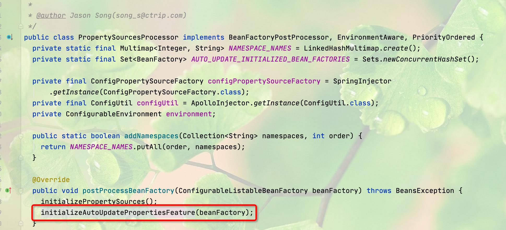

```java
public class AutoUpdateConfigChangeListener implements ConfigChangeListener {
    private static final Logger logger = LoggerFactory.getLogger(AutoUpdateConfigChangeListener.class);
    private final boolean typeConverterHasConvertIfNecessaryWithFieldParameter;
    private final Environment environment;
    private final ConfigurableBeanFactory beanFactory;
    private final TypeConverter typeConverter;
    private final PlaceholderHelper placeholderHelper;
    private final SpringValueRegistry springValueRegistry;
    private final Gson gson;

    public AutoUpdateConfigChangeListener(Environment environment, ConfigurableListableBeanFactory beanFactory) {
        this.typeConverterHasConvertIfNecessaryWithFieldParameter = testTypeConverterHasConvertIfNecessaryWithFieldParameter();
        this.beanFactory = beanFactory;
        this.typeConverter = this.beanFactory.getTypeConverter();
        this.environment = environment;
        this.placeholderHelper = SpringInjector.getInstance(PlaceholderHelper.class);
        this.springValueRegistry = SpringInjector.getInstance(SpringValueRegistry.class);
        this.gson = new Gson();
    }

    // 通过对 properySource 增加 listener 来获取变更通知 @Override
    public void onChange(ConfigChangeEvent changeEvent) {
        Set<String> keys = changeEvent.changedKeys();
        if (CollectionUtils.isEmpty(keys)) {
            return;
        }
        for (String key : keys) {
            // 1. check whether the changed key is relevant
            // 检查新值是否有效 Collection<SpringValue> targetValues =

            springValueRegistry.get(beanFactory, key);
            if (targetValues == null || targetValues.isEmpty()) {
                continue;
            }
            // 2. update the value
            // 值有效就进行更新
            for (SpringValue val : targetValues) {
                updateSpringValue(val);
            }
        }
    }

    private void updateSpringValue(SpringValue springValue) {
        try {
            // 解析值，使用 spring 本身提供的功能，如 str->list str->map 等 //如org.springframework.core.convert.support.StringToBooleanConverter
            Object value = resolvePropertyValue(springValue);
            springValue.update(value);
            logger.info("Auto update apollo changed value successfully, new value:{},{}", value, springValue);
        } catch (Throwable ex) {
            logger.error("Auto update apollo changed value failed, {}", springValue.toString(), ex);
        }
    }
}
```
至此 apollo 加载配置到配置更新的主流程已经清楚，接下来还需要分析一下配置解 析及本地配置的处理。
从 registerBeanDefinitions(注解引入)->PropertySourcesProcessor(注入容器)- >ConfigPropertySource(注入 env 的 property 类型)->获取 Config(包装了远程 获取 com.ctrip.framework.apollo.internals.RemoteConfigRepository 和本地获取 com.ctrip.framework.apollo.internals.LocalFileConfigRepository 的实现)->从 config 中获取变量 此处细节不再赘述，有兴趣可以调试一下。主要是了解原理，不用过分追求细节。 如果自己实现配置中心，还是尽可能简单。
com.ctrip.framework.apollo.internals.DefaultConfig 获取本地配置:


## fuled-config 源码解析
fuled-config 也是一个配置中心的框架，服务端使用 nacos，不依赖 nacos- config，只依赖 nacos-client，本地实现集合了 nacos 和 apollo 的优势，将 aopllo 处理 @Value 注解和 nacos 自动刷新进行了整合，精简了代码和逻辑。这样在不改变 原有使用习惯的基础上，发挥了配置中心的优势，在下一代配置中心 nacos 的基础上构建，紧跟潮流。
## 演示项目
GitHub - fuxiuzhan/fuled-framework-demo at 1.1.1.waterdrop
(注意替换 mvn settings ，否则依赖无法下载)
 #### fuled-config
- https://github.com/fuxiuzhan/fuled-component
#### fuled-framework
- https://github.com/fuxiuzhan/fuled-framework
  

