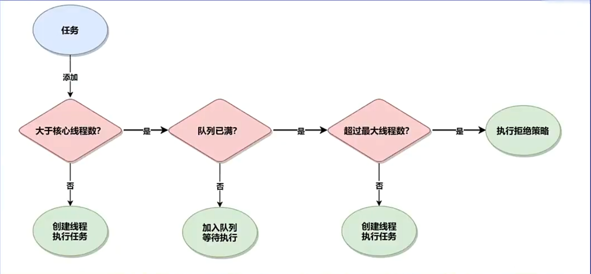
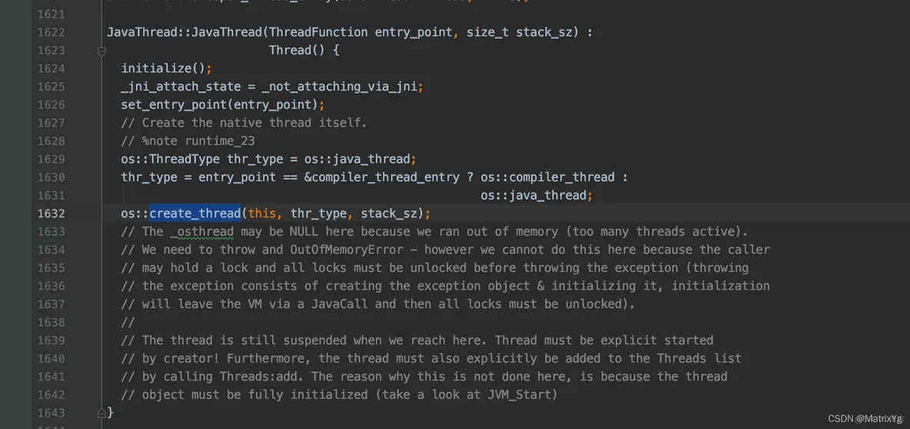
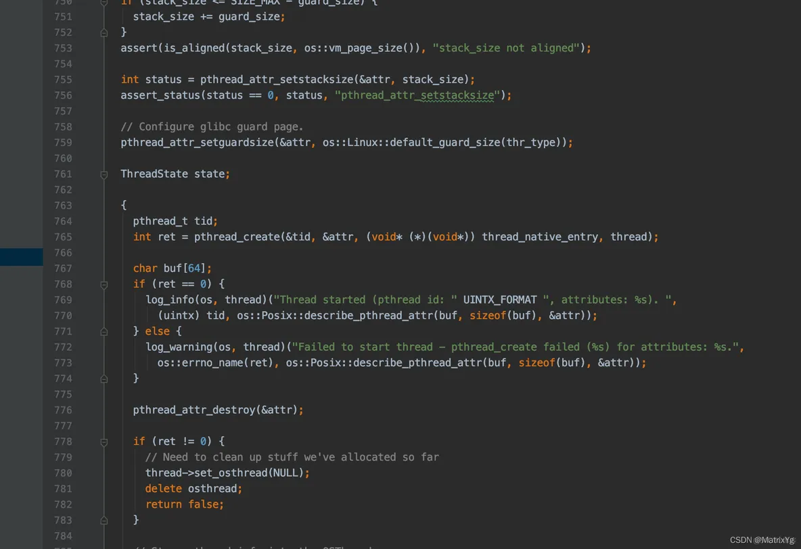
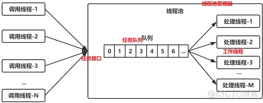
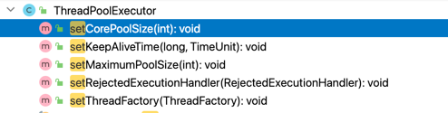
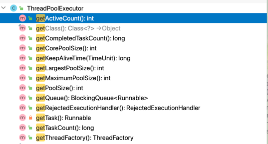

  **本文的重点不在于着重阐述线程池的基本概念，但有些知识点会高于基本概念，或者有些东西看似简单，
但实际上又说不清楚。最终的目的还是讲明白如何构建低侵入性（无侵入性），具有动态调整，ThreadLocal无感传递
和可观测性的动态线程池的组件。
如果有问题欢迎大家题issue。**

## 1、线程池的基本知识
```java
   public ThreadPoolExecutor(int corePoolSize,
                              int maximumPoolSize,
                              long keepAliveTime,
                              TimeUnit unit,
                              BlockingQueue<Runnable> workQueue,
                              ThreadFactory threadFactory,
                              RejectedExecutionHandler handler) {
        if (corePoolSize < 0 ||
            maximumPoolSize <= 0 ||
            maximumPoolSize < corePoolSize ||
            keepAliveTime < 0)
            throw new IllegalArgumentException();
        if (workQueue == null || threadFactory == null || handler == null)
            throw new NullPointerException();
        this.acc = System.getSecurityManager() == null ?
                null :
                AccessController.getContext();
        this.corePoolSize = corePoolSize;
        this.maximumPoolSize = maximumPoolSize;
        this.workQueue = workQueue;
        this.keepAliveTime = unit.toNanos(keepAliveTime);
        this.threadFactory = threadFactory;
        this.handler = handler;
    }
```
7个核心参数：
- corePoolSize：核心线程池的大小
- maximumPoolSize：最大线程池的大小
- keepAliveTime：当线程池中线程数大于corePoolSize，并且没有可执行任务时大于corePoolSize那部分线程的存活时间
- unit：keepAliveTime的时间单位
- workQueue：用来暂时保存任务的工作队列
- threadFactory：线程工厂提供线程的创建方式，默认使用Executors.defaultThreadFactory()
- handler：当线程池所处理的任务数超过其承载容量或关闭后继续有任务提交时，所调用的拒绝策略


###  **执行流程**


注意非核心线程创建的时机，如果任务是响应优先的需要调整一个非核心线程创建的时机（如tomcat线程池），目前这种方式
对于吞吐比较友好。下边一个简单的公式，大家参考，其实合适的线程数是要不断调整和观察得出来的。

```html
     io密集型可以使用更多的线程数
     Ncpu=CPU的数量
     Ucpu=目标CPU的使用率， 0<=Ucpu<=1
     W/C=等待时间与计算时间的比率
     为保持处理器达到期望的使用率，最优的池的大小等于：
     Nthreads=Ncpu x Ucpu x(1+W/C)
```
**java 线程的原理  1vs1**





可以看到java 的线程实现方式是用os pthread方式创建的。下边是使用c写的一个监听端口的服务端，
接受一个链接就创建一个线程，使用pthread创建新线程，有兴趣的可以直接用gcc编译一下试试

```java
#include <stdio.h>
#include <stdlib.h>
#include <netdb.h>
#include <sys/socket.h>
#include <pthread.h>
#include <string.h>
void *serverThread(void *param)
{
        printf("thread value:%d started....\n",*(int*)param);
        char buf[256]="\0";
        int len=0;
        while(1)
        {
                len=recv(*(int*)param,buf,sizeof(buf),0);
                //printf("get len:%d \n",len);
                *(buf+len)='\0';
                if(len>0)
                {
                        printf("\nRecvLen:%d   RecvMsg:%s \n",len,buf);
                }
                else
                {
                        *(int*)param=-1;
                        printf("disconnect from server \n");
                        break;
                }
        }
}

int main(int argc ,char *argv[])
{       
	if(argc!=3)
	{
	printf("usage:client ip port\n");
	return 1;
	}
        printf("Host:%s  port:%s\n",argv[1],argv[2]);
        int clientSocket;
        struct sockaddr_in serverAddr;
        char recvbuf[200];
        int iDataNum;
        if((clientSocket = socket(AF_INET, SOCK_STREAM, 0)) < 0)
        {
                printf("socket create error\n");
                return 1;
        }
        serverAddr.sin_family = AF_INET;
        serverAddr.sin_port = htons(atoi(argv[2]));
        serverAddr.sin_addr.s_addr = inet_addr(argv[1]);
        if(connect(clientSocket, (struct sockaddr *)&serverAddr, sizeof(serverAddr)) < 0)
        {
                printf("can not connect to server!\n");
                return 1;
        }
        printf("connect with destination host...\n");
        pthread_t thread_t;
        pthread_create(&thread_t,NULL,serverthread,(void*)&clientSocket);
        while(1)
        {	
		char sendbuf[100]={0};
                printf("input msg send:");
                gets(sendbuf);
		sendbuf[strlen(sendbuf)]='\n';
		if(strlen(sendbuf)!=0)
		{
               int sendl= send(clientSocket,sendbuf,strlen(sendbuf), 0);
               printf("send msg lenth %d secc!\n",sendl);
                if(strcmp(sendbuf, "quit") == 0)
                        break;
		}
        }
        close(clientSocket);
        return 0;
}

```


#### 线程池为什么要区分核心和非核心线程？
首先线程池其实就是资源池化，只是这个资源是计算资源。其实从池化的角度看待核心和非核心线程，两者并没有本质的
区别，只是池化的一种基本思想罢了，也并没有特别的深意，其实就是为了兼顾资源和响应。

## 2、线程池线程复用的原理
线程复用的原理，简单一句话就是线程池内部创建的worker才是真正的线程，核心线程和非核心线程都是worker，
如果worker不足则当前任务作为worker运行，也就是会新创建线程，否则丢到队列里，队列里就仅仅是任务而已了，
worker是作为常驻线程，worker执行完之后就会从queue里阻塞take任务，超时逻辑就是在take任务实现的，这里不在赘述。




 **注意点**
- **worker是真正的线程，那创建线程的动作是谁触发的？**

worker创建的时机一个是核心线程数不足的时候，另一个是队列满同时worker没有达到最大线程数时，创建的动作是由提交任务的线程，也就是父线程创建的，所以此时
是可以方便的拿到父线程的ThreadLocal数据的。

**- 线程池中任务添加到queue的动作是谁触发的？**

线程池中的任务添加到queue的动作是有提交线程触发的，也就是父线程。

**- 线程池目前已有的扩展点如beforeExecute 能不能作为ThreadLocal传递入口？有没有什么问题？**

可以。但是beforeExecute这种扩展点是从队列拿任务的时候才会走这个扩展点，如果提交的任务直接创建woker则不会走这个扩展点，具有一定的局限性。

## 3、线程池与mq的结合使用问题

其实无论kafka还是rocket都支持使用多线程方式消费。但是这个多线程方式并不是灵活。
至于消费位点的问题可以根据具体使用的mq做重试或者补偿。

- 如何实现 kafka 多线程消费(非并行度和非并行度方式)并准确的维护消费位点?
- 开源版本 RocketMQ 如何实现任意延迟事件?【商业版本支持任意事件延迟，开源版本只支持固定级别延迟。可以通过编写外挂
的方式，利用固定的延迟level多次在broker内轮转直到时间到再抛送真正的topic】

```
public class TestMain {
/**
* 业务处理逻辑，如果处理时⻓固定为 <30s *
* @param record */
public void execBiz(ConsumerRecord<String, String> record) { // 业务处理方法
}
/**
* 不使用线程出，直接消费
* <p>
* 耗时:<30s
* 是否本地缓存:不缓存
* 可用线程数:依赖消费者设置
* 可能丢消息:不会
* 可能重复消费:会 *
* @param record */
public void consume1(ConsumerRecord<String, String> record) {
    execBiz(record);
}
/**
* 使用线程池 默认拒绝策略
* <p>
* 耗时:<<30s
* 是否本地缓存:缓存队列大小
* 可用线程数:依赖线程池设置
* 可能丢消息:会
* 可能重复消费:会 *
* @param record */
public void consume2(ConsumerRecord<String, String> record) {
 ThreadPoolExecutor threadPoolExecutor = new ThreadPoolExecutor(Runtime.getRuntime().availableProcessors() * 2, Runtime.getRuntime().availableProcessors() * 2, 0, TimeUnit.SECONDS, new ArrayBlockingQueue<>(1024));
    threadPoolExecutor.execute(() -> execBiz(record));
}
/**
* 使用线程池 并且设置入队等待
* <p>
* 耗时:可能>30s 可能部分线程出现⻓时间等待
* 是否本地缓存:缓存队列大小
* 可用线程数:依赖线程池设置
* 可能丢消息:不会
* 可能重复消费:会 *
* @param record
* @throws InterruptedException */
public void consume3(ConsumerRecord<String, String> record) throws InterruptedException {
ThreadPoolExecutor threadPoolExecutor = new ThreadPoolExecutor(Runtime.getRuntime().availableProcessors() * 2, Runtime.getRuntime().availableProcessors() * 2, 0, TimeUnit.SECONDS, new ArrayBlockingQueue<>(1024));
double threshHold = 0.5D;
int maxQueSize = 1000;
if (threadPoolExecutor.getQueue().size() > threshHold * maxQueSize)
{
    Thread.sleep(1000);
}
threadPoolExecutor.execute(() -> execBiz(record));
}
/**
* 使用线程池，使用默认拒绝策略，但对拒绝的使用当前线程处理
* <p>
* 耗时:<30s
* 是否本地缓存:缓存队列大小
* 可用线程数:线程池设置 + 消费组设置并行度
* 可能丢消息:不会
* 可能重复消费:会 *
* @param record */
public void consume4(ConsumerRecord<String, String> record) {
ThreadPoolExecutor threadPoolExecutor = new
 ThreadPoolExecutor(Runtime.getRuntime().availableProcessors() * 2, Runtime.getRuntime().availableProcessors() * 2, 0, TimeUnit.SECONDS, new ArrayBlockingQueue<>(1024));
try {
    threadPoolExecutor.execute(() -> execBiz(record));
} catch (RejectedExecutionException e) {
    execBiz(record);
}
}
/**
* 使用线程池，设置拒绝策略为 CallerRunsPolicy
* 耗时:<30s
* 是否本地缓存:缓存队列大小
* 可用线程数:线程池设置 + 消费组线设置并行度
* 可能丢消息:不会
* 可能重复消费:会 *
* @param record */
public void consume5(ConsumerRecord<String, String> record) { ThreadPoolExecutor threadPoolExecutor = new
ThreadPoolExecutor(Runtime.getRuntime().availableProcessors() * 2, Runtime.getRuntime().availableProcessors() * 2, 0, TimeUnit.SECONDS, new ArrayBlockingQueue<>(1024), new ThreadPoolExecutor.CallerRunsPolicy());
threadPoolExecutor.execute(() -> execBiz(record));
}
/**
* 使用线程池 ，设置拒绝策略为 CallerRunsPolicy，设置队列为 0 容量
SynchronousQueue
* <p>
* 耗时:<30s
* 是否本地缓存:不缓存
* 可用线程数:线程池设置 + 消费组线设置并行度
* 可能丢消息:不会
* 可能重复消费:会 *
* @param record */
public void consume6(ConsumerRecord<String, String> record) { ThreadPoolExecutor threadPoolExecutor = new
ThreadPoolExecutor(Runtime.getRuntime().availableProcessors() * 2, Runtime.getRuntime().availableProcessors() * 2, 0, TimeUnit.SECONDS, new SynchronousQueue<>(), new ThreadPoolExecutor.CallerRunsPolicy());

threadPoolExecutor.execute(() -> execBiz(record));
}
}
```

## 4、ThreadLocal传递问题
ThreadLocal传递问题面试高频问题，包括InheritableThreadLocal,ThreadLocal和阿里的TransmittableThreadLocal，
另外还有ThreadLocal的内存泄漏问题，当然这不是本文的重点，本文的重点是ThreadLocal如何夸线程池传递，以及目前比较常用的解决方案。

目前主流的方式还是实现Runnable接口，通过构造方法获取父线程的ThreadLocal并保存下来，在run方法中set当前保存的内容。这是一种通用的方式，
但是每次都要专门写个RunnableWrapper，未免有点麻烦，如果可以做成通用的组件就更好了，但势必要修改ThreadPoolExecutor，也就是搞个新类继承ThreadPoolExecutor，
使用上会改变程序员的使用习惯，反正让我new个奇奇怪怪不是jdk自带的线程池怎么都会感觉不舒服。

## 5、线程池动态调整原理



目前原生的支持的set方法。不过对于线程池来说作为计算池化工具，最核心的莫过于线程数。虽然不支持queue的大小调整当，当然也可以采用支持大小调整的queue，但是
同样也需要继承线程池才能实现。
对于线程数和核心线程数是原生就有更新的方法，所以实现线程数的动态调整非常简单，只需要从配置拿到新值直接更新即可，并没有什么难度。唯一需要注意的就是1.8中可以
随意设值，17中则必须核心线程数<=最大线程数，否则无法更新。

## 6、动态参数与配置中心的结合问题

摘一段动态线程池更新方法的注释。无论采用什么配置中心，我们只需要关心spring容器中Environment的变化即可。

配置中心原理还不了解的话可以看下 [**⭐️⭐️⭐️⭐配置中心深度解析（多图加载慢）⭐️⭐⭐️⭐**](doc/deep-config.md)

```java
 /**
 * 在收到EnvironmentChangeEvent会重新刷新属性
 * 但是如果直接从容器取可能还未刷新完成，
 * 所以就主动刷新一次，ConfigurationPropertiesRebinder
 * 也是相同的操作，其实所有的@ConfigurationProperties
 * 配置变量都需要spring容器处理，所以无论从什么地方发起的配置
 * 如，nacos，apollo，spring-config,zk,file
 * 都需要更新到容器的Environment中，然后走属性刷新
 * 无需关心配置是从何而来，只需要取到的是最新的配置即可

 ThreadPoolProperties bean = ProxyUtils.getTargetObject(applicationContext.getBean(ThreadPoolProperties.class));
 applicationContext.getAutowireCapableBeanFactory().destroyBean(bean);
 applicationContext.getAutowireCapableBeanFactory().initializeBean(bean, "threadPoolProperties");
 或者采用如下方式获取当前最新的配置即可
 ThreadPoolProperties threadPoolProperties=new ThreadPoolProperties();
 Binder.get(applicationContext.getEnvironment()).bind("fuled.dynamic.threadpool", Bindable.ofInstance(threadPoolProperties));
 */
```

## 7、线程池可观测性


**原生的可以拿到的线程池数据。但是这些数据远远不够，我们希望能拿到的数据远不止这些，至少包括如下信息：**
- 1.任务队列内等待时间
- 2.任务执行时间
- 3.任务存活时间
- 4.任务执行速率
- 5.曾经最大线程数
- 6.执行任务总数
- 7.当前线程数
- 8.最大线程数
- 9.当前队列任务大小
- 10.阻塞队列容量
- 11.拒绝任务数
- 12.任务拒绝率

其中一些指标尤其重要，比如：任务队列内等待时间，任务执行时间，当前队列任务大小，任务拒绝率等。是判断任务执行效果和性能的重要指标，并且为后续优化指明方向。

## 8、怎么才算好的动态线程池工具

**理想的动态线程池工具应该有一下特点：**
- 1、不改变原有的使用习惯，使用上还是使用jdk的线程池
- 2、无需关心使用的何种配置中心均能适配
- 3、通过配置支持ThreadLocal无感传递
- 4、具备至少上述的监控指标
- 5、监控指标暴露可以自行扩展。默认支持Prometheus方式，也支持扩展其他方式

## 9、兼具动态调整，threadLocal无感传递，详细监控的动态线程池原理及源码解析
接下里就是本文重点，将详解 ️[⭐⭐⭐动态线程池⭐⭐⭐](https://github.com/fuxiuzhan/fuled-component/tree/master/fuled-dynamic-threadpool-starter)是如何实现上述理想
动态线程池工具的。
 #### 首先难点是什么？
- 1、不改变原有使用习惯，还是使用jdk线程池，但要实现ThreadLocal的传递，丰富的监控指标？
- 2、ThreadLocal的传递在任务被创建worker运行和入队列时怎么获取和保存？
- 3、像任务队列内等待时间，运行时间这类指标如何获取和记录？

带着上述问题我们来看下源码相信就会有答案。

首先上用法：
```java
 private static ThreadPoolExecutor getThreadPool(String poolName) {
        //创建线程池
        ThreadPoolExecutor executor = new ThreadPoolExecutor(CORE_THREADS, CORE_THREADS * 2, 60, TimeUnit.SECONDS, new ArrayBlockingQueue<>(1000), ThreadFactoryNamed.named(THREAD_POOL_PREFIX));
        executor.allowCoreThreadTimeOut(true);
        //注册线程池，只增加一行代码即可，当然也可以自动注册，需要把线程池注册到容器中，但是不建议。
        ThreadPoolRegistry.registerThreadPool(poolName, executor);
        return executor;
    }
```

ThreadPoolRegistry.registerThreadPool 入口：

```java
   /**
     * 线程池注册入口
     *
     * @param threadPoolName
     * @param threadPoolExecutor
     */
    public static void registerThreadPool(String threadPoolName, ThreadPoolExecutor threadPoolExecutor) {
        registerThreadPool(threadPoolName, threadPoolExecutor, defaultExecuteHook);
    }

    /**
     * 线程池注册入口
     *
     * @param threadPoolName
     * @param threadPoolExecutor
     * @param threadExecuteHook  hook扩展点，可配置ThreadLocal传递方式
     */
    public static void registerThreadPool(String threadPoolName, ThreadPoolExecutor threadPoolExecutor, ThreadExecuteHook threadExecuteHook) {
        if (StringUtils.isEmpty(threadPoolName) || Objects.isNull(threadPoolExecutor)) {
            log.error("threadPoolName and threadPool must not be null");
            return;
        }
        if (!manageableMap.containsKey(threadPoolName)) {
            Manageable manageable;
            if (threadPoolExecutor instanceof ScheduledThreadPoolExecutor) {
                //线程池的监控主要是监控ThreadPoolExecutor，对于定时线程池由于其内部队列原理是采用list的大小堆排序的queue
                //所以像核心线程数最大线程数拒绝策略均有所不同，此处增加处理作原理说明，此处不处理定时线程池
                manageable = new ScheduledThreadPoolExecutorWrapper(threadPoolName, (ScheduledThreadPoolExecutor) threadPoolExecutor);
            } else {
                manageable = new ThreadPoolExecutorWrapper(threadPoolName, threadPoolExecutor);
                //ScheduledThreadPoolExecutor 不代理queue，所以不支持ThreadLocal很好的传递，重点处理ThreadPoolExecutor
                //线程池内创建线程的来源只有一个，那就是增加worker的时候，而worker的增加需要ThreadFactory的包装
                //入队的线程，包括runnable和callable就是简单的入队操作，callable会包装成runnable入队
                //所以要实现threadLocal的传递只需要包装ThreadFactory和queue入队，塞入要传递的threadLocal就可以了。
                BlockingQueue wrapperQueue = QueueWrapper.wrapper(threadPoolExecutor.getQueue(), threadExecuteHook, threadPoolName);
                try {
                    modifyFinal(threadPoolExecutor, "workQueue", wrapperQueue);
                } catch (Exception e) {
                    log.warn("warn: inject queue error ->{}, threadLocal transmit invalid", e.getMessage());
                }
            }
            threadPoolExecutor.setThreadFactory(new ThreadFactoryWrapper(threadPoolExecutor.getThreadFactory(), threadExecuteHook, threadPoolName));
            manageableMap.put(threadPoolName, manageable);
            start();
            log.info("threadPoolName->{} registered", threadPoolName);
        } else {
            log.warn("threadPoolName->{} has been registered,skipped", threadPoolName);
        }
    }

    /**
     * 更新线程池核心线程数
     *
     * @param threadPoolName
     * @param coreSize
     */
    public static void updateCoreSize(String threadPoolName, int coreSize) {
        if (coreSize <= 0) {
            log.error("coreSize must be >0,name->{},size->{}", threadPoolName, coreSize);
            return;
        }
        Manageable manageable = manageableMap.get(threadPoolName);
        if (Objects.isNull(manageable)) {
            log.error("threadPoolName not exits name->{}", threadPoolName);
            return;
        }
        manageable.updateCoreSize(coreSize);
    }

    private static void modifyFinal(Object object, String fieldName, Object newFieldValue) throws Exception {
        Field field = null;
        if (object.getClass().equals(ThreadPoolExecutor.class)) {
            field = object.getClass().getDeclaredField(fieldName);
        } else if (object.getClass().equals(ScheduledThreadPoolExecutor.class)) {
            //获取父类
            field = object.getClass().getSuperclass().getDeclaredField(fieldName);
        }
        //高版本的jdk会限制修改final类型，优先使用unsafe进行修改
        Unsafe unsafe = UnsafeUtil.getUnsafe();
        if (Objects.nonNull(unsafe)) {
            log.info("wrapper Queue using unsafe");
            long offset = unsafe.objectFieldOffset(field);
            unsafe.putObject(object, offset, newFieldValue);
            return;
        }
        log.info("wrapper Queue using reflection");
        Field modifiersField = Field.class.getDeclaredField("modifiers");
        modifiersField.setAccessible(true);
        modifiersField.setInt(field, field.getModifiers() & ~Modifier.FINAL);
        if (!field.isAccessible()) {
            field.setAccessible(true);
        }
        field.set(object, newFieldValue);
    }
```


重点Queue代理，因为不改变原有使用习惯，必须使用代理方式，代理方式是在queue前面增加一层代理，这样使用的queue不变，但
可以代理入队动作，增加额外的信息，比如ThreadLocal

```java
/**
 * 包装queue
 */
public class QueueWrapper {
    public static BlockingQueue wrapper(BlockingQueue blockingQueue, ThreadExecuteHook threadExecuteHook, String thredPoolName) {
        return (BlockingQueue) Proxy.newProxyInstance(Thread.currentThread().getContextClassLoader(), new Class[]{BlockingQueue.class, Raw.class},
                (proxy, method, args) -> {
                    if ("offer".equals(method.getName()) || "add".equals(method.getName())) {
                        //包装runnable
                        Object[] newArgs = args;
                        if (args[0] instanceof Runnable) {
                            newArgs = new Object[]{new RunnableWrapper((Runnable) args[0], RpcContext.get(), threadExecuteHook, thredPoolName, Boolean.FALSE)};
                        } else if (args[0] instanceof Callable) {
                            //callable其实线程池也是包装成runnable进行运行的，所以这条逻辑不会执行到，
                            //如果是拦截入口的话就需要了
                            //原理提示作用
                            newArgs = new Object[]{new CallableWrapper<>((Callable) args[0], RpcContext.get(), threadExecuteHook, thredPoolName)};
                        }
                        return blockingQueue.offer(newArgs[0]);
                    }
                    //获取被代理对象
                    if ("getNative".equals(method.getName())) {
                        return blockingQueue;
                    }
                    Method targetMethod = blockingQueue.getClass().getMethod(method.getName(), method.getParameterTypes());
                    try {
                        return targetMethod.invoke(blockingQueue, args);
                        //处理原始异常，不然使用代理的捕获异常机制会失效
                    } catch (InvocationTargetException ex) {
                        throw ex.getTargetException();
                    }
                });
    }

    public interface Raw {
        Object getNative();
    }
}

```

重点RunnableWrapper，只要完成ThreadLocal的生效和原始ThreadLocal的还原，运行数据的监控，父ThreadLocal 拷贝使用
反射方式，内部类无法直接访问：

```java
@Slf4j
public class RunnableWrapper implements Runnable, TaskWrapper {
    private Object meta;
    private Runnable runnable;

    private ThreadExecuteHook threadExecuteHook;

    /**
     * 存储父线程的tl
     */
    private Object parentThreadLocalMap;

    /**
     * 存储父线程的itl
     */
    private Object parentIThreadLocalMap;

    /**
     * 存储备份的tl
     */
    private Object backTheadLocalMap;
    /**
     * 存储备份的itl
     */
    private Object backIThreadLocalMap;

    @Getter
    private String threadPoolName;
    /*
     * 统计运行及等待时间需要排除worker的情况
     * 不然指标会体现出部分线程等待时间短，但
     * 运行时间极长
     */
    @Getter
    private long bornTs;
    @Getter
    private long executeTs;
    @Getter
    private long queuedDuration;
    @Getter
    private long executeDuration;

    @Getter
    private long aliveDuration;
    @Getter
    private long completeTs;
    @Getter
    private boolean isWorker;


    public RunnableWrapper(Runnable runnable, Object meta, ThreadExecuteHook threadExecuteHook, String threadPoolName, boolean isWroker) {
        this.meta = meta;
        this.runnable = runnable;
        this.threadExecuteHook = threadExecuteHook;
        this.threadPoolName = threadPoolName;
        this.isWorker = isWroker;
        this.bornTs = System.currentTimeMillis();
        storeThreadLocal();
        threadExecuteHook.enqueue(this);
    }

    @Override
    public void run() {
        try {
            executeTs = System.currentTimeMillis();
            queuedDuration = executeTs - bornTs;
            //将threadLocal设置在hook可见范围内
            //backup线程池内线程的tl & itl
            backUpAndClearThreadLocal();
            //设置父线程的tl & itl
            setStoreThreadLocal();
            RpcContext.set(meta);
            //此处增加方法即可实现如下两个只有继承线程池才能实现的方法
            //beforeExecute
            threadExecuteHook.beforeExecute(this);
            runnable.run();
        } catch (Throwable t) {
            threadExecuteHook.onException(this, t);
            throw t;
        } finally {
            /**
             * 排除worker的干扰
             */
            if (!isWorker) {
                completeTs = System.currentTimeMillis();
                executeDuration = completeTs - executeTs;
                aliveDuration = completeTs - bornTs;
            }
            threadExecuteHook.afterExecute(this);
            RpcContext.remove();
            //恢复线程池原始的tl & itl
            clearAndRecoverBackupThreadLocal();
            //afterExecute
        }
    }

    /**
     * 备份当前线程的tl & itl 并清理
     */
    private void backUpAndClearThreadLocal() {
        if (threadExecuteHook.threadLocalSupport()) {
            //backup tl
            backTheadLocalMap = getThreadLocal();
            //backup itl
            backIThreadLocalMap = getInheritThreadLocal();
            //clean tl
            cleanThreadLocal(Boolean.FALSE);
            //clean itl
            cleanThreadLocal(Boolean.TRUE);
        }
    }

    /**
     * 存储父线程的tl和itl数据
     */
    private void storeThreadLocal() {
        if (threadExecuteHook.threadLocalSupport()) {
            //将父线程的tl & itl 备份起来
            parentThreadLocalMap = getThreadLocal();
            parentIThreadLocalMap = getInheritThreadLocal();
        }
    }

    /**
     * 设置父线程的tl & itl
     */
    private void setStoreThreadLocal() {
        if (threadExecuteHook.threadLocalSupport()) {
            //set tl
            setThreadLocalMap(parentThreadLocalMap);
            //set itl
            setIThreadLocalMap(parentIThreadLocalMap);
        }
    }

    /**
     * 清理当前线程的tl & itl 并恢复原始的
     */
    private void clearAndRecoverBackupThreadLocal() {
        if (threadExecuteHook.threadLocalSupport()) {
            //clean tl
            cleanThreadLocal(Boolean.FALSE);
            //clean itl
            cleanThreadLocal(Boolean.TRUE);
            //set backup tl
            setThreadLocalMap(backTheadLocalMap);
            //set backup itl
            setIThreadLocalMap(backIThreadLocalMap);
        }
    }

    /**
     * 获取当前线程的threadLocal
     *
     * @return
     */
    private Object getThreadLocal() {
        return getThreadLocal(Boolean.FALSE);
    }

    /**
     * 获取当前线程的InheritThreadLocal
     *
     * @return
     */
    private Object getInheritThreadLocal() {
        return getThreadLocal(Boolean.TRUE);
    }

    /**
     * set tl
     *
     * @param threadLocalMap
     */
    private void setThreadLocalMap(Object threadLocalMap) {
        updateThreadLocal(threadLocalMap, Boolean.FALSE);
    }

    /**
     * set itl
     *
     * @param threadLocalMap
     */
    private void setIThreadLocalMap(Object threadLocalMap) {
        updateThreadLocal(threadLocalMap, Boolean.TRUE);
    }

    /**
     * 获取threadLocal
     *
     * @param inheritable
     * @return
     */
    private Object getThreadLocal(boolean inheritable) {
        String filed = "threadLocals";
        if (inheritable) {
            filed = "inheritableThreadLocals";
        }
        Thread parent = Thread.currentThread();
        Field threadLocals = ReflectionUtils.findField(Thread.class, filed);
        if (!threadLocals.isAccessible()) {
            ReflectionUtils.makeAccessible(threadLocals);
        }
        try {
            if (inheritable) {
                //itl
                //inheritableThreadLocals
                Object threadLocalObj = threadLocals.get(parent);
                if (Objects.nonNull(threadLocalObj)) {
                    // 利用ThreadLocalMap createInheritedMap(ThreadLocalMap parentMap) 生成新的
                    Optional<Method> createInheritedMapOpt = Arrays.stream(ThreadLocal.class.getDeclaredMethods()).filter(e -> e.getName().equals("createInheritedMap")).findFirst();
                    Method createInheritedMap = createInheritedMapOpt.get();
                    ReflectionUtils.makeAccessible(createInheritedMap);
                    return createInheritedMap.invoke(threadLocalObj.getClass(), threadLocalObj);
                }

            } else {
                //ThreadLocal 需要手动copy，
                //首先获取所有的entry对象
                //然后创建一个新的threadLocal，将entry对象都放进去
                //tl
                Object threadLocalObj = threadLocals.get(parent);
                if (Objects.nonNull(threadLocalObj)) {
                    //copy table
                    Field tableFiled = ReflectionUtils.findField(threadLocalObj.getClass(), "table");
                    ReflectionUtils.makeAccessible(tableFiled);
                    Object tableObj = tableFiled.get(threadLocalObj);
                    if (Objects.nonNull(tableObj)) {
                        Object threadLocalMap = null;
                        Optional<Method> setOpt = Arrays.stream(threadLocalObj.getClass().getDeclaredMethods()).filter(e -> e.getName().equals("set")).findFirst();
                        Method setMethod = setOpt.get();
                        setMethod.setAccessible(Boolean.TRUE);
                        WeakReference<ThreadLocal<?>>[] entries = (WeakReference<ThreadLocal<?>>[]) tableObj;
                        for (WeakReference<ThreadLocal<?>> entry : entries) {
                            if (Objects.nonNull(entry)) {
                                ThreadLocal<?> threadLocal = entry.get();
                                if (Objects.nonNull(threadLocal)) {
                                    Object value = threadLocal.get();
                                    if (Objects.isNull(threadLocalMap)) {
                                        //首次需要初始化
                                        Constructor<?> constructor = threadLocalObj.getClass().getDeclaredConstructor(ThreadLocal.class, Object.class);
                                        constructor.setAccessible(Boolean.TRUE);
                                        threadLocalMap = constructor.newInstance(threadLocal, value);
                                    } else {
                                        setMethod.invoke(threadLocalMap, threadLocal, value);
                                    }
                                }
                            }
                        }
                        return threadLocalMap;
                    }
                }
            }
        } catch (Exception e) {
            log.error("copy threadLocal from parentThread error->{}", e);
        }
        return null;
    }

    /**
     * 更新threadLocal
     *
     * @param threadLocal
     * @param inheritable
     */
    private void updateThreadLocal(Object threadLocal, boolean inheritable) {
        String filed = "threadLocals";
        if (inheritable) {
            filed = "inheritableThreadLocals";
        }
        Field threadLocals = ReflectionUtils.findField(Thread.class, filed);
        if (!threadLocals.isAccessible()) {
            ReflectionUtils.makeAccessible(threadLocals);
        }
        try {
            //type check
            threadLocals.set(Thread.currentThread(), threadLocal);
        } catch (Exception e) {
            log.info("clean threadLocal error, threadName->{},error->{}", Thread.currentThread().getName(), e);
        }
    }

    /**
     * 清理当前线程的threadLocal
     *
     * @param inheritable
     */
    private void cleanThreadLocal(boolean inheritable) {
        updateThreadLocal(null, inheritable);
    }

    @Override
    public long queuedDuration() {
        return queuedDuration;
    }

    @Override
    public long aliveDuration() {
        return aliveDuration;
    }

    @Override
    public long executedDuration() {
        return executeDuration;
    }
}

```


动态配置：
```java
@EventListener
    public void eventListener(ApplicationEvent event) {
        /**
         * 在收到EnvironmentChangeEvent会重新刷新属性
         * 但是如果直接从容器取可能还未刷新完成，
         * 所以就主动刷新一次，ConfigurationPropertiesRebinder
         * 也是相同的操作，其实所有的@ConfigurationProperties
         * 配置变量都需要spring容器处理，所以无论从什么地方发起的配置
         * 如，nacos，apollo，spring-config,zk,file
         * 都需要更新到容器的Environment中，然后走属性刷新
         * 无需关心配置是从何而来，只需要取到的是最新的配置即可

         ThreadPoolProperties bean = ProxyUtils.getTargetObject(applicationContext.getBean(ThreadPoolProperties.class));
         applicationContext.getAutowireCapableBeanFactory().destroyBean(bean);
         applicationContext.getAutowireCapableBeanFactory().initializeBean(bean, "threadPoolProperties");
         或者采用如下方式获取当前最新的配置即可
         ThreadPoolProperties threadPoolProperties=new ThreadPoolProperties();
         Binder.get(applicationContext.getEnvironment()).bind("fuled.dynamic.threadpool", Bindable.ofInstance(threadPoolProperties));
         */
        if (event instanceof EnvironmentChangeEvent) {
            ThreadPoolProperties bean = applicationContext.getBean(ThreadPoolProperties.class);
            Binder.get(applicationContext.getEnvironment()).bind(ThreadPoolProperties.PREFIX, Bindable.ofInstance(bean));
            if (!CollectionUtils.isEmpty(bean.getConfig())) {
                bean.getConfig().forEach((k, v) -> updateCoreSize(k, v.getCoreSize()));
            }
        }
    }

```


指标暴露部分，两个接口：
```java

/**
 * 如果需要监控数据上报，则需要实现自己的reporter
 *
 * @author fxz
 */
public interface Reporter {
    default void report(List<ReporterDto> records) {
    }
}


/**
 * 桥接结构
 * 用于传递隔离的dynamicThreadPool和Repoter
 */
public interface FastStatReporter {

    /**
     * 更新瞬时指标
     * <p>
     * Repoter倾向于慢速或者静态指标
     * <p>
     * 收集的结果
     * <p>
     * 此处更新执行时的瞬时结果
     *
     * @param threadPoolName
     * @param queuedDuration
     * @param executeDuration
     */
    default void updateStat(String threadPoolName, long queuedDuration, long executeDuration, long aliveDuration) {
    }

}


```

Prometheus暴露：

```java
public class PrometheusReporter implements Reporter {
    @Autowired(required = false)
    private MeterRegistry meterRegistry;

    @Value("${fuled.dynamic.threadpool.monitor.age:600}")
    private int maxAge;

    @Value("${fuled.dynamic.threadpool.summary.enabled:true}")
    private boolean summaryEnabled;
    @Autowired(required = false)
    private CollectorRegistry collectorRegistry;
    private static final String GAUGE = "fuled.dynamic.thread.pool";
    /**
     * tags
     */
    private static final String PREFIX = "thread.pool.";
    private static final String APP_NAME = PREFIX + "app.name";
    private static final String THREAD_POOL_NAME = PREFIX + "name";
    private static final String IPV4 = PREFIX + "ipv4";
    private static final String IPV6 = PREFIX + "ipv6";
    private static final String THREAD_POOL_TYPE = "type";
    private static final String QUEUE_TYPE = "queue.type";
    private static final String REJECT_TYPE = "reject.handler.type";
    /**
     * gauge
     */
    private static final String TIMESTAMP = PREFIX + "timestamp";
    private static final String CURRENT_CORE_SIZE = "current.core.size";

    private static final String LARGEST_CORE_SIZE = "largest.pool.size";
    private static final String REJECT_CNT = "reject.count";
    private static final String EXEC_COUNT = "exec.count";
    private static final String TASK_COUNT = "task.count";
    private static final String ACTIVE_COUNT = "active.count";
    private static final String MAX_QUEUE_SIZE = "max.queue.size";
    private static final String QUEUE_CAPACITY = "queue.capacity";
    private static final String CURRENT_QUEUE_SIZE = "current.queue.size";
    private static final String CORE_SIZE = "core.size";
    private static final String MAX_CORE_SIZE = "max.core.size";
    private static final String QUEUED_DURATION = "queued.duration";
    private static final String EXECUTED_DURATION = "executed.duration";

    private static final String ALIVE_DURATION = "alive.duration";

    private static final String COMPONENT_VERSION = "component.version";
    private Map<String, ReporterDto> reporterMap = new ConcurrentHashMap<>();
    private AtomicBoolean INIT = new AtomicBoolean(Boolean.FALSE);
    /**
     * waitTime
     */
    private Summary queuedSummary;
    /**
     * runningTime
     */
    private Summary executedSummary;
    private Summary alivedSummary;

    /**
     * appName
     *
     * @param records
     */
    @Override
    public void report(List<ReporterDto> records) {
        if (!CollectionUtils.isEmpty(records) && Objects.nonNull(meterRegistry) && Objects.nonNull(collectorRegistry)) {
            Set<String> threadPools = records.stream().map(ReporterDto::getThreadPoolName).collect(Collectors.toSet());
            threadPools.forEach(t -> {
                ReporterDto r = records.stream().filter(e -> e.getThreadPoolName().equals(t)).max(Comparator.comparing(e -> e.getTimeStamp())).get();
                if (!reporterMap.containsKey(t)) {
                    ReporterDto reporterDto = new ReporterDto();
                    BeanUtils.copyProperties(r, reporterDto);
                    buildGauge(reporterDto);
                    reporterMap.put(t, reporterDto);
                } else {
                    ReporterDto reporterDto = reporterMap.get(t);
                    BeanUtils.copyProperties(r, reporterDto);
                }
            });
        }
    }

    /**
     * summary
     *
     * @param
     */
    public void updateDuration(String threadPoolName, long queuedDuration, long executeDuration, long aliveDuration) {
        if (summaryEnabled) {
            if (reporterMap.containsKey(threadPoolName) && INIT.compareAndSet(Boolean.FALSE, Boolean.TRUE)) {
                ReporterDto reporterDto = reporterMap.get(threadPoolName);
                queuedSummary = Summary.build((GAUGE + "." + QUEUED_DURATION).replace(".", "_"), "Thread Queued Time")
                        .quantile(0.99, 0.001).quantile(0.95, 0.005).quantile(0.90, 0.01)
                        .labelNames(buildLabels(reporterDto)).maxAgeSeconds(TimeUnit.SECONDS.toSeconds(maxAge))
                        .register(collectorRegistry);
                executedSummary = Summary.build((GAUGE + "." + EXECUTED_DURATION).replace(".", "_"), "Thread Executed Time")
                        .quantile(0.99, 0.001).quantile(0.95, 0.005).quantile(0.90, 0.01)
                        .labelNames(buildLabels(reporterDto)).maxAgeSeconds(TimeUnit.SECONDS.toSeconds(maxAge))
                        .register(collectorRegistry);
                alivedSummary = Summary.build((GAUGE + "." + ALIVE_DURATION).replace(".", "_"), "Thread Alived Time")
                        .quantile(0.99, 0.001).quantile(0.95, 0.005).quantile(0.90, 0.01)
                        .labelNames(buildLabels(reporterDto)).maxAgeSeconds(TimeUnit.SECONDS.toSeconds(maxAge))
                        .register(collectorRegistry);
            }
            if (Objects.nonNull(queuedSummary) && Objects.nonNull(executedSummary) && Objects.nonNull(alivedSummary)) {
                queuedSummary.labels(buildLabelValues(reporterMap.get(threadPoolName))).observe(queuedDuration);
                executedSummary.labels(buildLabelValues(reporterMap.get(threadPoolName))).observe(executeDuration);
                alivedSummary.labels(buildLabelValues(reporterMap.get(threadPoolName))).observe(aliveDuration);
            }
        }
    }


    public void buildGauge(ReporterDto reporterDto) {
        Gauge.builder(GAUGE + "." + TIMESTAMP, reporterDto, ReporterDto::getTimeStamp)
                .tags(buildTags(reporterDto))
                .description("Last Execute TimeStamp")
                .register(meterRegistry);

        Gauge.builder(GAUGE + "." + CURRENT_CORE_SIZE, reporterDto, ReporterDto::getCurrentPoolSize)
                .tags(buildTags(reporterDto))
                .description("ThreadPoolCoreSize")
                .register(meterRegistry);

        Gauge.builder(GAUGE + "." + LARGEST_CORE_SIZE, reporterDto, ReporterDto::getLargestPoolSize)
                .tags(buildTags(reporterDto))
                .description("ThreadLargestPoolSize")
                .register(meterRegistry);


        Gauge.builder(GAUGE + "." + REJECT_CNT, reporterDto, ReporterDto::getRejectCnt)
                .tags(buildTags(reporterDto))
                .description("ThreadPoolRejectCount")
                .register(meterRegistry);


        Gauge.builder(GAUGE + "." + EXEC_COUNT, reporterDto, ReporterDto::getExecCount)
                .tags(buildTags(reporterDto))
                .description("ThreadPoolExecCount")
                .register(meterRegistry);

        Gauge.builder(GAUGE + "." + TASK_COUNT, reporterDto, ReporterDto::getTaskCount)
                .tags(buildTags(reporterDto))
                .description("ThreadPoolTaskCount")
                .register(meterRegistry);

        Gauge.builder(GAUGE + "." + ACTIVE_COUNT, reporterDto, ReporterDto::getActiveCount)
                .tags(buildTags(reporterDto))
                .description("ThreadPoolActiveCount")
                .register(meterRegistry);

        Gauge.builder(GAUGE + "." + MAX_QUEUE_SIZE, reporterDto, ReporterDto::getQueueMaxSize)
                .tags(buildTags(reporterDto))
                .description("ThreadPoolMaxQueueSize")
                .register(meterRegistry);

        Gauge.builder(GAUGE + "." + QUEUE_CAPACITY, reporterDto, ReporterDto::getQueueMaxSize)
                .tags(buildTags(reporterDto))
                .description("ThreadPoolQueueCapacity")
                .register(meterRegistry);

        Gauge.builder(GAUGE + "." + CURRENT_QUEUE_SIZE, reporterDto, ReporterDto::getCurrentQueueSize)
                .tags(buildTags(reporterDto))
                .description("ThreadPoolCurrentQueueSize")
                .register(meterRegistry);

        Gauge.builder(GAUGE + "." + CORE_SIZE, reporterDto, ReporterDto::getCorePoolSize)
                .tags(buildTags(reporterDto))
                .description("ThreadPoolCoreSize")
                .register(meterRegistry);

        Gauge.builder(GAUGE + "." + MAX_CORE_SIZE, reporterDto, ReporterDto::getMaximumPoolSize)
                .tags(buildTags(reporterDto))
                .description("ThreadPoolMaxCoreSize")
                .register(meterRegistry);
    }

    /**
     * 创建Gauge 并添加tags
     *
     * @param reporterDto
     * @return
     */
    private Iterable<Tag> buildTags(ReporterDto reporterDto) {
        return Tags.concat(Tags.empty(), APP_NAME, reporterDto.getAppName(), THREAD_POOL_NAME, reporterDto.getThreadPoolName(),
                IPV4, buildIpString(reporterDto.getIps(), Boolean.TRUE), IPV6, buildIpString(reporterDto.getIps(), Boolean.FALSE),
                THREAD_POOL_TYPE, reporterDto.getThreadPoolType(), QUEUE_TYPE, reporterDto.getQueueType(),
                REJECT_TYPE, reporterDto.getRejectHandlerType(), COMPONENT_VERSION, reporterDto.getVersion());
    }

    /**
     * 组装lables
     *
     * @param reporterDto
     * @return
     */
    private String[] buildLabels(ReporterDto reporterDto) {
        return new String[]{APP_NAME.replace(".", "_"), THREAD_POOL_NAME.replace(".", "_"), IPV4.replace(".", "_")
                , IPV6.replace(".", "_"), THREAD_POOL_TYPE.replace(".", "_")
                , QUEUE_TYPE.replace(".", "_"), REJECT_TYPE.replace(".", "_"), COMPONENT_VERSION.replace(".", "_")};
    }

    /**
     * 组装labelValues
     *
     * @param reporterDto
     * @return
     */
    private String[] buildLabelValues(ReporterDto reporterDto) {
        return new String[]{reporterDto.getAppName(), reporterDto.getThreadPoolName(), buildIpString(reporterDto.getIps(), Boolean.TRUE)
                , buildIpString(reporterDto.getIps(), Boolean.FALSE), reporterDto.getThreadPoolType(), reporterDto.getQueueType(), reporterDto.getRejectHandlerType(), Objects.nonNull(reporterDto.getVersion()) ? reporterDto.getVersion() : ""};
    }

    /**
     * 构建ip地址列表
     *
     * @param ips
     * @param ipv4
     * @return
     */
    private String buildIpString(List<String> ips, boolean ipv4) {
        List<String> result = ips.stream().filter(i -> IPUtil.isIpv4(i) == ipv4).collect(Collectors.toList());
        if (CollectionUtils.isEmpty(result)) {
            return "";
        }
        Collections.sort(result);
        return String.join(",", result);
    }
}

```


暴露结果（以fuled_dynamic_thread_pool_current_queue_size为例）：

```html
# HELP fuled_dynamic_thread_pool_current_queue_size ThreadPoolCurrentQueueSize
# TYPE fuled_dynamic_thread_pool_current_queue_size gauge
fuled_dynamic_thread_pool_current_queue_size{application="dns-server",queue_type="java.util.concurrent.ArrayBlockingQueue",reject_handler_type="java.util.concurrent.ThreadPoolExecutor$AbortPolicy",thread_pool_app_name="dns-server",thread_pool_ipv4="172.17.0.1",thread_pool_ipv6="0:0:0:0:0:0:0:1%lo",thread_pool_name="netty-group",type="java.util.concurrent.ThreadPoolExecutor",} 0.0
fuled_dynamic_thread_pool_current_queue_size{application="dns-server",queue_type="java.util.concurrent.ArrayBlockingQueue",reject_handler_type="java.util.concurrent.ThreadPoolExecutor$AbortPolicy",thread_pool_app_name="dns-server",thread_pool_ipv4="172.17.0.1",thread_pool_ipv6="0:0:0:0:0:0:0:1%lo",thread_pool_name="dns-sync-thread-pool",type="java.util.concurrent.ThreadPoolExecutor",} 0.0
fuled_dynamic_thread_pool_current_queue_size{application="dns-server",queue_type="java.util.concurrent.ArrayBlockingQueue",reject_handler_type="java.util.concurrent.ThreadPoolExecutor$AbortPolicy",thread_pool_app_name="dns-server",thread_pool_ipv4="172.17.0.1",thread_pool_ipv6="0:0:0:0:0:0:0:1%lo",thread_pool_name="dns-export-thread-pool",type="java.util.concurrent.ThreadPoolExecutor",} 0.0
```


## 总结
  **动态线程池的实现原理并不复杂，如果只是单纯的实现动态调整那原生的已经支持，只要完成线程池的注册和参数变更更新参数即可。 但是要实现ThreadLocal的传递和细致的监控指标就需要做queue代理和RunnableWrapper。 另外还有其他部分上边并未提及，需要看完整的动态线程池源码，比如监控指标需要排除worker，因为worker属于常驻线程，就算是非核心线程，
超时退出，它的监控指标肯定是异常的，比如任务执行时间，可能是几十分钟甚至更长，因为大部分等在等待了，真正的任务耗时非常短。怎么去判断 是否是worker呢，因为worker创建还需要一道工序，就是ThreadFactory，所以通过ThreadFactory创建是都是worker线程。**

  **还有很多细节无法一一讲到，有兴趣的可以查看源码，源码非常精简。** 


️[⭐⭐⭐动态线程池⭐⭐⭐](https://github.com/fuxiuzhan/fuled-component/tree/master/fuled-dynamic-threadpool-starter)

**看到这里请小伙伴帮star一下，万分感谢。**


