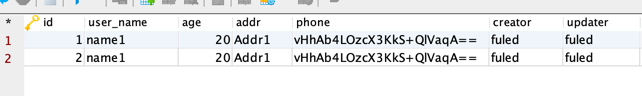

```java
   @TableField("user_name")
private String userName;
@TableField("user_name")
private String username;
private Integer age;
private String addr;
private EncryptColumn phone;

```
phone 字段写入是加密字段，读取的时候自动解密，byId.getPhone().getValue();获取原文

动态数据源组件，适用于应用链接多个数据源的情况，无需更改代码，只需要在具体的查询方法上打上
@DS注解指定使用的链接即可，底层使用苞米豆动态数据源组件