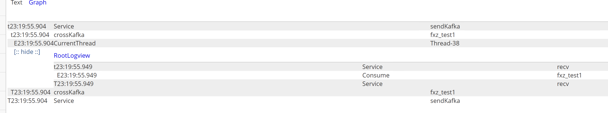

```log
2025-05-30 22:17:34.723 ||||fuled-example-dynamic-kafka[main] INFO  com.fxz.fuled.config.starter.nacos.property.NacosPropertySourceBuilder - get config from nacos server : dataId->fuled-example-dynamic-kafka,groupId->fuled-example-dynamic-kafka,result->null
2025-05-30 22:17:34.725 ||||fuled-example-dynamic-kafka[main] WARN  com.fxz.fuled.config.starter.nacos.property.NacosPropertySourceBuilder - Ignore the empty nacos configuration and get it based on dataId[fuled-example-dynamic-kafka] & group[fuled-example-dynamic-kafka]
2025-05-30 22:17:34.731 ||||fuled-example-dynamic-kafka[main] INFO  com.fxz.fuled.config.starter.nacos.property.NacosPropertySourceBuilder - get config from nacos server : dataId->fuled-example-dynamic-kafka.properties,groupId->fuled-example-dynamic-kafka,result->null
2025-05-30 22:17:34.731 ||||fuled-example-dynamic-kafka[main] WARN  com.fxz.fuled.config.starter.nacos.property.NacosPropertySourceBuilder - Ignore the empty nacos configuration and get it based on dataId[fuled-example-dynamic-kafka.properties] & group[fuled-example-dynamic-kafka]
2025-05-30 22:17:34.736 ||||fuled-example-dynamic-kafka[main] INFO  com.fxz.fuled.config.starter.nacos.property.NacosPropertySourceBuilder - get config from nacos server : dataId->application,groupId->fuled-example-dynamic-kafka,result->null
2025-05-30 22:17:34.737 ||||fuled-example-dynamic-kafka[main] WARN  com.fxz.fuled.config.starter.nacos.property.NacosPropertySourceBuilder - Ignore the empty nacos configuration and get it based on dataId[application] & group[fuled-example-dynamic-kafka]
2025-05-30 22:17:34.743 ||||fuled-example-dynamic-kafka[main] INFO  com.fxz.fuled.config.starter.nacos.property.NacosPropertySourceBuilder - get config from nacos server : dataId->application.properties,groupId->fuled-example-dynamic-kafka,result->spring.kafka.bootstrap-servers=192.168.10.201:9092
#global
#fuled.dynamic.kafka.global-config.key.serializer=org.apache.kafka.common.serialization.StringDeserializer
#fuled.dynamic.kafka.global-config.key.deserializer=org.apache.kafka.common.serialization.StringDeserializer
#fuled.dynamic.kafka.global-config.value.serializer=org.apache.kafka.common.serialization.StringDeserializer
#fuled.dynamic.kafka.global-config.value.deserializer=org.apache.kafka.common.serialization.StringDeserializer
#topic1
fuled.dynamic.kafka.config.topic1.enabled=true
fuled.dynamic.kafka.config.topic1.bootstrap-servers=192.168.10.201:9092
fuled.dynamic.kafka.config.topic1.name=topic1
fuled.dynamic.kafka.config.topic1.topics=fxz_test1
fuled.dynamic.kafka.config.topic1.concurrency=1
fuled.dynamic.kafka.config.topic1.group-id=GID_topic1
fuled.dynamic.kafka.config.topic1.listener-bean-name=batchMessageListener
#topic2
fuled.dynamic.kafka.config.topic2.enabled=true
fuled.dynamic.kafka.config.topic2.bootstrap-servers=192.168.10.201:9092
fuled.dynamic.kafka.config.topic2.name=topic2
fuled.dynamic.kafka.config.topic2.topics=fxz_test2
fuled.dynamic.kafka.config.topic2.concurrency=1
fuled.dynamic.kafka.config.topic2.group-id=GID_topic2
fuled.dynamic.kafka.config.topic2.listener-bean-name=batchMessageListener

2025-05-30 22:17:34.751 ||||fuled-example-dynamic-kafka[main] INFO  org.springframework.cloud.bootstrap.config.PropertySourceBootstrapConfiguration - Located property source: [BootstrapPropertySource {name='bootstrapProperties-systemProperties'}, BootstrapPropertySource {name='bootstrapProperties-nacos-rewritable-properties'}, BootstrapPropertySource {name='bootstrapProperties-application.properties,fuled-example-dynamic-kafka'}, BootstrapPropertySource {name='bootstrapProperties-application,fuled-example-dynamic-kafka'}, BootstrapPropertySource {name='bootstrapProperties-fuled-example-dynamic-kafka.properties,fuled-example-dynamic-kafka'}, BootstrapPropertySource {name='bootstrapProperties-fuled-example-dynamic-kafka,fuled-example-dynamic-kafka'}]
2025-05-30 22:17:34.756 ||||fuled-example-dynamic-kafka[main] INFO  com.fxz.fuled.config.starter.nacos.property.NacosPropertySourceBuilder - get config from nacos server : dataId->global.properties,groupId->base_arch,result->spring.cloud.sentinel.transport.dashboard=192.168.10.201:8858
spring.cloud.sentinel.datasource.nacos.nacos.rule-type=flow
spring.cloud.sentinel.datasource.nacos.nacos.server-addr=192.168.10.201
spring.cloud.sentinel.datasource.nacos.nacos.namespace=${env}
spring.cloud.sentinel.datasource.nacos.nacos.data-id=${spring.application.name}.sentinel.properties
spring.cloud.sentinel.eager=true
2025-05-30 22:17:34.757 ||||fuled-example-dynamic-kafka[main] INFO  com.fxz.fuled.base.arch.env.locator.BaseEnvSourceLocator - load config from nacos dataId->global complete
2025-05-30 22:17:34.762 ||||fuled-example-dynamic-kafka[main] INFO  com.fxz.fuled.config.starter.nacos.property.NacosPropertySourceBuilder - get config from nacos server : dataId->fuled-example-dynamic-kafka.properties,groupId->base_arch,result->null
2025-05-30 22:17:34.762 ||||fuled-example-dynamic-kafka[main] WARN  com.fxz.fuled.config.starter.nacos.property.NacosPropertySourceBuilder - Ignore the empty nacos configuration and get it based on dataId[fuled-example-dynamic-kafka.properties] & group[base_arch]
2025-05-30 22:17:34.762 ||||fuled-example-dynamic-kafka[main] INFO  com.fxz.fuled.base.arch.env.locator.BaseEnvSourceLocator - load config from nacos dataId->fuled-example-dynamic-kafka complete
2025-05-30 22:17:34.762 ||||fuled-example-dynamic-kafka[main] INFO  org.springframework.cloud.bootstrap.config.PropertySourceBootstrapConfiguration - Located property source: [BootstrapPropertySource {name='bootstrapProperties-fuled-example-dynamic-kafka.properties,base_arch'}, BootstrapPropertySource {name='bootstrapProperties-global.properties,base_arch'}]
2025-05-30 22:17:34.766 ||||fuled-example-dynamic-kafka[main] INFO  fuled.boot.example.dynamic.kafka.DynamicKafka - No active profile set, falling back to default profiles: default
2025-05-30 22:17:35.327 ||||fuled-example-dynamic-kafka[main] INFO  org.springframework.cloud.context.scope.GenericScope - BeanFactory id=6b174eb7-a1df-316a-a8f1-15d433d8eb4a
2025-05-30 22:17:35.482 ||||fuled-example-dynamic-kafka[main] INFO  org.springframework.context.support.PostProcessorRegistrationDelegate$BeanPostProcessorChecker - Bean 'spring.cloud.sentinel-com.alibaba.cloud.sentinel.SentinelProperties' of type [com.alibaba.cloud.sentinel.SentinelProperties] is not eligible for getting processed by all BeanPostProcessors (for example: not eligible for auto-proxying)
2025-05-30 22:17:35.531 ||||fuled-example-dynamic-kafka[main] INFO  org.springframework.context.support.PostProcessorRegistrationDelegate$BeanPostProcessorChecker - Bean 'com.alibaba.cloud.sentinel.custom.SentinelAutoConfiguration' of type [com.alibaba.cloud.sentinel.custom.SentinelAutoConfiguration] is not eligible for getting processed by all BeanPostProcessors (for example: not eligible for auto-proxying)
2025-05-30 22:17:35.724 ||||fuled-example-dynamic-kafka[main] INFO  org.springframework.boot.web.embedded.tomcat.TomcatWebServer - Tomcat initialized with port(s): 8080 (http)
2025-05-30 22:17:35.730 ||||fuled-example-dynamic-kafka[main] INFO  org.apache.coyote.http11.Http11NioProtocol - Initializing ProtocolHandler ["http-nio-8080"]
2025-05-30 22:17:35.731 ||||fuled-example-dynamic-kafka[main] INFO  org.apache.catalina.core.StandardService - Starting service [Tomcat]
2025-05-30 22:17:35.731 ||||fuled-example-dynamic-kafka[main] INFO  org.apache.catalina.core.StandardEngine - Starting Servlet engine: [Apache Tomcat/9.0.37]
2025-05-30 22:17:35.798 ||||fuled-example-dynamic-kafka[main] INFO  org.apache.catalina.core.ContainerBase.[Tomcat].[localhost].[/] - Initializing Spring embedded WebApplicationContext
2025-05-30 22:17:35.798 ||||fuled-example-dynamic-kafka[main] INFO  org.springframework.boot.web.servlet.context.ServletWebServerApplicationContext - Root WebApplicationContext: initialization completed in 1021 ms
2025-05-30 22:17:35.898 ||||fuled-example-dynamic-kafka[main] WARN  com.netflix.config.sources.URLConfigurationSource - No URLs will be polled as dynamic configuration sources.
2025-05-30 22:17:35.899 ||||fuled-example-dynamic-kafka[main] INFO  com.netflix.config.sources.URLConfigurationSource - To enable URLs as dynamic configuration sources, define System property archaius.configurationSource.additionalUrls or make config.properties available on classpath.
2025-05-30 22:17:35.901 ||||fuled-example-dynamic-kafka[main] WARN  com.netflix.config.sources.URLConfigurationSource - No URLs will be polled as dynamic configuration sources.
2025-05-30 22:17:35.901 ||||fuled-example-dynamic-kafka[main] INFO  com.netflix.config.sources.URLConfigurationSource - To enable URLs as dynamic configuration sources, define System property archaius.configurationSource.additionalUrls or make config.properties available on classpath.
2025-05-30 22:17:36.008 ||||fuled-example-dynamic-kafka[main] INFO  org.springframework.scheduling.concurrent.ThreadPoolTaskExecutor - Initializing ExecutorService 'applicationTaskExecutor'
2025-05-30 22:17:36.108 ||||fuled-example-dynamic-kafka[main] INFO  com.alibaba.cloud.sentinel.SentinelWebAutoConfiguration - [Sentinel Starter] register SentinelWebInterceptor with urlPatterns: [/**].
2025-05-30 22:17:36.173 ||||fuled-example-dynamic-kafka[main] INFO  com.fxz.fuled.common.chain.FilterConfig - Filter->LoadConfigFromDBPropFilter group->Dynamic_Kafka_Group order->0 enabled->true adding....
2025-05-30 22:17:36.173 ||||fuled-example-dynamic-kafka[main] INFO  com.fxz.fuled.common.chain.FilterConfig - Filter->LoadConfigFromDBPropFilter group->Dynamic_Kafka_Group order->0 enabled->true added
2025-05-30 22:17:36.173 ||||fuled-example-dynamic-kafka[main] INFO  com.fxz.fuled.common.chain.FilterConfig - Filter->InstanceSelectByTag group->nacosInstanceFilterGroup order->0 enabled->true adding....
2025-05-30 22:17:36.173 ||||fuled-example-dynamic-kafka[main] INFO  com.fxz.fuled.common.chain.FilterConfig - Filter->InstanceSelectByTag group->nacosInstanceFilterGroup order->0 enabled->true added
2025-05-30 22:17:36.173 ||||fuled-example-dynamic-kafka[main] INFO  com.fxz.fuled.common.chain.FilterConfig - Filter->InstanceWarmUpSelectBronTime group->nacosInstanceFilterGroup order->-10 enabled->true adding....
2025-05-30 22:17:36.173 ||||fuled-example-dynamic-kafka[main] INFO  com.fxz.fuled.common.chain.FilterConfig - Filter->InstanceWarmUpSelectBronTime group->nacosInstanceFilterGroup order->-10 enabled->true added
2025-05-30 22:17:36.184 ||||fuled-example-dynamic-kafka[main] INFO  org.springframework.scheduling.concurrent.ThreadPoolTaskScheduler - Initializing ExecutorService 'Nacos-Watch-Task-Scheduler'
2025-05-30 22:17:36.364 ||||fuled-example-dynamic-kafka[main] INFO  springfox.documentation.spring.web.PropertySourcedRequestMappingHandlerMapping - Mapped URL path [/v2/api-docs] onto method [springfox.documentation.swagger2.web.Swagger2Controller#getDocumentation(String, HttpServletRequest)]
2025-05-30 22:17:36.414 ||||fuled-example-dynamic-kafka[main] WARN  com.alibaba.cloud.sentinel.datasource.converter.SentinelConverter - converter can not convert rules because source is empty
2025-05-30 22:17:36.422 ||||fuled-example-dynamic-kafka[main] INFO  com.fxz.fuled.dynamic.kafka.manager.ConsumerManager - consumer container starting......... topic1
2025-05-30 22:17:36.456 ||||fuled-example-dynamic-kafka[main] INFO  org.apache.kafka.clients.consumer.ConsumerConfig - ConsumerConfig values: 
	allow.auto.create.topics = true
	auto.commit.interval.ms = 5000
	auto.offset.reset = latest
	bootstrap.servers = [192.168.10.201:9092]
	check.crcs = true
	client.dns.lookup = default
	client.id = 
	client.rack = 
	connections.max.idle.ms = 540000
	default.api.timeout.ms = 60000
	enable.auto.commit = false
	exclude.internal.topics = true
	fetch.max.bytes = 52428800
	fetch.max.wait.ms = 500
	fetch.min.bytes = 1
	group.id = GID_topic1
	group.instance.id = null
	heartbeat.interval.ms = 3000
	interceptor.classes = []
	internal.leave.group.on.close = true
	isolation.level = read_uncommitted
	key.deserializer = class org.apache.kafka.common.serialization.StringDeserializer
	max.partition.fetch.bytes = 1048576
	max.poll.interval.ms = 300000
	max.poll.records = 500
	metadata.max.age.ms = 300000
	metric.reporters = []
	metrics.num.samples = 2
	metrics.recording.level = INFO
	metrics.sample.window.ms = 30000
	partition.assignment.strategy = [class org.apache.kafka.clients.consumer.RangeAssignor]
	receive.buffer.bytes = 65536
	reconnect.backoff.max.ms = 1000
	reconnect.backoff.ms = 50
	request.timeout.ms = 30000
	retry.backoff.ms = 100
	sasl.client.callback.handler.class = null
	sasl.jaas.config = null
	sasl.kerberos.kinit.cmd = /usr/bin/kinit
	sasl.kerberos.min.time.before.relogin = 60000
	sasl.kerberos.service.name = null
	sasl.kerberos.ticket.renew.jitter = 0.05
	sasl.kerberos.ticket.renew.window.factor = 0.8
	sasl.login.callback.handler.class = null
	sasl.login.class = null
	sasl.login.refresh.buffer.seconds = 300
	sasl.login.refresh.min.period.seconds = 60
	sasl.login.refresh.window.factor = 0.8
	sasl.login.refresh.window.jitter = 0.05
	sasl.mechanism = GSSAPI
	security.protocol = PLAINTEXT
	security.providers = null
	send.buffer.bytes = 131072
	session.timeout.ms = 10000
	ssl.cipher.suites = null
	ssl.enabled.protocols = [TLSv1.2]
	ssl.endpoint.identification.algorithm = https
	ssl.key.password = null
	ssl.keymanager.algorithm = SunX509
	ssl.keystore.location = null
	ssl.keystore.password = null
	ssl.keystore.type = JKS
	ssl.protocol = TLSv1.2
	ssl.provider = null
	ssl.secure.random.implementation = null
	ssl.trustmanager.algorithm = PKIX
	ssl.truststore.location = null
	ssl.truststore.password = null
	ssl.truststore.type = JKS
	value.deserializer = class org.apache.kafka.common.serialization.StringDeserializer

2025-05-30 22:17:36.484 ||||fuled-example-dynamic-kafka[main] INFO  org.apache.kafka.common.utils.AppInfoParser - Kafka version: 2.5.0
2025-05-30 22:17:36.484 ||||fuled-example-dynamic-kafka[main] INFO  org.apache.kafka.common.utils.AppInfoParser - Kafka commitId: 66563e712b0b9f84
2025-05-30 22:17:36.484 ||||fuled-example-dynamic-kafka[main] INFO  org.apache.kafka.common.utils.AppInfoParser - Kafka startTimeMs: 1748614656484
2025-05-30 22:17:36.485 ||||fuled-example-dynamic-kafka[main] INFO  org.apache.kafka.clients.consumer.KafkaConsumer - [Consumer clientId=consumer-GID_topic1-1, groupId=GID_topic1] Subscribed to topic(s): fxz_test1
2025-05-30 22:17:36.489 ||||fuled-example-dynamic-kafka[main] INFO  org.springframework.scheduling.concurrent.ThreadPoolTaskScheduler - Initializing ExecutorService
2025-05-30 22:17:36.491 ||||fuled-example-dynamic-kafka[main] INFO  com.fxz.fuled.dynamic.kafka.manager.ConsumerManager - consumer container started name->topic1
2025-05-30 22:17:36.491 ||||fuled-example-dynamic-kafka[main] INFO  com.fxz.fuled.dynamic.kafka.manager.ConsumerManager - consumer container starting......... topic2
2025-05-30 22:17:36.493 ||||fuled-example-dynamic-kafka[main] INFO  org.apache.kafka.clients.consumer.ConsumerConfig - ConsumerConfig values: 
	allow.auto.create.topics = true
	auto.commit.interval.ms = 5000
	auto.offset.reset = latest
	bootstrap.servers = [192.168.10.201:9092]
	check.crcs = true
	client.dns.lookup = default
	client.id = 
	client.rack = 
	connections.max.idle.ms = 540000
	default.api.timeout.ms = 60000
	enable.auto.commit = false
	exclude.internal.topics = true
	fetch.max.bytes = 52428800
	fetch.max.wait.ms = 500
	fetch.min.bytes = 1
	group.id = GID_topic2
	group.instance.id = null
	heartbeat.interval.ms = 3000
	interceptor.classes = []
	internal.leave.group.on.close = true
	isolation.level = read_uncommitted
	key.deserializer = class org.apache.kafka.common.serialization.StringDeserializer
	max.partition.fetch.bytes = 1048576
	max.poll.interval.ms = 300000
	max.poll.records = 500
	metadata.max.age.ms = 300000
	metric.reporters = []
	metrics.num.samples = 2
	metrics.recording.level = INFO
	metrics.sample.window.ms = 30000
	partition.assignment.strategy = [class org.apache.kafka.clients.consumer.RangeAssignor]
	receive.buffer.bytes = 65536
	reconnect.backoff.max.ms = 1000
	reconnect.backoff.ms = 50
	request.timeout.ms = 30000
	retry.backoff.ms = 100
	sasl.client.callback.handler.class = null
	sasl.jaas.config = null
	sasl.kerberos.kinit.cmd = /usr/bin/kinit
	sasl.kerberos.min.time.before.relogin = 60000
	sasl.kerberos.service.name = null
	sasl.kerberos.ticket.renew.jitter = 0.05
	sasl.kerberos.ticket.renew.window.factor = 0.8
	sasl.login.callback.handler.class = null
	sasl.login.class = null
	sasl.login.refresh.buffer.seconds = 300
	sasl.login.refresh.min.period.seconds = 60
	sasl.login.refresh.window.factor = 0.8
	sasl.login.refresh.window.jitter = 0.05
	sasl.mechanism = GSSAPI
	security.protocol = PLAINTEXT
	security.providers = null
	send.buffer.bytes = 131072
	session.timeout.ms = 10000
	ssl.cipher.suites = null
	ssl.enabled.protocols = [TLSv1.2]
	ssl.endpoint.identification.algorithm = https
	ssl.key.password = null
	ssl.keymanager.algorithm = SunX509
	ssl.keystore.location = null
	ssl.keystore.password = null
	ssl.keystore.type = JKS
	ssl.protocol = TLSv1.2
	ssl.provider = null
	ssl.secure.random.implementation = null
	ssl.trustmanager.algorithm = PKIX
	ssl.truststore.location = null
	ssl.truststore.password = null
	ssl.truststore.type = JKS
	value.deserializer = class org.apache.kafka.common.serialization.StringDeserializer

2025-05-30 22:17:36.497 ||||fuled-example-dynamic-kafka[main] INFO  org.apache.kafka.common.utils.AppInfoParser - Kafka version: 2.5.0
2025-05-30 22:17:36.497 ||||fuled-example-dynamic-kafka[main] INFO  org.apache.kafka.common.utils.AppInfoParser - Kafka commitId: 66563e712b0b9f84
2025-05-30 22:17:36.497 ||||fuled-example-dynamic-kafka[main] INFO  org.apache.kafka.common.utils.AppInfoParser - Kafka startTimeMs: 1748614656497
2025-05-30 22:17:36.498 ||||fuled-example-dynamic-kafka[main] INFO  org.apache.kafka.clients.consumer.KafkaConsumer - [Consumer clientId=consumer-GID_topic2-2, groupId=GID_topic2] Subscribed to topic(s): fxz_test2
2025-05-30 22:17:36.498 ||||fuled-example-dynamic-kafka[main] INFO  org.springframework.scheduling.concurrent.ThreadPoolTaskScheduler - Initializing ExecutorService
2025-05-30 22:17:36.498 ||||fuled-example-dynamic-kafka[main] INFO  com.fxz.fuled.dynamic.kafka.manager.ConsumerManager - consumer container started name->topic2
2025-05-30 22:17:36.584 ||||fuled-example-dynamic-kafka[main] INFO  org.apache.coyote.http11.Http11NioProtocol - Starting ProtocolHandler ["http-nio-8080"]
2025-05-30 22:17:36.602 ||||fuled-example-dynamic-kafka[main] INFO  org.springframework.boot.web.embedded.tomcat.TomcatWebServer - Tomcat started on port(s): 8080 (http) with context path ''
2025-05-30 22:17:36.603 ||||fuled-example-dynamic-kafka[main] INFO  com.fxz.fuled.env.encryptor.starter.ApplicationEventListener - eventType->org.springframework.boot.web.servlet.context.ServletWebServerInitializedEvent
2025-05-30 22:17:36.613 ||||fuled-example-dynamic-kafka[main] INFO  com.alibaba.cloud.nacos.registry.NacosServiceRegistry - nacos registry, DEFAULT_GROUP fuled-example-dynamic-kafka 192.168.10.167:8080 register finished
2025-05-30 22:17:36.616 ||||fuled-example-dynamic-kafka[main] INFO  com.fxz.fuled.env.encryptor.starter.ApplicationEventListener - eventType->org.springframework.boot.web.servlet.context.ServletWebServerInitializedEvent
2025-05-30 22:17:36.616 ||||fuled-example-dynamic-kafka[main] INFO  springfox.documentation.spring.web.plugins.DocumentationPluginsBootstrapper - Context refreshed
2025-05-30 22:17:36.623 ||||fuled-example-dynamic-kafka[main] INFO  springfox.documentation.spring.web.plugins.DocumentationPluginsBootstrapper - Found 1 custom documentation plugin(s)
2025-05-30 22:17:36.645 ||||fuled-example-dynamic-kafka[topic1KafkaMessageListenerContainer-0-C-1] INFO  org.apache.kafka.clients.Metadata - [Consumer clientId=consumer-GID_topic1-1, groupId=GID_topic1] Cluster ID: 00qjyHGBRPKyKJmTr1bNNg
2025-05-30 22:17:36.645 ||||fuled-example-dynamic-kafka[topic2KafkaMessageListenerContainer-0-C-1] INFO  org.apache.kafka.clients.Metadata - [Consumer clientId=consumer-GID_topic2-2, groupId=GID_topic2] Cluster ID: 00qjyHGBRPKyKJmTr1bNNg
2025-05-30 22:17:36.646 ||||fuled-example-dynamic-kafka[topic2KafkaMessageListenerContainer-0-C-1] INFO  org.apache.kafka.clients.consumer.internals.AbstractCoordinator - [Consumer clientId=consumer-GID_topic2-2, groupId=GID_topic2] Discovered group coordinator 192.168.10.201:9092 (id: 2147482646 rack: null)
2025-05-30 22:17:36.646 ||||fuled-example-dynamic-kafka[topic1KafkaMessageListenerContainer-0-C-1] INFO  org.apache.kafka.clients.consumer.internals.AbstractCoordinator - [Consumer clientId=consumer-GID_topic1-1, groupId=GID_topic1] Discovered group coordinator 192.168.10.201:9092 (id: 2147482646 rack: null)
2025-05-30 22:17:36.647 ||||fuled-example-dynamic-kafka[main] INFO  springfox.documentation.spring.web.scanners.ApiListingReferenceScanner - Scanning for api listing references
2025-05-30 22:17:36.647 ||||fuled-example-dynamic-kafka[topic2KafkaMessageListenerContainer-0-C-1] INFO  org.apache.kafka.clients.consumer.internals.AbstractCoordinator - [Consumer clientId=consumer-GID_topic2-2, groupId=GID_topic2] (Re-)joining group
2025-05-30 22:17:36.647 ||||fuled-example-dynamic-kafka[topic1KafkaMessageListenerContainer-0-C-1] INFO  org.apache.kafka.clients.consumer.internals.AbstractCoordinator - [Consumer clientId=consumer-GID_topic1-1, groupId=GID_topic1] (Re-)joining group
2025-05-30 22:17:36.662 ||||fuled-example-dynamic-kafka[topic1KafkaMessageListenerContainer-0-C-1] INFO  org.apache.kafka.clients.consumer.internals.AbstractCoordinator - [Consumer clientId=consumer-GID_topic1-1, groupId=GID_topic1] Join group failed with org.apache.kafka.common.errors.MemberIdRequiredException: The group member needs to have a valid member id before actually entering a consumer group
2025-05-30 22:17:36.662 ||||fuled-example-dynamic-kafka[topic2KafkaMessageListenerContainer-0-C-1] INFO  org.apache.kafka.clients.consumer.internals.AbstractCoordinator - [Consumer clientId=consumer-GID_topic2-2, groupId=GID_topic2] Join group failed with org.apache.kafka.common.errors.MemberIdRequiredException: The group member needs to have a valid member id before actually entering a consumer group
2025-05-30 22:17:36.663 ||||fuled-example-dynamic-kafka[main] INFO  fuled.boot.example.dynamic.kafka.DynamicKafka - Started DynamicKafka in 2.699 seconds (JVM running for 3.223)
2025-05-30 22:17:36.663 ||||fuled-example-dynamic-kafka[topic2KafkaMessageListenerContainer-0-C-1] INFO  org.apache.kafka.clients.consumer.internals.AbstractCoordinator - [Consumer clientId=consumer-GID_topic2-2, groupId=GID_topic2] (Re-)joining group
2025-05-30 22:17:36.663 ||||fuled-example-dynamic-kafka[topic1KafkaMessageListenerContainer-0-C-1] INFO  org.apache.kafka.clients.consumer.internals.AbstractCoordinator - [Consumer clientId=consumer-GID_topic1-1, groupId=GID_topic1] (Re-)joining group
2025-05-30 22:17:36.668 ||||fuled-example-dynamic-kafka[Thread-32] INFO  org.apache.kafka.clients.producer.ProducerConfig - ProducerConfig values: 
	acks = 1
	batch.size = 16384
	bootstrap.servers = [192.168.10.201:9092]
	buffer.memory = 33554432
	client.dns.lookup = default
	client.id = producer-1
	compression.type = none
	connections.max.idle.ms = 540000
	delivery.timeout.ms = 120000
	enable.idempotence = false
	interceptor.classes = []
	key.serializer = class org.apache.kafka.common.serialization.StringSerializer
	linger.ms = 0
	max.block.ms = 60000
	max.in.flight.requests.per.connection = 5
	max.request.size = 1048576
	metadata.max.age.ms = 300000
	metadata.max.idle.ms = 300000
	metric.reporters = []
	metrics.num.samples = 2
	metrics.recording.level = INFO
	metrics.sample.window.ms = 30000
	partitioner.class = class org.apache.kafka.clients.producer.internals.DefaultPartitioner
	receive.buffer.bytes = 32768
	reconnect.backoff.max.ms = 1000
	reconnect.backoff.ms = 50
	request.timeout.ms = 30000
	retries = 2147483647
	retry.backoff.ms = 100
	sasl.client.callback.handler.class = null
	sasl.jaas.config = null
	sasl.kerberos.kinit.cmd = /usr/bin/kinit
	sasl.kerberos.min.time.before.relogin = 60000
	sasl.kerberos.service.name = null
	sasl.kerberos.ticket.renew.jitter = 0.05
	sasl.kerberos.ticket.renew.window.factor = 0.8
	sasl.login.callback.handler.class = null
	sasl.login.class = null
	sasl.login.refresh.buffer.seconds = 300
	sasl.login.refresh.min.period.seconds = 60
	sasl.login.refresh.window.factor = 0.8
	sasl.login.refresh.window.jitter = 0.05
	sasl.mechanism = GSSAPI
	security.protocol = PLAINTEXT
	security.providers = null
	send.buffer.bytes = 131072
	ssl.cipher.suites = null
	ssl.enabled.protocols = [TLSv1.2]
	ssl.endpoint.identification.algorithm = https
	ssl.key.password = null
	ssl.keymanager.algorithm = SunX509
	ssl.keystore.location = null
	ssl.keystore.password = null
	ssl.keystore.type = JKS
	ssl.protocol = TLSv1.2
	ssl.provider = null
	ssl.secure.random.implementation = null
	ssl.trustmanager.algorithm = PKIX
	ssl.truststore.location = null
	ssl.truststore.password = null
	ssl.truststore.type = JKS
	transaction.timeout.ms = 60000
	transactional.id = null
	value.serializer = class org.apache.kafka.common.serialization.StringSerializer

2025-05-30 22:17:36.670 ||||fuled-example-dynamic-kafka[topic1KafkaMessageListenerContainer-0-C-1] INFO  org.apache.kafka.clients.consumer.internals.ConsumerCoordinator - [Consumer clientId=consumer-GID_topic1-1, groupId=GID_topic1] Finished assignment for group at generation 71: {consumer-GID_topic1-1-364a8f5e-51f0-45bc-8a4e-5f3deb09c42a=Assignment(partitions=[fxz_test1-0, fxz_test1-1, fxz_test1-2, fxz_test1-3, fxz_test1-4, fxz_test1-5, fxz_test1-6, fxz_test1-7, fxz_test1-8, fxz_test1-9, fxz_test1-10, fxz_test1-11])}
2025-05-30 22:17:36.670 ||||fuled-example-dynamic-kafka[topic2KafkaMessageListenerContainer-0-C-1] INFO  org.apache.kafka.clients.consumer.internals.ConsumerCoordinator - [Consumer clientId=consumer-GID_topic2-2, groupId=GID_topic2] Finished assignment for group at generation 35: {consumer-GID_topic2-2-a578d925-b631-4cf5-aa73-afd2be11ab96=Assignment(partitions=[fxz_test2-0, fxz_test2-1, fxz_test2-2, fxz_test2-3, fxz_test2-4, fxz_test2-5, fxz_test2-6, fxz_test2-7, fxz_test2-8, fxz_test2-9, fxz_test2-10, fxz_test2-11])}
2025-05-30 22:17:36.679 ||||fuled-example-dynamic-kafka[Thread-32] INFO  org.apache.kafka.common.utils.AppInfoParser - Kafka version: 2.5.0
2025-05-30 22:17:36.680 ||||fuled-example-dynamic-kafka[Thread-32] INFO  org.apache.kafka.common.utils.AppInfoParser - Kafka commitId: 66563e712b0b9f84
2025-05-30 22:17:36.680 ||||fuled-example-dynamic-kafka[Thread-32] INFO  org.apache.kafka.common.utils.AppInfoParser - Kafka startTimeMs: 1748614656679
2025-05-30 22:17:36.821 ||||fuled-example-dynamic-kafka[topic2KafkaMessageListenerContainer-0-C-1] INFO  org.apache.kafka.clients.consumer.internals.AbstractCoordinator - [Consumer clientId=consumer-GID_topic2-2, groupId=GID_topic2] Successfully joined group with generation 35
2025-05-30 22:17:36.821 ||||fuled-example-dynamic-kafka[topic1KafkaMessageListenerContainer-0-C-1] INFO  org.apache.kafka.clients.consumer.internals.AbstractCoordinator - [Consumer clientId=consumer-GID_topic1-1, groupId=GID_topic1] Successfully joined group with generation 71
2025-05-30 22:17:36.824 ||||fuled-example-dynamic-kafka[topic2KafkaMessageListenerContainer-0-C-1] INFO  org.apache.kafka.clients.consumer.internals.ConsumerCoordinator - [Consumer clientId=consumer-GID_topic2-2, groupId=GID_topic2] Adding newly assigned partitions: fxz_test2-11, fxz_test2-2, fxz_test2-1, fxz_test2-0, fxz_test2-10, fxz_test2-9, fxz_test2-8, fxz_test2-7, fxz_test2-6, fxz_test2-5, fxz_test2-4, fxz_test2-3
2025-05-30 22:17:36.824 ||||fuled-example-dynamic-kafka[topic1KafkaMessageListenerContainer-0-C-1] INFO  org.apache.kafka.clients.consumer.internals.ConsumerCoordinator - [Consumer clientId=consumer-GID_topic1-1, groupId=GID_topic1] Adding newly assigned partitions: fxz_test1-11, fxz_test1-10, fxz_test1-1, fxz_test1-0, fxz_test1-9, fxz_test1-8, fxz_test1-7, fxz_test1-6, fxz_test1-5, fxz_test1-4, fxz_test1-3, fxz_test1-2
2025-05-30 22:17:36.830 ||||fuled-example-dynamic-kafka[kafka-producer-network-thread | producer-1] INFO  org.apache.kafka.clients.Metadata - [Producer clientId=producer-1] Cluster ID: 00qjyHGBRPKyKJmTr1bNNg
2025-05-30 22:17:36.833 ||||fuled-example-dynamic-kafka[topic1KafkaMessageListenerContainer-0-C-1] INFO  org.springframework.kafka.listener.ConcurrentMessageListenerContainer - GID_topic1: partitions assigned: [fxz_test1-11, fxz_test1-10, fxz_test1-1, fxz_test1-0, fxz_test1-9, fxz_test1-8, fxz_test1-7, fxz_test1-6, fxz_test1-5, fxz_test1-4, fxz_test1-3, fxz_test1-2]
2025-05-30 22:17:36.833 ||||fuled-example-dynamic-kafka[topic2KafkaMessageListenerContainer-0-C-1] INFO  org.springframework.kafka.listener.ConcurrentMessageListenerContainer - GID_topic2: partitions assigned: [fxz_test2-11, fxz_test2-2, fxz_test2-1, fxz_test2-0, fxz_test2-10, fxz_test2-9, fxz_test2-8, fxz_test2-7, fxz_test2-6, fxz_test2-5, fxz_test2-4, fxz_test2-3]
2025-05-30 22:17:36.843 ||||fuled-example-dynamic-kafka[topic1KafkaMessageListenerContainer-0-C-1] INFO  org.apache.kafka.clients.consumer.internals.ConsumerCoordinator - [Consumer clientId=consumer-GID_topic1-1, groupId=GID_topic1] Setting offset for partition fxz_test1-1 to the committed offset FetchPosition{offset=3575, offsetEpoch=Optional.empty, currentLeader=LeaderAndEpoch{leader=Optional[192.168.10.201:9092 (id: 1001 rack: null)], epoch=0}}
2025-05-30 22:17:36.843 ||||fuled-example-dynamic-kafka[topic2KafkaMessageListenerContainer-0-C-1] INFO  org.apache.kafka.clients.consumer.internals.ConsumerCoordinator - [Consumer clientId=consumer-GID_topic2-2, groupId=GID_topic2] Setting offset for partition fxz_test2-2 to the committed offset FetchPosition{offset=3419, offsetEpoch=Optional.empty, currentLeader=LeaderAndEpoch{leader=Optional[192.168.10.201:9092 (id: 1001 rack: null)], epoch=0}}
2025-05-30 22:17:36.843 ||||fuled-example-dynamic-kafka[topic1KafkaMessageListenerContainer-0-C-1] INFO  org.apache.kafka.clients.consumer.internals.ConsumerCoordinator - [Consumer clientId=consumer-GID_topic1-1, groupId=GID_topic1] Setting offset for partition fxz_test1-0 to the committed offset FetchPosition{offset=3614, offsetEpoch=Optional.empty, currentLeader=LeaderAndEpoch{leader=Optional[192.168.10.201:9092 (id: 1001 rack: null)], epoch=0}}
2025-05-30 22:17:36.843 ||||fuled-example-dynamic-kafka[topic2KafkaMessageListenerContainer-0-C-1] INFO  org.apache.kafka.clients.consumer.internals.ConsumerCoordinator - [Consumer clientId=consumer-GID_topic2-2, groupId=GID_topic2] Setting offset for partition fxz_test2-1 to the committed offset FetchPosition{offset=3587, offsetEpoch=Optional.empty, currentLeader=LeaderAndEpoch{leader=Optional[192.168.10.201:9092 (id: 1001 rack: null)], epoch=0}}
2025-05-30 22:17:36.843 ||||fuled-example-dynamic-kafka[topic1KafkaMessageListenerContainer-0-C-1] INFO  org.apache.kafka.clients.consumer.internals.ConsumerCoordinator - [Consumer clientId=consumer-GID_topic1-1, groupId=GID_topic1] Setting offset for partition fxz_test1-11 to the committed offset FetchPosition{offset=3553, offsetEpoch=Optional.empty, currentLeader=LeaderAndEpoch{leader=Optional[192.168.10.201:9092 (id: 1001 rack: null)], epoch=0}}
2025-05-30 22:17:36.843 ||||fuled-example-dynamic-kafka[topic2KafkaMessageListenerContainer-0-C-1] INFO  org.apache.kafka.clients.consumer.internals.ConsumerCoordinator - [Consumer clientId=consumer-GID_topic2-2, groupId=GID_topic2] Setting offset for partition fxz_test2-0 to the committed offset FetchPosition{offset=3579, offsetEpoch=Optional.empty, currentLeader=LeaderAndEpoch{leader=Optional[192.168.10.201:9092 (id: 1001 rack: null)], epoch=0}}
2025-05-30 22:17:36.843 ||||fuled-example-dynamic-kafka[topic1KafkaMessageListenerContainer-0-C-1] INFO  org.apache.kafka.clients.consumer.internals.ConsumerCoordinator - [Consumer clientId=consumer-GID_topic1-1, groupId=GID_topic1] Setting offset for partition fxz_test1-10 to the committed offset FetchPosition{offset=3494, offsetEpoch=Optional.empty, currentLeader=LeaderAndEpoch{leader=Optional[192.168.10.201:9092 (id: 1001 rack: null)], epoch=0}}
2025-05-30 22:17:36.843 ||||fuled-example-dynamic-kafka[topic2KafkaMessageListenerContainer-0-C-1] INFO  org.apache.kafka.clients.consumer.internals.ConsumerCoordinator - [Consumer clientId=consumer-GID_topic2-2, groupId=GID_topic2] Setting offset for partition fxz_test2-11 to the committed offset FetchPosition{offset=3620, offsetEpoch=Optional.empty, currentLeader=LeaderAndEpoch{leader=Optional[192.168.10.201:9092 (id: 1001 rack: null)], epoch=0}}
2025-05-30 22:17:36.843 ||||fuled-example-dynamic-kafka[topic1KafkaMessageListenerContainer-0-C-1] INFO  org.apache.kafka.clients.consumer.internals.ConsumerCoordinator - [Consumer clientId=consumer-GID_topic1-1, groupId=GID_topic1] Setting offset for partition fxz_test1-9 to the committed offset FetchPosition{offset=3525, offsetEpoch=Optional.empty, currentLeader=LeaderAndEpoch{leader=Optional[192.168.10.201:9092 (id: 1001 rack: null)], epoch=0}}
2025-05-30 22:17:36.843 ||||fuled-example-dynamic-kafka[topic1KafkaMessageListenerContainer-0-C-1] INFO  org.apache.kafka.clients.consumer.internals.ConsumerCoordinator - [Consumer clientId=consumer-GID_topic1-1, groupId=GID_topic1] Setting offset for partition fxz_test1-8 to the committed offset FetchPosition{offset=3508, offsetEpoch=Optional.empty, currentLeader=LeaderAndEpoch{leader=Optional[192.168.10.201:9092 (id: 1001 rack: null)], epoch=0}}
2025-05-30 22:17:36.843 ||||fuled-example-dynamic-kafka[topic2KafkaMessageListenerContainer-0-C-1] INFO  org.apache.kafka.clients.consumer.internals.ConsumerCoordinator - [Consumer clientId=consumer-GID_topic2-2, groupId=GID_topic2] Setting offset for partition fxz_test2-10 to the committed offset FetchPosition{offset=3580, offsetEpoch=Optional.empty, currentLeader=LeaderAndEpoch{leader=Optional[192.168.10.201:9092 (id: 1001 rack: null)], epoch=0}}
2025-05-30 22:17:36.843 ||||fuled-example-dynamic-kafka[topic1KafkaMessageListenerContainer-0-C-1] INFO  org.apache.kafka.clients.consumer.internals.ConsumerCoordinator - [Consumer clientId=consumer-GID_topic1-1, groupId=GID_topic1] Setting offset for partition fxz_test1-7 to the committed offset FetchPosition{offset=3578, offsetEpoch=Optional.empty, currentLeader=LeaderAndEpoch{leader=Optional[192.168.10.201:9092 (id: 1001 rack: null)], epoch=0}}
2025-05-30 22:17:36.843 ||||fuled-example-dynamic-kafka[topic2KafkaMessageListenerContainer-0-C-1] INFO  org.apache.kafka.clients.consumer.internals.ConsumerCoordinator - [Consumer clientId=consumer-GID_topic2-2, groupId=GID_topic2] Setting offset for partition fxz_test2-9 to the committed offset FetchPosition{offset=3487, offsetEpoch=Optional.empty, currentLeader=LeaderAndEpoch{leader=Optional[192.168.10.201:9092 (id: 1001 rack: null)], epoch=0}}
2025-05-30 22:17:36.843 ||||fuled-example-dynamic-kafka[topic1KafkaMessageListenerContainer-0-C-1] INFO  org.apache.kafka.clients.consumer.internals.ConsumerCoordinator - [Consumer clientId=consumer-GID_topic1-1, groupId=GID_topic1] Setting offset for partition fxz_test1-6 to the committed offset FetchPosition{offset=3798, offsetEpoch=Optional.empty, currentLeader=LeaderAndEpoch{leader=Optional[192.168.10.201:9092 (id: 1001 rack: null)], epoch=0}}
2025-05-30 22:17:36.843 ||||fuled-example-dynamic-kafka[topic2KafkaMessageListenerContainer-0-C-1] INFO  org.apache.kafka.clients.consumer.internals.ConsumerCoordinator - [Consumer clientId=consumer-GID_topic2-2, groupId=GID_topic2] Setting offset for partition fxz_test2-8 to the committed offset FetchPosition{offset=3566, offsetEpoch=Optional.empty, currentLeader=LeaderAndEpoch{leader=Optional[192.168.10.201:9092 (id: 1001 rack: null)], epoch=0}}
2025-05-30 22:17:36.843 ||||fuled-example-dynamic-kafka[topic1KafkaMessageListenerContainer-0-C-1] INFO  org.apache.kafka.clients.consumer.internals.ConsumerCoordinator - [Consumer clientId=consumer-GID_topic1-1, groupId=GID_topic1] Setting offset for partition fxz_test1-5 to the committed offset FetchPosition{offset=3660, offsetEpoch=Optional.empty, currentLeader=LeaderAndEpoch{leader=Optional[192.168.10.201:9092 (id: 1001 rack: null)], epoch=0}}
2025-05-30 22:17:36.843 ||||fuled-example-dynamic-kafka[topic2KafkaMessageListenerContainer-0-C-1] INFO  org.apache.kafka.clients.consumer.internals.ConsumerCoordinator - [Consumer clientId=consumer-GID_topic2-2, groupId=GID_topic2] Setting offset for partition fxz_test2-7 to the committed offset FetchPosition{offset=3622, offsetEpoch=Optional.empty, currentLeader=LeaderAndEpoch{leader=Optional[192.168.10.201:9092 (id: 1001 rack: null)], epoch=0}}
2025-05-30 22:17:36.843 ||||fuled-example-dynamic-kafka[topic1KafkaMessageListenerContainer-0-C-1] INFO  org.apache.kafka.clients.consumer.internals.ConsumerCoordinator - [Consumer clientId=consumer-GID_topic1-1, groupId=GID_topic1] Setting offset for partition fxz_test1-4 to the committed offset FetchPosition{offset=3598, offsetEpoch=Optional.empty, currentLeader=LeaderAndEpoch{leader=Optional[192.168.10.201:9092 (id: 1001 rack: null)], epoch=0}}
2025-05-30 22:17:36.843 ||||fuled-example-dynamic-kafka[topic2KafkaMessageListenerContainer-0-C-1] INFO  org.apache.kafka.clients.consumer.internals.ConsumerCoordinator - [Consumer clientId=consumer-GID_topic2-2, groupId=GID_topic2] Setting offset for partition fxz_test2-6 to the committed offset FetchPosition{offset=3590, offsetEpoch=Optional.empty, currentLeader=LeaderAndEpoch{leader=Optional[192.168.10.201:9092 (id: 1001 rack: null)], epoch=0}}
2025-05-30 22:17:36.843 ||||fuled-example-dynamic-kafka[topic1KafkaMessageListenerContainer-0-C-1] INFO  org.apache.kafka.clients.consumer.internals.ConsumerCoordinator - [Consumer clientId=consumer-GID_topic1-1, groupId=GID_topic1] Setting offset for partition fxz_test1-3 to the committed offset FetchPosition{offset=3412, offsetEpoch=Optional.empty, currentLeader=LeaderAndEpoch{leader=Optional[192.168.10.201:9092 (id: 1001 rack: null)], epoch=0}}
2025-05-30 22:17:36.844 ||||fuled-example-dynamic-kafka[topic1KafkaMessageListenerContainer-0-C-1] INFO  org.apache.kafka.clients.consumer.internals.ConsumerCoordinator - [Consumer clientId=consumer-GID_topic1-1, groupId=GID_topic1] Setting offset for partition fxz_test1-2 to the committed offset FetchPosition{offset=3521, offsetEpoch=Optional.empty, currentLeader=LeaderAndEpoch{leader=Optional[192.168.10.201:9092 (id: 1001 rack: null)], epoch=0}}
2025-05-30 22:17:36.844 ||||fuled-example-dynamic-kafka[topic2KafkaMessageListenerContainer-0-C-1] INFO  org.apache.kafka.clients.consumer.internals.ConsumerCoordinator - [Consumer clientId=consumer-GID_topic2-2, groupId=GID_topic2] Setting offset for partition fxz_test2-5 to the committed offset FetchPosition{offset=3473, offsetEpoch=Optional.empty, currentLeader=LeaderAndEpoch{leader=Optional[192.168.10.201:9092 (id: 1001 rack: null)], epoch=0}}
2025-05-30 22:17:36.844 ||||fuled-example-dynamic-kafka[topic2KafkaMessageListenerContainer-0-C-1] INFO  org.apache.kafka.clients.consumer.internals.ConsumerCoordinator - [Consumer clientId=consumer-GID_topic2-2, groupId=GID_topic2] Setting offset for partition fxz_test2-4 to the committed offset FetchPosition{offset=3585, offsetEpoch=Optional.empty, currentLeader=LeaderAndEpoch{leader=Optional[192.168.10.201:9092 (id: 1001 rack: null)], epoch=0}}
2025-05-30 22:17:36.844 ||||fuled-example-dynamic-kafka[topic2KafkaMessageListenerContainer-0-C-1] INFO  org.apache.kafka.clients.consumer.internals.ConsumerCoordinator - [Consumer clientId=consumer-GID_topic2-2, groupId=GID_topic2] Setting offset for partition fxz_test2-3 to the committed offset FetchPosition{offset=3516, offsetEpoch=Optional.empty, currentLeader=LeaderAndEpoch{leader=Optional[192.168.10.201:9092 (id: 1001 rack: null)], epoch=0}}
2025-05-30 22:17:36.858 ||||fuled-example-dynamic-kafka[Thread-32] INFO  fuled.boot.example.dynamic.kafka.DynamicKafka - send
2025-05-30 22:17:36.908 ||||fuled-example-dynamic-kafka[topic1KafkaMessageListenerContainer-0-C-1] INFO  fuled.boot.example.dynamic.kafka.listener.MessageListener - topic->fxz_test1,offset->3525,partition->9,data->1748614656665
2025-05-30 22:17:36.908 ||||fuled-example-dynamic-kafka[topic2KafkaMessageListenerContainer-0-C-1] INFO  fuled.boot.example.dynamic.kafka.listener.MessageListener - topic->fxz_test2,offset->3419,partition->2,data->1748527876672
2025-05-30 22:17:36.908 ||||fuled-example-dynamic-kafka[topic2KafkaMessageListenerContainer-0-C-1] INFO  fuled.boot.example.dynamic.kafka.listener.MessageListener - topic->fxz_test2,offset->3420,partition->2,data->1748527881211
2025-05-30 22:17:36.908 ||||fuled-example-dynamic-kafka[topic2KafkaMessageListenerContainer-0-C-1] INFO  fuled.boot.example.dynamic.kafka.listener.MessageListener - topic->fxz_test2,offset->3421,partition->2,data->1748527886248
2025-05-30 22:17:36.908 ||||fuled-example-dynamic-kafka[topic2KafkaMessageListenerContainer-0-C-1] INFO  fuled.boot.example.dynamic.kafka.listener.MessageListener - topic->fxz_test2,offset->3422,partition->2,data->1748527893316
2025-05-30 22:17:36.908 ||||fuled-example-dynamic-kafka[topic2KafkaMessageListenerContainer-0-C-1] INFO  fuled.boot.example.dynamic.kafka.listener.MessageListener - topic->fxz_test2,offset->3423,partition->2,data->1748527894328
2025-05-30 22:17:36.908 ||||fuled-example-dynamic-kafka[topic2KafkaMessageListenerContainer-0-C-1] INFO  fuled.boot.example.dynamic.kafka.listener.MessageListener - topic->fxz_test2,offset->3424,partition->2,data->1748527896848
2025-05-30 22:17:36.908 ||||fuled-example-dynamic-kafka[topic2KafkaMessageListenerContainer-0-C-1] INFO  fuled.boot.example.dynamic.kafka.listener.MessageListener - topic->fxz_test2,offset->3425,partition->2,data->1748527907449
2025-05-30 22:17:36.908 ||||fuled-example-dynamic-kafka[topic2KafkaMessageListenerContainer-0-C-1] INFO  fuled.boot.example.dynamic.kafka.listener.MessageListener - topic->fxz_test2,offset->3426,partition->2,data->1748558745387
2025-05-30 22:17:36.908 ||||fuled-example-dynamic-kafka[topic2KafkaMessageListenerContainer-0-C-1] INFO  fuled.boot.example.dynamic.kafka.listener.MessageListener - topic->fxz_test2,offset->3427,partition->2,data->1748558756463
2025-05-30 22:17:36.908 ||||fuled-example-dynamic-kafka[topic2KafkaMessageListenerContainer-0-C-1] INFO  fuled.boot.example.dynamic.kafka.listener.MessageListener - topic->fxz_test2,offset->3428,partition->2,data->1748558760996
2025-05-30 22:17:36.908 ||||fuled-example-dynamic-kafka[topic2KafkaMessageListenerContainer-0-C-1] INFO  fuled.boot.example.dynamic.kafka.listener.MessageListener - topic->fxz_test2,offset->3429,partition->2,data->1748559198655
2025-05-30 22:17:36.908 ||||fuled-example-dynamic-kafka[topic2KafkaMessageListenerContainer-0-C-1] INFO  fuled.boot.example.dynamic.kafka.listener.MessageListener - topic->fxz_test2,offset->3430,partition->2,data->1748559200170
2025-05-30 22:17:36.908 ||||fuled-example-dynamic-kafka[topic2KafkaMessageListenerContainer-0-C-1] INFO  fuled.boot.example.dynamic.kafka.listener.MessageListener - topic->fxz_test2,offset->3431,partition->2,data->1748559203696
2025-05-30 22:17:36.908 ||||fuled-example-dynamic-kafka[topic2KafkaMessageListenerContainer-0-C-1] INFO  fuled.boot.example.dynamic.kafka.listener.MessageListener - topic->fxz_test2,offset->3432,partition->2,data->1748614534086
2025-05-30 22:17:36.909 ||||fuled-example-dynamic-kafka[topic2KafkaMessageListenerContainer-0-C-1] INFO  fuled.boot.example.dynamic.kafka.listener.MessageListener - topic->fxz_test2,offset->3433,partition->2,data->1748614595236
2025-05-30 22:17:36.909 ||||fuled-example-dynamic-kafka[topic2KafkaMessageListenerContainer-0-C-1] INFO  fuled.boot.example.dynamic.kafka.listener.MessageListener - topic->fxz_test2,offset->3434,partition->2,data->1748614620372
2025-05-30 22:17:36.909 ||||fuled-example-dynamic-kafka[topic2KafkaMessageListenerContainer-0-C-1] INFO  fuled.boot.example.dynamic.kafka.listener.MessageListener - topic->fxz_test2,offset->3587,partition->1,data->1748527224032
2025-05-30 22:17:36.909 ||||fuled-example-dynamic-kafka[topic2KafkaMessageListenerContainer-0-C-1] INFO  fuled.boot.example.dynamic.kafka.listener.MessageListener - topic->fxz_test2,offset->3588,partition->1,data->1748527225548
2025-05-30 22:17:36.909 ||||fuled-example-dynamic-kafka[topic2KafkaMessageListenerContainer-0-C-1] INFO  fuled.boot.example.dynamic.kafka.listener.MessageListener - topic->fxz_test2,offset->3589,partition->1,data->1748527229580
2025-05-30 22:17:36.909 ||||fuled-example-dynamic-kafka[topic2KafkaMessageListenerContainer-0-C-1] INFO  fuled.boot.example.dynamic.kafka.listener.MessageListener - topic->fxz_test2,offset->3590,partition->1,data->1748527877175
2025-05-30 22:17:36.909 ||||fuled-example-dynamic-kafka[topic2KafkaMessageListenerContainer-0-C-1] INFO  fuled.boot.example.dynamic.kafka.listener.MessageListener - topic->fxz_test2,offset->3591,partition->1,data->1748527879188
2025-05-30 22:17:36.909 ||||fuled-example-dynamic-kafka[topic2KafkaMessageListenerContainer-0-C-1] INFO  fuled.boot.example.dynamic.kafka.listener.MessageListener - topic->fxz_test2,offset->3592,partition->1,data->1748527883223
2025-05-30 22:17:36.909 ||||fuled-example-dynamic-kafka[topic2KafkaMessageListenerContainer-0-C-1] INFO  fuled.boot.example.dynamic.kafka.listener.MessageListener - topic->fxz_test2,offset->3593,partition->1,data->1748527884735
2025-05-30 22:17:36.909 ||||fuled-example-dynamic-kafka[topic2KafkaMessageListenerContainer-0-C-1] INFO  fuled.boot.example.dynamic.kafka.listener.MessageListener - topic->fxz_test2,offset->3594,partition->1,data->1748527887766
2025-05-30 22:17:36.909 ||||fuled-example-dynamic-kafka[topic2KafkaMessageListenerContainer-0-C-1] INFO  fuled.boot.example.dynamic.kafka.listener.MessageListener - topic->fxz_test2,offset->3595,partition->1,data->1748527891300
2025-05-30 22:17:36.909 ||||fuled-example-dynamic-kafka[topic2KafkaMessageListenerContainer-0-C-1] INFO  fuled.boot.example.dynamic.kafka.listener.MessageListener - topic->fxz_test2,offset->3596,partition->1,data->1748527898366
2025-05-30 22:17:36.909 ||||fuled-example-dynamic-kafka[topic2KafkaMessageListenerContainer-0-C-1] INFO  fuled.boot.example.dynamic.kafka.listener.MessageListener - topic->fxz_test2,offset->3597,partition->1,data->1748527899377
2025-05-30 22:17:36.909 ||||fuled-example-dynamic-kafka[topic2KafkaMessageListenerContainer-0-C-1] INFO  fuled.boot.example.dynamic.kafka.listener.MessageListener - topic->fxz_test2,offset->3598,partition->1,data->1748527908960
2025-05-30 22:17:36.909 ||||fuled-example-dynamic-kafka[topic2KafkaMessageListenerContainer-0-C-1] INFO  fuled.boot.example.dynamic.kafka.listener.MessageListener - topic->fxz_test2,offset->3599,partition->1,data->1748558735288
2025-05-30 22:17:36.909 ||||fuled-example-dynamic-kafka[topic2KafkaMessageListenerContainer-0-C-1] INFO  fuled.boot.example.dynamic.kafka.listener.MessageListener - topic->fxz_test2,offset->3600,partition->1,data->1748558740344
2025-05-30 22:17:36.909 ||||fuled-example-dynamic-kafka[topic2KafkaMessageListenerContainer-0-C-1] INFO  fuled.boot.example.dynamic.kafka.listener.MessageListener - topic->fxz_test2,offset->3601,partition->1,data->1748558741355
2025-05-30 22:17:36.909 ||||fuled-example-dynamic-kafka[topic2KafkaMessageListenerContainer-0-C-1] INFO  fuled.boot.example.dynamic.kafka.listener.MessageListener - topic->fxz_test2,offset->3602,partition->1,data->1748558755452
2025-05-30 22:17:36.909 ||||fuled-example-dynamic-kafka[topic2KafkaMessageListenerContainer-0-C-1] INFO  fuled.boot.example.dynamic.kafka.listener.MessageListener - topic->fxz_test2,offset->3603,partition->1,data->1748558758987
2025-05-30 22:17:36.909 ||||fuled-example-dynamic-kafka[topic2KafkaMessageListenerContainer-0-C-1] INFO  fuled.boot.example.dynamic.kafka.listener.MessageListener - topic->fxz_test2,offset->3604,partition->1,data->1748558766042
2025-05-30 22:17:36.909 ||||fuled-example-dynamic-kafka[topic2KafkaMessageListenerContainer-0-C-1] INFO  fuled.boot.example.dynamic.kafka.listener.MessageListener - topic->fxz_test2,offset->3605,partition->1,data->1748558769572
2025-05-30 22:17:36.909 ||||fuled-example-dynamic-kafka[topic2KafkaMessageListenerContainer-0-C-1] INFO  fuled.boot.example.dynamic.kafka.listener.MessageListener - topic->fxz_test2,offset->3606,partition->1,data->1748558771089
2025-05-30 22:17:36.909 ||||fuled-example-dynamic-kafka[topic2KafkaMessageListenerContainer-0-C-1] INFO  fuled.boot.example.dynamic.kafka.listener.MessageListener - topic->fxz_test2,offset->3607,partition->1,data->1748614618370
2025-05-30 22:17:36.909 ||||fuled-example-dynamic-kafka[topic2KafkaMessageListenerContainer-0-C-1] INFO  fuled.boot.example.dynamic.kafka.listener.MessageListener - topic->fxz_test2,offset->3608,partition->1,data->1748614656841
2025-05-30 22:17:36.909 ||||fuled-example-dynamic-kafka[topic2KafkaMessageListenerContainer-0-C-1] INFO  fuled.boot.example.dynamic.kafka.listener.MessageListener - topic->fxz_test2,offset->3579,partition->0,data->1748527226049
2025-05-30 22:17:36.909 ||||fuled-example-dynamic-kafka[topic2KafkaMessageListenerContainer-0-C-1] INFO  fuled.boot.example.dynamic.kafka.listener.MessageListener - topic->fxz_test2,offset->3580,partition->0,data->1748527228066
2025-05-30 22:17:36.909 ||||fuled-example-dynamic-kafka[topic2KafkaMessageListenerContainer-0-C-1] INFO  fuled.boot.example.dynamic.kafka.listener.MessageListener - topic->fxz_test2,offset->3581,partition->0,data->1748527230587
2025-05-30 22:17:36.909 ||||fuled-example-dynamic-kafka[topic2KafkaMessageListenerContainer-0-C-1] INFO  fuled.boot.example.dynamic.kafka.listener.MessageListener - topic->fxz_test2,offset->3582,partition->0,data->1748527896343
2025-05-30 22:17:36.909 ||||fuled-example-dynamic-kafka[topic2KafkaMessageListenerContainer-0-C-1] INFO  fuled.boot.example.dynamic.kafka.listener.MessageListener - topic->fxz_test2,offset->3583,partition->0,data->1748527905935
2025-05-30 22:17:36.909 ||||fuled-example-dynamic-kafka[topic2KafkaMessageListenerContainer-0-C-1] INFO  fuled.boot.example.dynamic.kafka.listener.MessageListener - topic->fxz_test2,offset->3584,partition->0,data->1748527909967
2025-05-30 22:17:36.909 ||||fuled-example-dynamic-kafka[topic2KafkaMessageListenerContainer-0-C-1] INFO  fuled.boot.example.dynamic.kafka.listener.MessageListener - topic->fxz_test2,offset->3585,partition->0,data->1748558740850
2025-05-30 22:17:36.909 ||||fuled-example-dynamic-kafka[topic2KafkaMessageListenerContainer-0-C-1] INFO  fuled.boot.example.dynamic.kafka.listener.MessageListener - topic->fxz_test2,offset->3586,partition->0,data->1748558744886
2025-05-30 22:17:36.909 ||||fuled-example-dynamic-kafka[topic2KafkaMessageListenerContainer-0-C-1] INFO  fuled.boot.example.dynamic.kafka.listener.MessageListener - topic->fxz_test2,offset->3587,partition->0,data->1748558760495
2025-05-30 22:17:36.909 ||||fuled-example-dynamic-kafka[topic2KafkaMessageListenerContainer-0-C-1] INFO  fuled.boot.example.dynamic.kafka.listener.MessageListener - topic->fxz_test2,offset->3588,partition->0,data->1748558762513
2025-05-30 22:17:36.909 ||||fuled-example-dynamic-kafka[topic2KafkaMessageListenerContainer-0-C-1] INFO  fuled.boot.example.dynamic.kafka.listener.MessageListener - topic->fxz_test2,offset->3589,partition->0,data->1748558771594
2025-05-30 22:17:36.909 ||||fuled-example-dynamic-kafka[topic2KafkaMessageListenerContainer-0-C-1] INFO  fuled.boot.example.dynamic.kafka.listener.MessageListener - topic->fxz_test2,offset->3590,partition->0,data->1748559201177
2025-05-30 22:17:36.909 ||||fuled-example-dynamic-kafka[topic2KafkaMessageListenerContainer-0-C-1] INFO  fuled.boot.example.dynamic.kafka.listener.MessageListener - topic->fxz_test2,offset->3591,partition->0,data->1748614583151
2025-05-30 22:17:36.909 ||||fuled-example-dynamic-kafka[topic2KafkaMessageListenerContainer-0-C-1] INFO  fuled.boot.example.dynamic.kafka.listener.MessageListener - topic->fxz_test2,offset->3592,partition->0,data->1748614586193
2025-05-30 22:17:36.909 ||||fuled-example-dynamic-kafka[topic2KafkaMessageListenerContainer-0-C-1] INFO  fuled.boot.example.dynamic.kafka.listener.MessageListener - topic->fxz_test2,offset->3620,partition->11,data->1748527874146
2025-05-30 22:17:36.909 ||||fuled-example-dynamic-kafka[topic2KafkaMessageListenerContainer-0-C-1] INFO  fuled.boot.example.dynamic.kafka.listener.MessageListener - topic->fxz_test2,offset->3621,partition->11,data->1748527876166
2025-05-30 22:17:36.909 ||||fuled-example-dynamic-kafka[topic2KafkaMessageListenerContainer-0-C-1] INFO  fuled.boot.example.dynamic.kafka.listener.MessageListener - topic->fxz_test2,offset->3622,partition->11,data->1748527880200
2025-05-30 22:17:36.909 ||||fuled-example-dynamic-kafka[topic2KafkaMessageListenerContainer-0-C-1] INFO  fuled.boot.example.dynamic.kafka.listener.MessageListener - topic->fxz_test2,offset->3623,partition->11,data->1748527886754
2025-05-30 22:17:36.909 ||||fuled-example-dynamic-kafka[topic2KafkaMessageListenerContainer-0-C-1] INFO  fuled.boot.example.dynamic.kafka.listener.MessageListener - topic->fxz_test2,offset->3624,partition->11,data->1748527888272
2025-05-30 22:17:36.909 ||||fuled-example-dynamic-kafka[topic2KafkaMessageListenerContainer-0-C-1] INFO  fuled.boot.example.dynamic.kafka.listener.MessageListener - topic->fxz_test2,offset->3625,partition->11,data->1748527889783
2025-05-30 22:17:36.909 ||||fuled-example-dynamic-kafka[topic2KafkaMessageListenerContainer-0-C-1] INFO  fuled.boot.example.dynamic.kafka.listener.MessageListener - topic->fxz_test2,offset->3626,partition->11,data->1748527900386
2025-05-30 22:17:36.909 ||||fuled-example-dynamic-kafka[topic2KafkaMessageListenerContainer-0-C-1] INFO  fuled.boot.example.dynamic.kafka.listener.MessageListener - topic->fxz_test2,offset->3627,partition->11,data->1748527903912
2025-05-30 22:17:36.909 ||||fuled-example-dynamic-kafka[topic2KafkaMessageListenerContainer-0-C-1] INFO  fuled.boot.example.dynamic.kafka.listener.MessageListener - topic->fxz_test2,offset->3628,partition->11,data->1748527909461
2025-05-30 22:17:36.909 ||||fuled-example-dynamic-kafka[topic2KafkaMessageListenerContainer-0-C-1] INFO  fuled.boot.example.dynamic.kafka.listener.MessageListener - topic->fxz_test2,offset->3629,partition->11,data->1748558736312
2025-05-30 22:17:36.910 ||||fuled-example-dynamic-kafka[topic2KafkaMessageListenerContainer-0-C-1] INFO  fuled.boot.example.dynamic.kafka.listener.MessageListener - topic->fxz_test2,offset->3630,partition->11,data->1748558742366
2025-05-30 22:17:36.910 ||||fuled-example-dynamic-kafka[topic2KafkaMessageListenerContainer-0-C-1] INFO  fuled.boot.example.dynamic.kafka.listener.MessageListener - topic->fxz_test2,offset->3631,partition->11,data->1748558746393
2025-05-30 22:17:36.910 ||||fuled-example-dynamic-kafka[topic2KafkaMessageListenerContainer-0-C-1] INFO  fuled.boot.example.dynamic.kafka.listener.MessageListener - topic->fxz_test2,offset->3632,partition->11,data->1748558749914
2025-05-30 22:17:36.910 ||||fuled-example-dynamic-kafka[topic2KafkaMessageListenerContainer-0-C-1] INFO  fuled.boot.example.dynamic.kafka.listener.MessageListener - topic->fxz_test2,offset->3633,partition->11,data->1748558763523
2025-05-30 22:17:36.910 ||||fuled-example-dynamic-kafka[topic2KafkaMessageListenerContainer-0-C-1] INFO  fuled.boot.example.dynamic.kafka.listener.MessageListener - topic->fxz_test2,offset->3634,partition->11,data->1748558768058
2025-05-30 22:17:36.910 ||||fuled-example-dynamic-kafka[topic2KafkaMessageListenerContainer-0-C-1] INFO  fuled.boot.example.dynamic.kafka.listener.MessageListener - topic->fxz_test2,offset->3635,partition->11,data->1748558770583
2025-05-30 22:17:36.910 ||||fuled-example-dynamic-kafka[topic2KafkaMessageListenerContainer-0-C-1] INFO  fuled.boot.example.dynamic.kafka.listener.MessageListener - topic->fxz_test2,offset->3636,partition->11,data->1748559202186
2025-05-30 22:17:36.910 ||||fuled-example-dynamic-kafka[topic2KafkaMessageListenerContainer-0-C-1] INFO  fuled.boot.example.dynamic.kafka.listener.MessageListener - topic->fxz_test2,offset->3637,partition->11,data->1748559203192
2025-05-30 22:17:36.910 ||||fuled-example-dynamic-kafka[topic2KafkaMessageListenerContainer-0-C-1] INFO  fuled.boot.example.dynamic.kafka.listener.MessageListener - topic->fxz_test2,offset->3638,partition->11,data->1748559204202
2025-05-30 22:17:36.910 ||||fuled-example-dynamic-kafka[topic2KafkaMessageListenerContainer-0-C-1] INFO  fuled.boot.example.dynamic.kafka.listener.MessageListener - topic->fxz_test2,offset->3639,partition->11,data->1748614589206
2025-05-30 22:17:36.910 ||||fuled-example-dynamic-kafka[topic2KafkaMessageListenerContainer-0-C-1] INFO  fuled.boot.example.dynamic.kafka.listener.MessageListener - topic->fxz_test2,offset->3640,partition->11,data->1748614591213
2025-05-30 22:17:36.910 ||||fuled-example-dynamic-kafka[topic2KafkaMessageListenerContainer-0-C-1] INFO  fuled.boot.example.dynamic.kafka.listener.MessageListener - topic->fxz_test2,offset->3641,partition->11,data->1748614616358
2025-05-30 22:17:36.910 ||||fuled-example-dynamic-kafka[topic2KafkaMessageListenerContainer-0-C-1] INFO  fuled.boot.example.dynamic.kafka.listener.MessageListener - topic->fxz_test2,offset->3642,partition->11,data->1748614621378
2025-05-30 22:17:36.910 ||||fuled-example-dynamic-kafka[topic2KafkaMessageListenerContainer-0-C-1] INFO  fuled.boot.example.dynamic.kafka.listener.MessageListener - topic->fxz_test2,offset->3580,partition->10,data->1748527224537
2025-05-30 22:17:36.910 ||||fuled-example-dynamic-kafka[topic2KafkaMessageListenerContainer-0-C-1] INFO  fuled.boot.example.dynamic.kafka.listener.MessageListener - topic->fxz_test2,offset->3581,partition->10,data->1748527227061
2025-05-30 22:17:36.910 ||||fuled-example-dynamic-kafka[topic2KafkaMessageListenerContainer-0-C-1] INFO  fuled.boot.example.dynamic.kafka.listener.MessageListener - topic->fxz_test2,offset->3582,partition->10,data->1748527873640
2025-05-30 22:17:36.910 ||||fuled-example-dynamic-kafka[topic2KafkaMessageListenerContainer-0-C-1] INFO  fuled.boot.example.dynamic.kafka.listener.MessageListener - topic->fxz_test2,offset->3583,partition->10,data->1748527875663
2025-05-30 22:17:36.910 ||||fuled-example-dynamic-kafka[topic2KafkaMessageListenerContainer-0-C-1] INFO  fuled.boot.example.dynamic.kafka.listener.MessageListener - topic->fxz_test2,offset->3584,partition->10,data->1748527879694
2025-05-30 22:17:36.910 ||||fuled-example-dynamic-kafka[topic2KafkaMessageListenerContainer-0-C-1] INFO  fuled.boot.example.dynamic.kafka.listener.MessageListener - topic->fxz_test2,offset->3585,partition->10,data->1748527885241
2025-05-30 22:17:36.910 ||||fuled-example-dynamic-kafka[topic2KafkaMessageListenerContainer-0-C-1] INFO  fuled.boot.example.dynamic.kafka.listener.MessageListener - topic->fxz_test2,offset->3586,partition->10,data->1748527891805
2025-05-30 22:17:36.910 ||||fuled-example-dynamic-kafka[topic2KafkaMessageListenerContainer-0-C-1] INFO  fuled.boot.example.dynamic.kafka.listener.MessageListener - topic->fxz_test2,offset->3587,partition->10,data->1748527897860
2025-05-30 22:17:36.910 ||||fuled-example-dynamic-kafka[topic2KafkaMessageListenerContainer-0-C-1] INFO  fuled.boot.example.dynamic.kafka.listener.MessageListener - topic->fxz_test2,offset->3588,partition->10,data->1748527903411
2025-05-30 22:17:36.910 ||||fuled-example-dynamic-kafka[topic2KafkaMessageListenerContainer-0-C-1] INFO  fuled.boot.example.dynamic.kafka.listener.MessageListener - topic->fxz_test2,offset->3589,partition->10,data->1748558743876
2025-05-30 22:17:36.910 ||||fuled-example-dynamic-kafka[topic2KafkaMessageListenerContainer-0-C-1] INFO  fuled.boot.example.dynamic.kafka.listener.MessageListener - topic->fxz_test2,offset->3590,partition->10,data->1748558751927
2025-05-30 22:17:36.910 ||||fuled-example-dynamic-kafka[topic2KafkaMessageListenerContainer-0-C-1] INFO  fuled.boot.example.dynamic.kafka.listener.MessageListener - topic->fxz_test2,offset->3591,partition->10,data->1748558754946
2025-05-30 22:17:36.910 ||||fuled-example-dynamic-kafka[topic2KafkaMessageListenerContainer-0-C-1] INFO  fuled.boot.example.dynamic.kafka.listener.MessageListener - topic->fxz_test2,offset->3592,partition->10,data->1748558759994
2025-05-30 22:17:36.910 ||||fuled-example-dynamic-kafka[topic2KafkaMessageListenerContainer-0-C-1] INFO  fuled.boot.example.dynamic.kafka.listener.MessageListener - topic->fxz_test2,offset->3593,partition->10,data->1748558762007
2025-05-30 22:17:36.910 ||||fuled-example-dynamic-kafka[topic2KafkaMessageListenerContainer-0-C-1] INFO  fuled.boot.example.dynamic.kafka.listener.MessageListener - topic->fxz_test2,offset->3594,partition->10,data->1748558767052
2025-05-30 22:17:36.910 ||||fuled-example-dynamic-kafka[topic2KafkaMessageListenerContainer-0-C-1] INFO  fuled.boot.example.dynamic.kafka.listener.MessageListener - topic->fxz_test2,offset->3595,partition->10,data->1748558770078
2025-05-30 22:17:36.910 ||||fuled-example-dynamic-kafka[topic2KafkaMessageListenerContainer-0-C-1] INFO  fuled.boot.example.dynamic.kafka.listener.MessageListener - topic->fxz_test2,offset->3596,partition->10,data->1748614594230
2025-05-30 22:17:36.910 ||||fuled-example-dynamic-kafka[topic2KafkaMessageListenerContainer-0-C-1] INFO  fuled.boot.example.dynamic.kafka.listener.MessageListener - topic->fxz_test2,offset->3487,partition->9,data->1748527231088
2025-05-30 22:17:36.910 ||||fuled-example-dynamic-kafka[topic2KafkaMessageListenerContainer-0-C-1] INFO  fuled.boot.example.dynamic.kafka.listener.MessageListener - topic->fxz_test2,offset->3488,partition->9,data->1748527875158
2025-05-30 22:17:36.910 ||||fuled-example-dynamic-kafka[topic2KafkaMessageListenerContainer-0-C-1] INFO  fuled.boot.example.dynamic.kafka.listener.MessageListener - topic->fxz_test2,offset->3489,partition->9,data->1748527877676
2025-05-30 22:17:36.910 ||||fuled-example-dynamic-kafka[topic2KafkaMessageListenerContainer-0-C-1] INFO  fuled.boot.example.dynamic.kafka.listener.MessageListener - topic->fxz_test2,offset->3490,partition->9,data->1748527884231
2025-05-30 22:17:36.910 ||||fuled-example-dynamic-kafka[topic2KafkaMessageListenerContainer-0-C-1] INFO  fuled.boot.example.dynamic.kafka.listener.MessageListener - topic->fxz_test2,offset->3491,partition->9,data->1748527892307
2025-05-30 22:17:36.910 ||||fuled-example-dynamic-kafka[topic2KafkaMessageListenerContainer-0-C-1] INFO  fuled.boot.example.dynamic.kafka.listener.MessageListener - topic->fxz_test2,offset->3492,partition->9,data->1748527895335
2025-05-30 22:17:36.910 ||||fuled-example-dynamic-kafka[topic2KafkaMessageListenerContainer-0-C-1] INFO  fuled.boot.example.dynamic.kafka.listener.MessageListener - topic->fxz_test2,offset->3493,partition->9,data->1748527898872
2025-05-30 22:17:36.910 ||||fuled-example-dynamic-kafka[topic2KafkaMessageListenerContainer-0-C-1] INFO  fuled.boot.example.dynamic.kafka.listener.MessageListener - topic->fxz_test2,offset->3494,partition->9,data->1748527907955
2025-05-30 22:17:36.910 ||||fuled-example-dynamic-kafka[topic2KafkaMessageListenerContainer-0-C-1] INFO  fuled.boot.example.dynamic.kafka.listener.MessageListener - topic->fxz_test2,offset->3495,partition->9,data->1748558737829
2025-05-30 22:17:36.910 ||||fuled-example-dynamic-kafka[topic2KafkaMessageListenerContainer-0-C-1] INFO  fuled.boot.example.dynamic.kafka.listener.MessageListener - topic->fxz_test2,offset->3496,partition->9,data->1748558739338
2025-05-30 22:17:36.910 ||||fuled-example-dynamic-kafka[topic2KafkaMessageListenerContainer-0-C-1] INFO  fuled.boot.example.dynamic.kafka.listener.MessageListener - topic->fxz_test2,offset->3497,partition->9,data->1748558761502
2025-05-30 22:17:36.910 ||||fuled-example-dynamic-kafka[topic2KafkaMessageListenerContainer-0-C-1] INFO  fuled.boot.example.dynamic.kafka.listener.MessageListener - topic->fxz_test2,offset->3498,partition->9,data->1748558763018
2025-05-30 22:17:36.910 ||||fuled-example-dynamic-kafka[topic2KafkaMessageListenerContainer-0-C-1] INFO  fuled.boot.example.dynamic.kafka.listener.MessageListener - topic->fxz_test2,offset->3499,partition->9,data->1748559201684
2025-05-30 22:17:36.910 ||||fuled-example-dynamic-kafka[topic2KafkaMessageListenerContainer-0-C-1] INFO  fuled.boot.example.dynamic.kafka.listener.MessageListener - topic->fxz_test2,offset->3500,partition->9,data->1748614529048
2025-05-30 22:17:36.910 ||||fuled-example-dynamic-kafka[topic2KafkaMessageListenerContainer-0-C-1] INFO  fuled.boot.example.dynamic.kafka.listener.MessageListener - topic->fxz_test2,offset->3501,partition->9,data->1748614588199
2025-05-30 22:17:36.910 ||||fuled-example-dynamic-kafka[topic2KafkaMessageListenerContainer-0-C-1] INFO  fuled.boot.example.dynamic.kafka.listener.MessageListener - topic->fxz_test2,offset->3566,partition->8,data->1748527873119
2025-05-30 22:17:36.910 ||||fuled-example-dynamic-kafka[topic2KafkaMessageListenerContainer-0-C-1] INFO  fuled.boot.example.dynamic.kafka.listener.MessageListener - topic->fxz_test2,offset->3567,partition->8,data->1748527878178
2025-05-30 22:17:36.910 ||||fuled-example-dynamic-kafka[topic2KafkaMessageListenerContainer-0-C-1] INFO  fuled.boot.example.dynamic.kafka.listener.MessageListener - topic->fxz_test2,offset->3568,partition->8,data->1748527882215
2025-05-30 22:17:36.910 ||||fuled-example-dynamic-kafka[topic2KafkaMessageListenerContainer-0-C-1] INFO  fuled.boot.example.dynamic.kafka.listener.MessageListener - topic->fxz_test2,offset->3569,partition->8,data->1748527890288
2025-05-30 22:17:36.910 ||||fuled-example-dynamic-kafka[topic2KafkaMessageListenerContainer-0-C-1] INFO  fuled.boot.example.dynamic.kafka.listener.MessageListener - topic->fxz_test2,offset->3570,partition->8,data->1748527893822
2025-05-30 22:17:36.910 ||||fuled-example-dynamic-kafka[topic2KafkaMessageListenerContainer-0-C-1] INFO  fuled.boot.example.dynamic.kafka.listener.MessageListener - topic->fxz_test2,offset->3571,partition->8,data->1748527895841
2025-05-30 22:17:36.910 ||||fuled-example-dynamic-kafka[topic2KafkaMessageListenerContainer-0-C-1] INFO  fuled.boot.example.dynamic.kafka.listener.MessageListener - topic->fxz_test2,offset->3572,partition->8,data->1748558735806
2025-05-30 22:17:36.911 ||||fuled-example-dynamic-kafka[topic2KafkaMessageListenerContainer-0-C-1] INFO  fuled.boot.example.dynamic.kafka.listener.MessageListener - topic->fxz_test2,offset->3573,partition->8,data->1748558742871
2025-05-30 22:17:36.911 ||||fuled-example-dynamic-kafka[topic2KafkaMessageListenerContainer-0-C-1] INFO  fuled.boot.example.dynamic.kafka.listener.MessageListener - topic->fxz_test2,offset->3574,partition->8,data->1748558746894
2025-05-30 22:17:36.911 ||||fuled-example-dynamic-kafka[topic2KafkaMessageListenerContainer-0-C-1] INFO  fuled.boot.example.dynamic.kafka.listener.MessageListener - topic->fxz_test2,offset->3575,partition->8,data->1748558748905
2025-05-30 22:17:36.911 ||||fuled-example-dynamic-kafka[topic2KafkaMessageListenerContainer-0-C-1] INFO  fuled.boot.example.dynamic.kafka.listener.MessageListener - topic->fxz_test2,offset->3576,partition->8,data->1748558764530
2025-05-30 22:17:36.911 ||||fuled-example-dynamic-kafka[topic2KafkaMessageListenerContainer-0-C-1] INFO  fuled.boot.example.dynamic.kafka.listener.MessageListener - topic->fxz_test2,offset->3577,partition->8,data->1748558766546
2025-05-30 22:17:36.911 ||||fuled-example-dynamic-kafka[topic2KafkaMessageListenerContainer-0-C-1] INFO  fuled.boot.example.dynamic.kafka.listener.MessageListener - topic->fxz_test2,offset->3578,partition->8,data->1748559198121
2025-05-30 22:17:36.911 ||||fuled-example-dynamic-kafka[topic2KafkaMessageListenerContainer-0-C-1] INFO  fuled.boot.example.dynamic.kafka.listener.MessageListener - topic->fxz_test2,offset->3579,partition->8,data->1748559205714
2025-05-30 22:17:36.911 ||||fuled-example-dynamic-kafka[topic2KafkaMessageListenerContainer-0-C-1] INFO  fuled.boot.example.dynamic.kafka.listener.MessageListener - topic->fxz_test2,offset->3580,partition->8,data->1748614536097
2025-05-30 22:17:36.911 ||||fuled-example-dynamic-kafka[topic2KafkaMessageListenerContainer-0-C-1] INFO  fuled.boot.example.dynamic.kafka.listener.MessageListener - topic->fxz_test2,offset->3622,partition->7,data->1748527225042
2025-05-30 22:17:36.911 ||||fuled-example-dynamic-kafka[topic2KafkaMessageListenerContainer-0-C-1] INFO  fuled.boot.example.dynamic.kafka.listener.MessageListener - topic->fxz_test2,offset->3623,partition->7,data->1748527226555
2025-05-30 22:17:36.911 ||||fuled-example-dynamic-kafka[topic2KafkaMessageListenerContainer-0-C-1] INFO  fuled.boot.example.dynamic.kafka.listener.MessageListener - topic->fxz_test2,offset->3624,partition->7,data->1748527228572
2025-05-30 22:17:36.911 ||||fuled-example-dynamic-kafka[topic2KafkaMessageListenerContainer-0-C-1] INFO  fuled.boot.example.dynamic.kafka.listener.MessageListener - topic->fxz_test2,offset->3625,partition->7,data->1748527874652
2025-05-30 22:17:36.911 ||||fuled-example-dynamic-kafka[topic2KafkaMessageListenerContainer-0-C-1] INFO  fuled.boot.example.dynamic.kafka.listener.MessageListener - topic->fxz_test2,offset->3626,partition->7,data->1748527883728
2025-05-30 22:17:36.911 ||||fuled-example-dynamic-kafka[topic2KafkaMessageListenerContainer-0-C-1] INFO  fuled.boot.example.dynamic.kafka.listener.MessageListener - topic->fxz_test2,offset->3627,partition->7,data->1748527885743
2025-05-30 22:17:36.911 ||||fuled-example-dynamic-kafka[topic2KafkaMessageListenerContainer-0-C-1] INFO  fuled.boot.example.dynamic.kafka.listener.MessageListener - topic->fxz_test2,offset->3628,partition->7,data->1748527888778
2025-05-30 22:17:36.911 ||||fuled-example-dynamic-kafka[topic2KafkaMessageListenerContainer-0-C-1] INFO  fuled.boot.example.dynamic.kafka.listener.MessageListener - topic->fxz_test2,offset->3629,partition->7,data->1748527890794
2025-05-30 22:17:36.911 ||||fuled-example-dynamic-kafka[topic2KafkaMessageListenerContainer-0-C-1] INFO  fuled.boot.example.dynamic.kafka.listener.MessageListener - topic->fxz_test2,offset->3630,partition->7,data->1748527892813
2025-05-30 22:17:36.911 ||||fuled-example-dynamic-kafka[topic2KafkaMessageListenerContainer-0-C-1] INFO  fuled.boot.example.dynamic.kafka.listener.MessageListener - topic->fxz_test2,offset->3631,partition->7,data->1748527897354
2025-05-30 22:17:36.911 ||||fuled-example-dynamic-kafka[topic2KafkaMessageListenerContainer-0-C-1] INFO  fuled.boot.example.dynamic.kafka.listener.MessageListener - topic->fxz_test2,offset->3632,partition->7,data->1748527901392
2025-05-30 22:17:36.911 ||||fuled-example-dynamic-kafka[topic2KafkaMessageListenerContainer-0-C-1] INFO  fuled.boot.example.dynamic.kafka.listener.MessageListener - topic->fxz_test2,offset->3633,partition->7,data->1748527902399
2025-05-30 22:17:36.911 ||||fuled-example-dynamic-kafka[topic2KafkaMessageListenerContainer-0-C-1] INFO  fuled.boot.example.dynamic.kafka.listener.MessageListener - topic->fxz_test2,offset->3634,partition->7,data->1748527906946
2025-05-30 22:17:36.911 ||||fuled-example-dynamic-kafka[topic2KafkaMessageListenerContainer-0-C-1] INFO  fuled.boot.example.dynamic.kafka.listener.MessageListener - topic->fxz_test2,offset->3635,partition->7,data->1748527908455
2025-05-30 22:17:36.911 ||||fuled-example-dynamic-kafka[topic2KafkaMessageListenerContainer-0-C-1] INFO  fuled.boot.example.dynamic.kafka.listener.MessageListener - topic->fxz_test2,offset->3636,partition->7,data->1748558741860
2025-05-30 22:17:36.911 ||||fuled-example-dynamic-kafka[topic2KafkaMessageListenerContainer-0-C-1] INFO  fuled.boot.example.dynamic.kafka.listener.MessageListener - topic->fxz_test2,offset->3637,partition->7,data->1748558745889
2025-05-30 22:17:36.911 ||||fuled-example-dynamic-kafka[topic2KafkaMessageListenerContainer-0-C-1] INFO  fuled.boot.example.dynamic.kafka.listener.MessageListener - topic->fxz_test2,offset->3638,partition->7,data->1748558747397
2025-05-30 22:17:36.911 ||||fuled-example-dynamic-kafka[topic2KafkaMessageListenerContainer-0-C-1] INFO  fuled.boot.example.dynamic.kafka.listener.MessageListener - topic->fxz_test2,offset->3639,partition->7,data->1748558751424
2025-05-30 22:17:36.911 ||||fuled-example-dynamic-kafka[topic2KafkaMessageListenerContainer-0-C-1] INFO  fuled.boot.example.dynamic.kafka.listener.MessageListener - topic->fxz_test2,offset->3640,partition->7,data->1748558753437
2025-05-30 22:17:36.911 ||||fuled-example-dynamic-kafka[topic2KafkaMessageListenerContainer-0-C-1] INFO  fuled.boot.example.dynamic.kafka.listener.MessageListener - topic->fxz_test2,offset->3641,partition->7,data->1748558765036
2025-05-30 22:17:36.911 ||||fuled-example-dynamic-kafka[topic2KafkaMessageListenerContainer-0-C-1] INFO  fuled.boot.example.dynamic.kafka.listener.MessageListener - topic->fxz_test2,offset->3642,partition->7,data->1748559199160
2025-05-30 22:17:36.911 ||||fuled-example-dynamic-kafka[topic2KafkaMessageListenerContainer-0-C-1] INFO  fuled.boot.example.dynamic.kafka.listener.MessageListener - topic->fxz_test2,offset->3643,partition->7,data->1748614617364
2025-05-30 22:17:36.911 ||||fuled-example-dynamic-kafka[topic2KafkaMessageListenerContainer-0-C-1] INFO  fuled.boot.example.dynamic.kafka.listener.MessageListener - topic->fxz_test2,offset->3644,partition->7,data->1748614619371
2025-05-30 22:17:36.911 ||||fuled-example-dynamic-kafka[topic2KafkaMessageListenerContainer-0-C-1] INFO  fuled.boot.example.dynamic.kafka.listener.MessageListener - topic->fxz_test2,offset->3590,partition->6,data->1748527878683
2025-05-30 22:17:36.911 ||||fuled-example-dynamic-kafka[topic2KafkaMessageListenerContainer-0-C-1] INFO  fuled.boot.example.dynamic.kafka.listener.MessageListener - topic->fxz_test2,offset->3591,partition->6,data->1748527889282
2025-05-30 22:17:36.911 ||||fuled-example-dynamic-kafka[topic2KafkaMessageListenerContainer-0-C-1] INFO  fuled.boot.example.dynamic.kafka.listener.MessageListener - topic->fxz_test2,offset->3592,partition->6,data->1748558737324
2025-05-30 22:17:36.911 ||||fuled-example-dynamic-kafka[topic2KafkaMessageListenerContainer-0-C-1] INFO  fuled.boot.example.dynamic.kafka.listener.MessageListener - topic->fxz_test2,offset->3593,partition->6,data->1748558738335
2025-05-30 22:17:36.911 ||||fuled-example-dynamic-kafka[topic2KafkaMessageListenerContainer-0-C-1] INFO  fuled.boot.example.dynamic.kafka.listener.MessageListener - topic->fxz_test2,offset->3594,partition->6,data->1748558743373
2025-05-30 22:17:36.911 ||||fuled-example-dynamic-kafka[topic2KafkaMessageListenerContainer-0-C-1] INFO  fuled.boot.example.dynamic.kafka.listener.MessageListener - topic->fxz_test2,offset->3595,partition->6,data->1748558756969
2025-05-30 22:17:36.911 ||||fuled-example-dynamic-kafka[topic2KafkaMessageListenerContainer-0-C-1] INFO  fuled.boot.example.dynamic.kafka.listener.MessageListener - topic->fxz_test2,offset->3596,partition->6,data->1748558759490
2025-05-30 22:17:36.911 ||||fuled-example-dynamic-kafka[topic2KafkaMessageListenerContainer-0-C-1] INFO  fuled.boot.example.dynamic.kafka.listener.MessageListener - topic->fxz_test2,offset->3597,partition->6,data->1748559206722
2025-05-30 22:17:36.911 ||||fuled-example-dynamic-kafka[topic2KafkaMessageListenerContainer-0-C-1] INFO  fuled.boot.example.dynamic.kafka.listener.MessageListener - topic->fxz_test2,offset->3598,partition->6,data->1748614530067
2025-05-30 22:17:36.911 ||||fuled-example-dynamic-kafka[topic2KafkaMessageListenerContainer-0-C-1] INFO  fuled.boot.example.dynamic.kafka.listener.MessageListener - topic->fxz_test2,offset->3599,partition->6,data->1748614532079
2025-05-30 22:17:36.911 ||||fuled-example-dynamic-kafka[topic2KafkaMessageListenerContainer-0-C-1] INFO  fuled.boot.example.dynamic.kafka.listener.MessageListener - topic->fxz_test2,offset->3600,partition->6,data->1748614593223
2025-05-30 22:17:36.911 ||||fuled-example-dynamic-kafka[topic2KafkaMessageListenerContainer-0-C-1] INFO  fuled.boot.example.dynamic.kafka.listener.MessageListener - topic->fxz_test2,offset->3601,partition->6,data->1748614622380
2025-05-30 22:17:36.911 ||||fuled-example-dynamic-kafka[topic2KafkaMessageListenerContainer-0-C-1] INFO  fuled.boot.example.dynamic.kafka.listener.MessageListener - topic->fxz_test2,offset->3473,partition->5,data->1748527229074
2025-05-30 22:17:36.911 ||||fuled-example-dynamic-kafka[topic2KafkaMessageListenerContainer-0-C-1] INFO  fuled.boot.example.dynamic.kafka.listener.MessageListener - topic->fxz_test2,offset->3474,partition->5,data->1748527881713
2025-05-30 22:17:36.911 ||||fuled-example-dynamic-kafka[topic2KafkaMessageListenerContainer-0-C-1] INFO  fuled.boot.example.dynamic.kafka.listener.MessageListener - topic->fxz_test2,offset->3475,partition->5,data->1748527882717
2025-05-30 22:17:36.911 ||||fuled-example-dynamic-kafka[topic2KafkaMessageListenerContainer-0-C-1] INFO  fuled.boot.example.dynamic.kafka.listener.MessageListener - topic->fxz_test2,offset->3476,partition->5,data->1748527894829
2025-05-30 22:17:36.911 ||||fuled-example-dynamic-kafka[topic2KafkaMessageListenerContainer-0-C-1] INFO  fuled.boot.example.dynamic.kafka.listener.MessageListener - topic->fxz_test2,offset->3477,partition->5,data->1748527899883
2025-05-30 22:17:36.911 ||||fuled-example-dynamic-kafka[topic2KafkaMessageListenerContainer-0-C-1] INFO  fuled.boot.example.dynamic.kafka.listener.MessageListener - topic->fxz_test2,offset->3478,partition->5,data->1748527901897
2025-05-30 22:17:36.911 ||||fuled-example-dynamic-kafka[topic2KafkaMessageListenerContainer-0-C-1] INFO  fuled.boot.example.dynamic.kafka.listener.MessageListener - topic->fxz_test2,offset->3479,partition->5,data->1748527906440
2025-05-30 22:17:36.911 ||||fuled-example-dynamic-kafka[topic2KafkaMessageListenerContainer-0-C-1] INFO  fuled.boot.example.dynamic.kafka.listener.MessageListener - topic->fxz_test2,offset->3480,partition->5,data->1748558738835
2025-05-30 22:17:36.911 ||||fuled-example-dynamic-kafka[topic2KafkaMessageListenerContainer-0-C-1] INFO  fuled.boot.example.dynamic.kafka.listener.MessageListener - topic->fxz_test2,offset->3481,partition->5,data->1748558739839
2025-05-30 22:17:36.911 ||||fuled-example-dynamic-kafka[topic2KafkaMessageListenerContainer-0-C-1] INFO  fuled.boot.example.dynamic.kafka.listener.MessageListener - topic->fxz_test2,offset->3482,partition->5,data->1748558748404
2025-05-30 22:17:36.911 ||||fuled-example-dynamic-kafka[topic2KafkaMessageListenerContainer-0-C-1] INFO  fuled.boot.example.dynamic.kafka.listener.MessageListener - topic->fxz_test2,offset->3483,partition->5,data->1748558750416
2025-05-30 22:17:36.911 ||||fuled-example-dynamic-kafka[topic2KafkaMessageListenerContainer-0-C-1] INFO  fuled.boot.example.dynamic.kafka.listener.MessageListener - topic->fxz_test2,offset->3484,partition->5,data->1748558754445
2025-05-30 22:17:36.911 ||||fuled-example-dynamic-kafka[topic2KafkaMessageListenerContainer-0-C-1] INFO  fuled.boot.example.dynamic.kafka.listener.MessageListener - topic->fxz_test2,offset->3485,partition->5,data->1748558757475
2025-05-30 22:17:36.911 ||||fuled-example-dynamic-kafka[topic2KafkaMessageListenerContainer-0-C-1] INFO  fuled.boot.example.dynamic.kafka.listener.MessageListener - topic->fxz_test2,offset->3486,partition->5,data->1748558758482
2025-05-30 22:17:36.911 ||||fuled-example-dynamic-kafka[topic2KafkaMessageListenerContainer-0-C-1] INFO  fuled.boot.example.dynamic.kafka.listener.MessageListener - topic->fxz_test2,offset->3487,partition->5,data->1748559199666
2025-05-30 22:17:36.911 ||||fuled-example-dynamic-kafka[topic2KafkaMessageListenerContainer-0-C-1] INFO  fuled.boot.example.dynamic.kafka.listener.MessageListener - topic->fxz_test2,offset->3488,partition->5,data->1748559205213
2025-05-30 22:17:36.911 ||||fuled-example-dynamic-kafka[topic2KafkaMessageListenerContainer-0-C-1] INFO  fuled.boot.example.dynamic.kafka.listener.MessageListener - topic->fxz_test2,offset->3489,partition->5,data->1748614531073
2025-05-30 22:17:36.911 ||||fuled-example-dynamic-kafka[topic2KafkaMessageListenerContainer-0-C-1] INFO  fuled.boot.example.dynamic.kafka.listener.MessageListener - topic->fxz_test2,offset->3490,partition->5,data->1748614535092
2025-05-30 22:17:36.911 ||||fuled-example-dynamic-kafka[topic2KafkaMessageListenerContainer-0-C-1] INFO  fuled.boot.example.dynamic.kafka.listener.MessageListener - topic->fxz_test2,offset->3491,partition->5,data->1748614584181
2025-05-30 22:17:36.911 ||||fuled-example-dynamic-kafka[topic2KafkaMessageListenerContainer-0-C-1] INFO  fuled.boot.example.dynamic.kafka.listener.MessageListener - topic->fxz_test2,offset->3492,partition->5,data->1748614587198
2025-05-30 22:17:36.911 ||||fuled-example-dynamic-kafka[topic2KafkaMessageListenerContainer-0-C-1] INFO  fuled.boot.example.dynamic.kafka.listener.MessageListener - topic->fxz_test2,offset->3493,partition->5,data->1748614590207
2025-05-30 22:17:36.911 ||||fuled-example-dynamic-kafka[topic2KafkaMessageListenerContainer-0-C-1] INFO  fuled.boot.example.dynamic.kafka.listener.MessageListener - topic->fxz_test2,offset->3494,partition->5,data->1748614615332
2025-05-30 22:17:36.912 ||||fuled-example-dynamic-kafka[topic2KafkaMessageListenerContainer-0-C-1] INFO  fuled.boot.example.dynamic.kafka.listener.MessageListener - topic->fxz_test2,offset->3585,partition->4,data->1748527230086
2025-05-30 22:17:36.912 ||||fuled-example-dynamic-kafka[topic2KafkaMessageListenerContainer-0-C-1] INFO  fuled.boot.example.dynamic.kafka.listener.MessageListener - topic->fxz_test2,offset->3586,partition->4,data->1748527902904
2025-05-30 22:17:36.912 ||||fuled-example-dynamic-kafka[topic2KafkaMessageListenerContainer-0-C-1] INFO  fuled.boot.example.dynamic.kafka.listener.MessageListener - topic->fxz_test2,offset->3587,partition->4,data->1748527904924
2025-05-30 22:17:36.912 ||||fuled-example-dynamic-kafka[topic2KafkaMessageListenerContainer-0-C-1] INFO  fuled.boot.example.dynamic.kafka.listener.MessageListener - topic->fxz_test2,offset->3588,partition->4,data->1748558736818
2025-05-30 22:17:36.912 ||||fuled-example-dynamic-kafka[topic2KafkaMessageListenerContainer-0-C-1] INFO  fuled.boot.example.dynamic.kafka.listener.MessageListener - topic->fxz_test2,offset->3589,partition->4,data->1748558744381
2025-05-30 22:17:36.912 ||||fuled-example-dynamic-kafka[topic2KafkaMessageListenerContainer-0-C-1] INFO  fuled.boot.example.dynamic.kafka.listener.MessageListener - topic->fxz_test2,offset->3590,partition->4,data->1748558747902
2025-05-30 22:17:36.912 ||||fuled-example-dynamic-kafka[topic2KafkaMessageListenerContainer-0-C-1] INFO  fuled.boot.example.dynamic.kafka.listener.MessageListener - topic->fxz_test2,offset->3591,partition->4,data->1748558749410
2025-05-30 22:17:36.912 ||||fuled-example-dynamic-kafka[topic2KafkaMessageListenerContainer-0-C-1] INFO  fuled.boot.example.dynamic.kafka.listener.MessageListener - topic->fxz_test2,offset->3592,partition->4,data->1748558752934
2025-05-30 22:17:36.912 ||||fuled-example-dynamic-kafka[topic2KafkaMessageListenerContainer-0-C-1] INFO  fuled.boot.example.dynamic.kafka.listener.MessageListener - topic->fxz_test2,offset->3593,partition->4,data->1748558757976
2025-05-30 22:17:36.912 ||||fuled-example-dynamic-kafka[topic2KafkaMessageListenerContainer-0-C-1] INFO  fuled.boot.example.dynamic.kafka.listener.MessageListener - topic->fxz_test2,offset->3594,partition->4,data->1748558764024
2025-05-30 22:17:36.912 ||||fuled-example-dynamic-kafka[topic2KafkaMessageListenerContainer-0-C-1] INFO  fuled.boot.example.dynamic.kafka.listener.MessageListener - topic->fxz_test2,offset->3595,partition->4,data->1748558767557
2025-05-30 22:17:36.912 ||||fuled-example-dynamic-kafka[topic2KafkaMessageListenerContainer-0-C-1] INFO  fuled.boot.example.dynamic.kafka.listener.MessageListener - topic->fxz_test2,offset->3596,partition->4,data->1748558769069
2025-05-30 22:17:36.912 ||||fuled-example-dynamic-kafka[topic2KafkaMessageListenerContainer-0-C-1] INFO  fuled.boot.example.dynamic.kafka.listener.MessageListener - topic->fxz_test2,offset->3597,partition->4,data->1748558772100
2025-05-30 22:17:36.912 ||||fuled-example-dynamic-kafka[topic2KafkaMessageListenerContainer-0-C-1] INFO  fuled.boot.example.dynamic.kafka.listener.MessageListener - topic->fxz_test2,offset->3598,partition->4,data->1748559200672
2025-05-30 22:17:36.912 ||||fuled-example-dynamic-kafka[topic2KafkaMessageListenerContainer-0-C-1] INFO  fuled.boot.example.dynamic.kafka.listener.MessageListener - topic->fxz_test2,offset->3599,partition->4,data->1748559204707
2025-05-30 22:17:36.912 ||||fuled-example-dynamic-kafka[topic2KafkaMessageListenerContainer-0-C-1] INFO  fuled.boot.example.dynamic.kafka.listener.MessageListener - topic->fxz_test2,offset->3600,partition->4,data->1748614533083
2025-05-30 22:17:36.912 ||||fuled-example-dynamic-kafka[topic2KafkaMessageListenerContainer-0-C-1] INFO  fuled.boot.example.dynamic.kafka.listener.MessageListener - topic->fxz_test2,offset->3601,partition->4,data->1748614592219
2025-05-30 22:17:36.912 ||||fuled-example-dynamic-kafka[topic2KafkaMessageListenerContainer-0-C-1] INFO  fuled.boot.example.dynamic.kafka.listener.MessageListener - topic->fxz_test2,offset->3516,partition->3,data->1748527227565
2025-05-30 22:17:36.912 ||||fuled-example-dynamic-kafka[topic2KafkaMessageListenerContainer-0-C-1] INFO  fuled.boot.example.dynamic.kafka.listener.MessageListener - topic->fxz_test2,offset->3517,partition->3,data->1748527880706
2025-05-30 22:17:36.912 ||||fuled-example-dynamic-kafka[topic2KafkaMessageListenerContainer-0-C-1] INFO  fuled.boot.example.dynamic.kafka.listener.MessageListener - topic->fxz_test2,offset->3518,partition->3,data->1748527887259
2025-05-30 22:17:36.912 ||||fuled-example-dynamic-kafka[topic2KafkaMessageListenerContainer-0-C-1] INFO  fuled.boot.example.dynamic.kafka.listener.MessageListener - topic->fxz_test2,offset->3519,partition->3,data->1748527900890
2025-05-30 22:17:36.912 ||||fuled-example-dynamic-kafka[topic2KafkaMessageListenerContainer-0-C-1] INFO  fuled.boot.example.dynamic.kafka.listener.MessageListener - topic->fxz_test2,offset->3520,partition->3,data->1748527904418
2025-05-30 22:17:36.912 ||||fuled-example-dynamic-kafka[topic2KafkaMessageListenerContainer-0-C-1] INFO  fuled.boot.example.dynamic.kafka.listener.MessageListener - topic->fxz_test2,offset->3521,partition->3,data->1748527905430
2025-05-30 22:17:36.912 ||||fuled-example-dynamic-kafka[topic2KafkaMessageListenerContainer-0-C-1] INFO  fuled.boot.example.dynamic.kafka.listener.MessageListener - topic->fxz_test2,offset->3522,partition->3,data->1748558750918
2025-05-30 22:17:36.912 ||||fuled-example-dynamic-kafka[topic2KafkaMessageListenerContainer-0-C-1] INFO  fuled.boot.example.dynamic.kafka.listener.MessageListener - topic->fxz_test2,offset->3523,partition->3,data->1748558752429
2025-05-30 22:17:36.912 ||||fuled-example-dynamic-kafka[topic2KafkaMessageListenerContainer-0-C-1] INFO  fuled.boot.example.dynamic.kafka.listener.MessageListener - topic->fxz_test2,offset->3524,partition->3,data->1748558753942
2025-05-30 22:17:36.912 ||||fuled-example-dynamic-kafka[topic2KafkaMessageListenerContainer-0-C-1] INFO  fuled.boot.example.dynamic.kafka.listener.MessageListener - topic->fxz_test2,offset->3525,partition->3,data->1748558755958
2025-05-30 22:17:36.912 ||||fuled-example-dynamic-kafka[topic2KafkaMessageListenerContainer-0-C-1] INFO  fuled.boot.example.dynamic.kafka.listener.MessageListener - topic->fxz_test2,offset->3526,partition->3,data->1748558765542
2025-05-30 22:17:36.912 ||||fuled-example-dynamic-kafka[topic2KafkaMessageListenerContainer-0-C-1] INFO  fuled.boot.example.dynamic.kafka.listener.MessageListener - topic->fxz_test2,offset->3527,partition->3,data->1748558768564
2025-05-30 22:17:36.912 ||||fuled-example-dynamic-kafka[topic2KafkaMessageListenerContainer-0-C-1] INFO  fuled.boot.example.dynamic.kafka.listener.MessageListener - topic->fxz_test2,offset->3528,partition->3,data->1748559202688
2025-05-30 22:17:36.912 ||||fuled-example-dynamic-kafka[topic2KafkaMessageListenerContainer-0-C-1] INFO  fuled.boot.example.dynamic.kafka.listener.MessageListener - topic->fxz_test2,offset->3529,partition->3,data->1748559206216
2025-05-30 22:17:36.912 ||||fuled-example-dynamic-kafka[topic2KafkaMessageListenerContainer-0-C-1] INFO  fuled.boot.example.dynamic.kafka.listener.MessageListener - topic->fxz_test2,offset->3530,partition->3,data->1748614537103
2025-05-30 22:17:36.912 ||||fuled-example-dynamic-kafka[topic2KafkaMessageListenerContainer-0-C-1] INFO  fuled.boot.example.dynamic.kafka.listener.MessageListener - topic->fxz_test2,offset->3531,partition->3,data->1748614585186
2025-05-30 22:17:37.859 ||||fuled-example-dynamic-kafka[Thread-32] INFO  fuled.boot.example.dynamic.kafka.DynamicKafka - send
2025-05-30 22:17:37.876 ||||fuled-example-dynamic-kafka[topic1KafkaMessageListenerContainer-0-C-1] INFO  fuled.boot.example.dynamic.kafka.listener.MessageListener - topic->fxz_test1,offset->3521,partition->2,data->1748614657859
2025-05-30 22:17:37.876 ||||fuled-example-dynamic-kafka[topic2KafkaMessageListenerContainer-0-C-1] INFO  fuled.boot.example.dynamic.kafka.listener.MessageListener - topic->fxz_test2,offset->3435,partition->2,data->1748614657859
2025-05-30 22:17:38.866 ||||fuled-example-dynamic-kafka[Thread-32] INFO  fuled.boot.example.dynamic.kafka.DynamicKafka - send
2025-05-30 22:17:38.887 ||||fuled-example-dynamic-kafka[topic2KafkaMessageListenerContainer-0-C-1] INFO  fuled.boot.example.dynamic.kafka.listener.MessageListener - topic->fxz_test2,offset->3581,partition->8,data->1748614658865
2025-05-30 22:17:38.887 ||||fuled-example-dynamic-kafka[topic1KafkaMessageListenerContainer-0-C-1] INFO  fuled.boot.example.dynamic.kafka.listener.MessageListener - topic->fxz_test1,offset->3508,partition->8,data->1748614658864
2025-05-30 22:17:39.872 ||||fuled-example-dynamic-kafka[Thread-32] INFO  fuled.boot.example.dynamic.kafka.DynamicKafka - send
2025-05-30 22:17:39.879 ||||fuled-example-dynamic-kafka[topic1KafkaMessageListenerContainer-0-C-1] INFO  fuled.boot.example.dynamic.kafka.listener.MessageListener - topic->fxz_test1,offset->3614,partition->0,data->1748614659871
2025-05-30 22:17:39.879 ||||fuled-example-dynamic-kafka[topic2KafkaMessageListenerContainer-0-C-1] INFO  fuled.boot.example.dynamic.kafka.listener.MessageListener - topic->fxz_test2,offset->3645,partition->7,data->1748614659872
2025-05-30 22:17:40.879 ||||fuled-example-dynamic-kafka[Thread-32] INFO  fuled.boot.example.dynamic.kafka.DynamicKafka - send
2025-05-30 22:17:40.890 ||||fuled-example-dynamic-kafka[topic2KafkaMessageListenerContainer-0-C-1] INFO  fuled.boot.example.dynamic.kafka.listener.MessageListener - topic->fxz_test2,offset->3582,partition->8,data->1748614660878
2025-05-30 22:17:40.890 ||||fuled-example-dynamic-kafka[topic1KafkaMessageListenerContainer-0-C-1] INFO  fuled.boot.example.dynamic.kafka.listener.MessageListener - topic->fxz_test1,offset->3575,partition->1,data->1748614660877
2025-05-30 22:17:41.885 ||||fuled-example-dynamic-kafka[Thread-32] INFO  fuled.boot.example.dynamic.kafka.DynamicKafka - send
2025-05-30 22:17:41.904 ||||fuled-example-dynamic-kafka[topic1KafkaMessageListenerContainer-0-C-1] INFO  fuled.boot.example.dynamic.kafka.listener.MessageListener - topic->fxz_test1,offset->3615,partition->0,data->1748614661883
2025-05-30 22:17:41.904 ||||fuled-example-dynamic-kafka[topic2KafkaMessageListenerContainer-0-C-1] INFO  fuled.boot.example.dynamic.kafka.listener.MessageListener - topic->fxz_test2,offset->3602,partition->4,data->1748614661884
2025-05-30 22:17:42.889 ||||fuled-example-dynamic-kafka[Thread-32] INFO  fuled.boot.example.dynamic.kafka.DynamicKafka - send
2025-05-30 22:17:42.895 ||||fuled-example-dynamic-kafka[topic1KafkaMessageListenerContainer-0-C-1] INFO  fuled.boot.example.dynamic.kafka.listener.MessageListener - topic->fxz_test1,offset->3660,partition->5,data->1748614662888
2025-05-30 22:17:42.895 ||||fuled-example-dynamic-kafka[topic2KafkaMessageListenerContainer-0-C-1] INFO  fuled.boot.example.dynamic.kafka.listener.MessageListener - topic->fxz_test2,offset->3502,partition->9,data->1748614662889
2025-05-30 22:17:43.892 ||||fuled-example-dynamic-kafka[Thread-32] INFO  fuled.boot.example.dynamic.kafka.DynamicKafka - send
2025-05-30 22:17:43.907 ||||fuled-example-dynamic-kafka[topic1KafkaMessageListenerContainer-0-C-1] INFO  fuled.boot.example.dynamic.kafka.listener.MessageListener - topic->fxz_test1,offset->3576,partition->1,data->1748614663891
2025-05-30 22:17:43.908 ||||fuled-example-dynamic-kafka[topic2KafkaMessageListenerContainer-0-C-1] INFO  fuled.boot.example.dynamic.kafka.listener.MessageListener - topic->fxz_test2,offset->3603,partition->4,data->1748614663892
2025-05-30 22:17:44.898 ||||fuled-example-dynamic-kafka[Thread-32] INFO  fuled.boot.example.dynamic.kafka.DynamicKafka - send
2025-05-30 22:17:44.907 ||||fuled-example-dynamic-kafka[topic1KafkaMessageListenerContainer-0-C-1] INFO  fuled.boot.example.dynamic.kafka.listener.MessageListener - topic->fxz_test1,offset->3494,partition->10,data->1748614664896
2025-05-30 22:17:44.907 ||||fuled-example-dynamic-kafka[topic2KafkaMessageListenerContainer-0-C-1] INFO  fuled.boot.example.dynamic.kafka.listener.MessageListener - topic->fxz_test2,offset->3609,partition->1,data->1748614664897
2025-05-30 22:17:45.900 ||||fuled-example-dynamic-kafka[Thread-32] INFO  fuled.boot.example.dynamic.kafka.DynamicKafka - send
2025-05-30 22:17:45.931 ||||fuled-example-dynamic-kafka[topic2KafkaMessageListenerContainer-0-C-1] INFO  fuled.boot.example.dynamic.kafka.listener.MessageListener - topic->fxz_test2,offset->3503,partition->9,data->1748614665900
2025-05-30 22:17:45.931 ||||fuled-example-dynamic-kafka[topic1KafkaMessageListenerContainer-0-C-1] INFO  fuled.boot.example.dynamic.kafka.listener.MessageListener - topic->fxz_test1,offset->3661,partition->5,data->1748614665899
2025-05-30 22:17:46.906 ||||fuled-example-dynamic-kafka[Thread-32] INFO  fuled.boot.example.dynamic.kafka.DynamicKafka - send
2025-05-30 22:17:46.922 ||||fuled-example-dynamic-kafka[topic1KafkaMessageListenerContainer-0-C-1] INFO  fuled.boot.example.dynamic.kafka.listener.MessageListener - topic->fxz_test1,offset->3798,partition->6,data->1748614666905
2025-05-30 22:17:46.922 ||||fuled-example-dynamic-kafka[topic2KafkaMessageListenerContainer-0-C-1] INFO  fuled.boot.example.dynamic.kafka.listener.MessageListener - topic->fxz_test2,offset->3643,partition->11,data->1748614666906
2025-05-30 22:17:47.910 ||||fuled-example-dynamic-kafka[Thread-32] INFO  fuled.boot.example.dynamic.kafka.DynamicKafka - send
2025-05-30 22:17:47.919 ||||fuled-example-dynamic-kafka[topic2KafkaMessageListenerContainer-0-C-1] INFO  fuled.boot.example.dynamic.kafka.listener.MessageListener - topic->fxz_test2,offset->3597,partition->10,data->1748614667910
2025-05-30 22:17:47.924 ||||fuled-example-dynamic-kafka[topic1KafkaMessageListenerContainer-0-C-1] INFO  fuled.boot.example.dynamic.kafka.listener.MessageListener - topic->fxz_test1,offset->3662,partition->5,data->1748614667909
2025-05-30 22:17:48.913 ||||fuled-example-dynamic-kafka[Thread-32] INFO  fuled.boot.example.dynamic.kafka.DynamicKafka - send
2025-05-30 22:17:48.920 ||||fuled-example-dynamic-kafka[topic2KafkaMessageListenerContainer-0-C-1] INFO  fuled.boot.example.dynamic.kafka.listener.MessageListener - topic->fxz_test2,offset->3646,partition->7,data->1748614668912
2025-05-30 22:17:48.920 ||||fuled-example-dynamic-kafka[topic1KafkaMessageListenerContainer-0-C-1] INFO  fuled.boot.example.dynamic.kafka.listener.MessageListener - topic->fxz_test1,offset->3598,partition->4,data->1748614668912
2025-05-30 22:17:49.002 ||||fuled-example-dynamic-kafka[com.alibaba.nacos.client.Worker.longPolling.fixed-prd.nacos.fuled.xyz_8848-PRD] INFO  com.fxz.fuled.config.starter.nacos.listener.NacosListener - config changes ->ConfigChangeItem{key='fuled.dynamic.kafka.config.topic1.enabled', oldValue='true', newValue='false', type=MODIFIED}
2025-05-30 22:17:49.005 ||||fuled-example-dynamic-kafka[com.alibaba.nacos.client.Worker.longPolling.fixed-prd.nacos.fuled.xyz_8848-PRD] INFO  com.fxz.fuled.config.starter.nacos.listener.NacosListener - config changes key->fuled.dynamic.kafka.config.topic1.enabled, newValue->false,oldValue->true
2025-05-30 22:17:49.018 ||||fuled-example-dynamic-kafka[com.alibaba.nacos.client.Worker.longPolling.fixed-prd.nacos.fuled.xyz_8848-PRD] INFO  com.fxz.fuled.dynamic.kafka.manager.ConsumerManager - consumer container starting......... topic2
2025-05-30 22:17:49.019 ||||fuled-example-dynamic-kafka[com.alibaba.nacos.client.Worker.longPolling.fixed-prd.nacos.fuled.xyz_8848-PRD] INFO  com.fxz.fuled.dynamic.kafka.manager.ConsumerManager - consumer container started name->topic2
2025-05-30 22:17:49.023 ||||fuled-example-dynamic-kafka[topic1KafkaMessageListenerContainer-0-C-1] INFO  org.apache.kafka.clients.consumer.internals.ConsumerCoordinator - [Consumer clientId=consumer-GID_topic1-1, groupId=GID_topic1] Revoke previously assigned partitions fxz_test1-11, fxz_test1-10, fxz_test1-1, fxz_test1-0, fxz_test1-9, fxz_test1-8, fxz_test1-7, fxz_test1-6, fxz_test1-5, fxz_test1-4, fxz_test1-3, fxz_test1-2
2025-05-30 22:17:49.023 ||||fuled-example-dynamic-kafka[topic1KafkaMessageListenerContainer-0-C-1] INFO  org.springframework.kafka.listener.ConcurrentMessageListenerContainer - GID_topic1: partitions revoked: [fxz_test1-11, fxz_test1-10, fxz_test1-1, fxz_test1-0, fxz_test1-9, fxz_test1-8, fxz_test1-7, fxz_test1-6, fxz_test1-5, fxz_test1-4, fxz_test1-3, fxz_test1-2]
2025-05-30 22:17:49.024 ||||fuled-example-dynamic-kafka[topic1KafkaMessageListenerContainer-0-C-1] INFO  org.apache.kafka.clients.consumer.internals.AbstractCoordinator - [Consumer clientId=consumer-GID_topic1-1, groupId=GID_topic1] Member consumer-GID_topic1-1-364a8f5e-51f0-45bc-8a4e-5f3deb09c42a sending LeaveGroup request to coordinator 192.168.10.201:9092 (id: 2147482646 rack: null) due to the consumer unsubscribed from all topics
2025-05-30 22:17:49.026 ||||fuled-example-dynamic-kafka[topic1KafkaMessageListenerContainer-0-C-1] INFO  org.apache.kafka.clients.consumer.KafkaConsumer - [Consumer clientId=consumer-GID_topic1-1, groupId=GID_topic1] Unsubscribed all topics or patterns and assigned partitions
2025-05-30 22:17:49.026 ||||fuled-example-dynamic-kafka[topic1KafkaMessageListenerContainer-0-C-1] INFO  org.springframework.scheduling.concurrent.ThreadPoolTaskScheduler - Shutting down ExecutorService
2025-05-30 22:17:49.038 ||||fuled-example-dynamic-kafka[topic1KafkaMessageListenerContainer-0-C-1] INFO  org.springframework.kafka.listener.KafkaMessageListenerContainer$ListenerConsumer - GID_topic1: Consumer stopped
2025-05-30 22:17:49.040 ||||fuled-example-dynamic-kafka[com.alibaba.nacos.client.Worker.longPolling.fixed-prd.nacos.fuled.xyz_8848-PRD] INFO  com.fxz.fuled.dynamic.kafka.manager.ConsumerManager - shutdownKafkaConsumer:topic1KafkaMessageListenerContainer
2025-05-30 22:17:49.040 ||||fuled-example-dynamic-kafka[com.alibaba.nacos.client.Worker.longPolling.fixed-prd.nacos.fuled.xyz_8848-PRD] INFO  com.fxz.fuled.dynamic.kafka.manager.ConsumerManager - consumer container stopped name->topic1
2025-05-30 22:17:49.041 ||||fuled-example-dynamic-kafka[com.alibaba.nacos.client.Worker.longPolling.fixed-prd.nacos.fuled.xyz_8848-PRD] INFO  com.fxz.fuled.env.encryptor.starter.ApplicationEventListener - eventType->org.springframework.cloud.context.environment.EnvironmentChangeEvent
2025-05-30 22:17:49.101 ||||fuled-example-dynamic-kafka[com.alibaba.nacos.client.Worker.longPolling.fixed-prd.nacos.fuled.xyz_8848-PRD] INFO  com.fxz.fuled.env.encryptor.starter.ApplicationEventListener - eventType->org.springframework.cloud.context.environment.EnvironmentChangeEvent
2025-05-30 22:17:49.919 ||||fuled-example-dynamic-kafka[Thread-32] INFO  fuled.boot.example.dynamic.kafka.DynamicKafka - send
2025-05-30 22:17:49.927 ||||fuled-example-dynamic-kafka[topic2KafkaMessageListenerContainer-0-C-1] INFO  fuled.boot.example.dynamic.kafka.listener.MessageListener - topic->fxz_test2,offset->3602,partition->6,data->1748614669919
2025-05-30 22:17:50.920 ||||fuled-example-dynamic-kafka[Thread-32] INFO  fuled.boot.example.dynamic.kafka.DynamicKafka - send
2025-05-30 22:17:50.937 ||||fuled-example-dynamic-kafka[topic2KafkaMessageListenerContainer-0-C-1] INFO  fuled.boot.example.dynamic.kafka.listener.MessageListener - topic->fxz_test2,offset->3532,partition->3,data->1748614670920
2025-05-30 22:17:51.924 ||||fuled-example-dynamic-kafka[Thread-32] INFO  fuled.boot.example.dynamic.kafka.DynamicKafka - send
2025-05-30 22:17:51.954 ||||fuled-example-dynamic-kafka[topic2KafkaMessageListenerContainer-0-C-1] INFO  fuled.boot.example.dynamic.kafka.listener.MessageListener - topic->fxz_test2,offset->3593,partition->0,data->1748614671924
2025-05-30 22:17:52.930 ||||fuled-example-dynamic-kafka[Thread-32] INFO  fuled.boot.example.dynamic.kafka.DynamicKafka - send
2025-05-30 22:17:52.939 ||||fuled-example-dynamic-kafka[topic2KafkaMessageListenerContainer-0-C-1] INFO  fuled.boot.example.dynamic.kafka.listener.MessageListener - topic->fxz_test2,offset->3495,partition->5,data->1748614672930
2025-05-30 22:17:53.932 ||||fuled-example-dynamic-kafka[Thread-32] INFO  fuled.boot.example.dynamic.kafka.DynamicKafka - send
2025-05-30 22:17:53.949 ||||fuled-example-dynamic-kafka[topic2KafkaMessageListenerContainer-0-C-1] INFO  fuled.boot.example.dynamic.kafka.listener.MessageListener - topic->fxz_test2,offset->3610,partition->1,data->1748614673932
2025-05-30 22:17:54.939 ||||fuled-example-dynamic-kafka[Thread-32] INFO  fuled.boot.example.dynamic.kafka.DynamicKafka - send
2025-05-30 22:17:54.948 ||||fuled-example-dynamic-kafka[topic2KafkaMessageListenerContainer-0-C-1] INFO  fuled.boot.example.dynamic.kafka.listener.MessageListener - topic->fxz_test2,offset->3504,partition->9,data->1748614674938
2025-05-30 22:17:55.941 ||||fuled-example-dynamic-kafka[Thread-32] INFO  fuled.boot.example.dynamic.kafka.DynamicKafka - send
2025-05-30 22:17:55.966 ||||fuled-example-dynamic-kafka[topic2KafkaMessageListenerContainer-0-C-1] INFO  fuled.boot.example.dynamic.kafka.listener.MessageListener - topic->fxz_test2,offset->3496,partition->5,data->1748614675941
2025-05-30 22:17:56.944 ||||fuled-example-dynamic-kafka[Thread-32] INFO  fuled.boot.example.dynamic.kafka.DynamicKafka - send
2025-05-30 22:17:56.953 ||||fuled-example-dynamic-kafka[topic2KafkaMessageListenerContainer-0-C-1] INFO  fuled.boot.example.dynamic.kafka.listener.MessageListener - topic->fxz_test2,offset->3594,partition->0,data->1748614676944
2025-05-30 22:17:57.947 ||||fuled-example-dynamic-kafka[Thread-32] INFO  fuled.boot.example.dynamic.kafka.DynamicKafka - send
2025-05-30 22:17:57.956 ||||fuled-example-dynamic-kafka[topic2KafkaMessageListenerContainer-0-C-1] INFO  fuled.boot.example.dynamic.kafka.listener.MessageListener - topic->fxz_test2,offset->3436,partition->2,data->1748614677946
2025-05-30 22:17:58.950 ||||fuled-example-dynamic-kafka[Thread-32] INFO  fuled.boot.example.dynamic.kafka.DynamicKafka - send
2025-05-30 22:17:58.957 ||||fuled-example-dynamic-kafka[topic2KafkaMessageListenerContainer-0-C-1] INFO  fuled.boot.example.dynamic.kafka.listener.MessageListener - topic->fxz_test2,offset->3595,partition->0,data->1748614678950
2025-05-30 22:17:59.898 ||||fuled-example-dynamic-kafka[com.alibaba.nacos.client.Worker.longPolling.fixed-prd.nacos.fuled.xyz_8848-PRD] INFO  com.fxz.fuled.config.starter.nacos.listener.NacosListener - config changes ->ConfigChangeItem{key='fuled.dynamic.kafka.config.topic2.enabled', oldValue='true', newValue='false', type=MODIFIED}
2025-05-30 22:17:59.900 ||||fuled-example-dynamic-kafka[com.alibaba.nacos.client.Worker.longPolling.fixed-prd.nacos.fuled.xyz_8848-PRD] INFO  com.fxz.fuled.config.starter.nacos.listener.NacosListener - config changes key->fuled.dynamic.kafka.config.topic2.enabled, newValue->false,oldValue->true
2025-05-30 22:17:59.912 ||||fuled-example-dynamic-kafka[topic2KafkaMessageListenerContainer-0-C-1] INFO  org.apache.kafka.clients.consumer.internals.ConsumerCoordinator - [Consumer clientId=consumer-GID_topic2-2, groupId=GID_topic2] Revoke previously assigned partitions fxz_test2-11, fxz_test2-2, fxz_test2-1, fxz_test2-0, fxz_test2-10, fxz_test2-9, fxz_test2-8, fxz_test2-7, fxz_test2-6, fxz_test2-5, fxz_test2-4, fxz_test2-3
2025-05-30 22:17:59.912 ||||fuled-example-dynamic-kafka[topic2KafkaMessageListenerContainer-0-C-1] INFO  org.springframework.kafka.listener.ConcurrentMessageListenerContainer - GID_topic2: partitions revoked: [fxz_test2-11, fxz_test2-2, fxz_test2-1, fxz_test2-0, fxz_test2-10, fxz_test2-9, fxz_test2-8, fxz_test2-7, fxz_test2-6, fxz_test2-5, fxz_test2-4, fxz_test2-3]
2025-05-30 22:17:59.912 ||||fuled-example-dynamic-kafka[topic2KafkaMessageListenerContainer-0-C-1] INFO  org.apache.kafka.clients.consumer.internals.AbstractCoordinator - [Consumer clientId=consumer-GID_topic2-2, groupId=GID_topic2] Member consumer-GID_topic2-2-a578d925-b631-4cf5-aa73-afd2be11ab96 sending LeaveGroup request to coordinator 192.168.10.201:9092 (id: 2147482646 rack: null) due to the consumer unsubscribed from all topics
2025-05-30 22:17:59.913 ||||fuled-example-dynamic-kafka[topic2KafkaMessageListenerContainer-0-C-1] INFO  org.apache.kafka.clients.consumer.KafkaConsumer - [Consumer clientId=consumer-GID_topic2-2, groupId=GID_topic2] Unsubscribed all topics or patterns and assigned partitions
2025-05-30 22:17:59.913 ||||fuled-example-dynamic-kafka[topic2KafkaMessageListenerContainer-0-C-1] INFO  org.springframework.scheduling.concurrent.ThreadPoolTaskScheduler - Shutting down ExecutorService
2025-05-30 22:17:59.933 ||||fuled-example-dynamic-kafka[topic2KafkaMessageListenerContainer-0-C-1] INFO  org.springframework.kafka.listener.KafkaMessageListenerContainer$ListenerConsumer - GID_topic2: Consumer stopped
2025-05-30 22:17:59.935 ||||fuled-example-dynamic-kafka[com.alibaba.nacos.client.Worker.longPolling.fixed-prd.nacos.fuled.xyz_8848-PRD] INFO  com.fxz.fuled.dynamic.kafka.manager.ConsumerManager - shutdownKafkaConsumer:topic2KafkaMessageListenerContainer
2025-05-30 22:17:59.935 ||||fuled-example-dynamic-kafka[com.alibaba.nacos.client.Worker.longPolling.fixed-prd.nacos.fuled.xyz_8848-PRD] INFO  com.fxz.fuled.dynamic.kafka.manager.ConsumerManager - consumer container stopped name->topic2
2025-05-30 22:17:59.938 ||||fuled-example-dynamic-kafka[com.alibaba.nacos.client.Worker.longPolling.fixed-prd.nacos.fuled.xyz_8848-PRD] INFO  com.fxz.fuled.env.encryptor.starter.ApplicationEventListener - eventType->org.springframework.cloud.context.environment.EnvironmentChangeEvent
2025-05-30 22:17:59.956 ||||fuled-example-dynamic-kafka[Thread-32] INFO  fuled.boot.example.dynamic.kafka.DynamicKafka - send
2025-05-30 22:18:00.029 ||||fuled-example-dynamic-kafka[com.alibaba.nacos.client.Worker.longPolling.fixed-prd.nacos.fuled.xyz_8848-PRD] INFO  com.fxz.fuled.env.encryptor.starter.ApplicationEventListener - eventType->org.springframework.cloud.context.environment.EnvironmentChangeEvent
2025-05-30 22:18:00.962 ||||fuled-example-dynamic-kafka[Thread-32] INFO  fuled.boot.example.dynamic.kafka.DynamicKafka - send
2025-05-30 22:18:01.968 ||||fuled-example-dynamic-kafka[Thread-32] INFO  fuled.boot.example.dynamic.kafka.DynamicKafka - send
2025-05-30 22:18:02.973 ||||fuled-example-dynamic-kafka[Thread-32] INFO  fuled.boot.example.dynamic.kafka.DynamicKafka - send
2025-05-30 22:18:03.979 ||||fuled-example-dynamic-kafka[Thread-32] INFO  fuled.boot.example.dynamic.kafka.DynamicKafka - send
2025-05-30 22:18:04.980 ||||fuled-example-dynamic-kafka[Thread-32] INFO  fuled.boot.example.dynamic.kafka.DynamicKafka - send
2025-05-30 22:18:05.987 ||||fuled-example-dynamic-kafka[Thread-32] INFO  fuled.boot.example.dynamic.kafka.DynamicKafka - send
2025-05-30 22:18:06.993 ||||fuled-example-dynamic-kafka[Thread-32] INFO  fuled.boot.example.dynamic.kafka.DynamicKafka - send
2025-05-30 22:18:07.998 ||||fuled-example-dynamic-kafka[Thread-32] INFO  fuled.boot.example.dynamic.kafka.DynamicKafka - send
2025-05-30 22:18:08.999 ||||fuled-example-dynamic-kafka[Thread-32] INFO  fuled.boot.example.dynamic.kafka.DynamicKafka - send
2025-05-30 22:18:10.005 ||||fuled-example-dynamic-kafka[Thread-32] INFO  fuled.boot.example.dynamic.kafka.DynamicKafka - send
2025-05-30 22:18:11.010 ||||fuled-example-dynamic-kafka[Thread-32] INFO  fuled.boot.example.dynamic.kafka.DynamicKafka - send
2025-05-30 22:18:12.016 ||||fuled-example-dynamic-kafka[Thread-32] INFO  fuled.boot.example.dynamic.kafka.DynamicKafka - send
2025-05-30 22:18:13.004 ||||fuled-example-dynamic-kafka[com.alibaba.nacos.client.Worker.longPolling.fixed-prd.nacos.fuled.xyz_8848-PRD] INFO  com.fxz.fuled.config.starter.nacos.listener.NacosListener - config changes ->ConfigChangeItem{key='fuled.dynamic.kafka.config.topic1.enabled', oldValue='false', newValue='true', type=MODIFIED}
2025-05-30 22:18:13.005 ||||fuled-example-dynamic-kafka[com.alibaba.nacos.client.Worker.longPolling.fixed-prd.nacos.fuled.xyz_8848-PRD] INFO  com.fxz.fuled.config.starter.nacos.listener.NacosListener - config changes key->fuled.dynamic.kafka.config.topic1.enabled, newValue->true,oldValue->false
2025-05-30 22:18:13.005 ||||fuled-example-dynamic-kafka[com.alibaba.nacos.client.Worker.longPolling.fixed-prd.nacos.fuled.xyz_8848-PRD] INFO  com.fxz.fuled.config.starter.nacos.listener.NacosListener - config changes key->fuled.dynamic.kafka.config.topic2.enabled, newValue->true,oldValue->false
2025-05-30 22:18:13.016 ||||fuled-example-dynamic-kafka[com.alibaba.nacos.client.Worker.longPolling.fixed-prd.nacos.fuled.xyz_8848-PRD] INFO  com.fxz.fuled.dynamic.kafka.manager.ConsumerManager - consumer container starting......... topic1
2025-05-30 22:18:13.017 ||||fuled-example-dynamic-kafka[Thread-32] INFO  fuled.boot.example.dynamic.kafka.DynamicKafka - send
2025-05-30 22:18:13.043 ||||fuled-example-dynamic-kafka[com.alibaba.nacos.client.Worker.longPolling.fixed-prd.nacos.fuled.xyz_8848-PRD] INFO  org.apache.kafka.clients.consumer.ConsumerConfig - ConsumerConfig values: 
	allow.auto.create.topics = true
	auto.commit.interval.ms = 5000
	auto.offset.reset = latest
	bootstrap.servers = [192.168.10.201:9092]
	check.crcs = true
	client.dns.lookup = default
	client.id = 
	client.rack = 
	connections.max.idle.ms = 540000
	default.api.timeout.ms = 60000
	enable.auto.commit = false
	exclude.internal.topics = true
	fetch.max.bytes = 52428800
	fetch.max.wait.ms = 500
	fetch.min.bytes = 1
	group.id = GID_topic1
	group.instance.id = null
	heartbeat.interval.ms = 3000
	interceptor.classes = []
	internal.leave.group.on.close = true
	isolation.level = read_uncommitted
	key.deserializer = class org.apache.kafka.common.serialization.StringDeserializer
	max.partition.fetch.bytes = 1048576
	max.poll.interval.ms = 300000
	max.poll.records = 500
	metadata.max.age.ms = 300000
	metric.reporters = []
	metrics.num.samples = 2
	metrics.recording.level = INFO
	metrics.sample.window.ms = 30000
	partition.assignment.strategy = [class org.apache.kafka.clients.consumer.RangeAssignor]
	receive.buffer.bytes = 65536
	reconnect.backoff.max.ms = 1000
	reconnect.backoff.ms = 50
	request.timeout.ms = 30000
	retry.backoff.ms = 100
	sasl.client.callback.handler.class = null
	sasl.jaas.config = null
	sasl.kerberos.kinit.cmd = /usr/bin/kinit
	sasl.kerberos.min.time.before.relogin = 60000
	sasl.kerberos.service.name = null
	sasl.kerberos.ticket.renew.jitter = 0.05
	sasl.kerberos.ticket.renew.window.factor = 0.8
	sasl.login.callback.handler.class = null
	sasl.login.class = null
	sasl.login.refresh.buffer.seconds = 300
	sasl.login.refresh.min.period.seconds = 60
	sasl.login.refresh.window.factor = 0.8
	sasl.login.refresh.window.jitter = 0.05
	sasl.mechanism = GSSAPI
	security.protocol = PLAINTEXT
	security.providers = null
	send.buffer.bytes = 131072
	session.timeout.ms = 10000
	ssl.cipher.suites = null
	ssl.enabled.protocols = [TLSv1.2]
	ssl.endpoint.identification.algorithm = https
	ssl.key.password = null
	ssl.keymanager.algorithm = SunX509
	ssl.keystore.location = null
	ssl.keystore.password = null
	ssl.keystore.type = JKS
	ssl.protocol = TLSv1.2
	ssl.provider = null
	ssl.secure.random.implementation = null
	ssl.trustmanager.algorithm = PKIX
	ssl.truststore.location = null
	ssl.truststore.password = null
	ssl.truststore.type = JKS
	value.deserializer = class org.apache.kafka.common.serialization.StringDeserializer

2025-05-30 22:18:13.046 ||||fuled-example-dynamic-kafka[com.alibaba.nacos.client.Worker.longPolling.fixed-prd.nacos.fuled.xyz_8848-PRD] INFO  org.apache.kafka.common.utils.AppInfoParser - Kafka version: 2.5.0
2025-05-30 22:18:13.046 ||||fuled-example-dynamic-kafka[com.alibaba.nacos.client.Worker.longPolling.fixed-prd.nacos.fuled.xyz_8848-PRD] INFO  org.apache.kafka.common.utils.AppInfoParser - Kafka commitId: 66563e712b0b9f84
2025-05-30 22:18:13.046 ||||fuled-example-dynamic-kafka[com.alibaba.nacos.client.Worker.longPolling.fixed-prd.nacos.fuled.xyz_8848-PRD] INFO  org.apache.kafka.common.utils.AppInfoParser - Kafka startTimeMs: 1748614693046
2025-05-30 22:18:13.046 ||||fuled-example-dynamic-kafka[com.alibaba.nacos.client.Worker.longPolling.fixed-prd.nacos.fuled.xyz_8848-PRD] INFO  org.apache.kafka.clients.consumer.KafkaConsumer - [Consumer clientId=consumer-GID_topic1-3, groupId=GID_topic1] Subscribed to topic(s): fxz_test1
2025-05-30 22:18:13.047 ||||fuled-example-dynamic-kafka[com.alibaba.nacos.client.Worker.longPolling.fixed-prd.nacos.fuled.xyz_8848-PRD] INFO  org.springframework.scheduling.concurrent.ThreadPoolTaskScheduler - Initializing ExecutorService
2025-05-30 22:18:13.047 ||||fuled-example-dynamic-kafka[com.alibaba.nacos.client.Worker.longPolling.fixed-prd.nacos.fuled.xyz_8848-PRD] INFO  com.fxz.fuled.dynamic.kafka.manager.ConsumerManager - consumer container started name->topic1
2025-05-30 22:18:13.047 ||||fuled-example-dynamic-kafka[com.alibaba.nacos.client.Worker.longPolling.fixed-prd.nacos.fuled.xyz_8848-PRD] INFO  com.fxz.fuled.dynamic.kafka.manager.ConsumerManager - consumer container starting......... topic2
2025-05-30 22:18:13.049 ||||fuled-example-dynamic-kafka[com.alibaba.nacos.client.Worker.longPolling.fixed-prd.nacos.fuled.xyz_8848-PRD] INFO  org.apache.kafka.clients.consumer.ConsumerConfig - ConsumerConfig values: 
	allow.auto.create.topics = true
	auto.commit.interval.ms = 5000
	auto.offset.reset = latest
	bootstrap.servers = [192.168.10.201:9092]
	check.crcs = true
	client.dns.lookup = default
	client.id = 
	client.rack = 
	connections.max.idle.ms = 540000
	default.api.timeout.ms = 60000
	enable.auto.commit = false
	exclude.internal.topics = true
	fetch.max.bytes = 52428800
	fetch.max.wait.ms = 500
	fetch.min.bytes = 1
	group.id = GID_topic2
	group.instance.id = null
	heartbeat.interval.ms = 3000
	interceptor.classes = []
	internal.leave.group.on.close = true
	isolation.level = read_uncommitted
	key.deserializer = class org.apache.kafka.common.serialization.StringDeserializer
	max.partition.fetch.bytes = 1048576
	max.poll.interval.ms = 300000
	max.poll.records = 500
	metadata.max.age.ms = 300000
	metric.reporters = []
	metrics.num.samples = 2
	metrics.recording.level = INFO
	metrics.sample.window.ms = 30000
	partition.assignment.strategy = [class org.apache.kafka.clients.consumer.RangeAssignor]
	receive.buffer.bytes = 65536
	reconnect.backoff.max.ms = 1000
	reconnect.backoff.ms = 50
	request.timeout.ms = 30000
	retry.backoff.ms = 100
	sasl.client.callback.handler.class = null
	sasl.jaas.config = null
	sasl.kerberos.kinit.cmd = /usr/bin/kinit
	sasl.kerberos.min.time.before.relogin = 60000
	sasl.kerberos.service.name = null
	sasl.kerberos.ticket.renew.jitter = 0.05
	sasl.kerberos.ticket.renew.window.factor = 0.8
	sasl.login.callback.handler.class = null
	sasl.login.class = null
	sasl.login.refresh.buffer.seconds = 300
	sasl.login.refresh.min.period.seconds = 60
	sasl.login.refresh.window.factor = 0.8
	sasl.login.refresh.window.jitter = 0.05
	sasl.mechanism = GSSAPI
	security.protocol = PLAINTEXT
	security.providers = null
	send.buffer.bytes = 131072
	session.timeout.ms = 10000
	ssl.cipher.suites = null
	ssl.enabled.protocols = [TLSv1.2]
	ssl.endpoint.identification.algorithm = https
	ssl.key.password = null
	ssl.keymanager.algorithm = SunX509
	ssl.keystore.location = null
	ssl.keystore.password = null
	ssl.keystore.type = JKS
	ssl.protocol = TLSv1.2
	ssl.provider = null
	ssl.secure.random.implementation = null
	ssl.trustmanager.algorithm = PKIX
	ssl.truststore.location = null
	ssl.truststore.password = null
	ssl.truststore.type = JKS
	value.deserializer = class org.apache.kafka.common.serialization.StringDeserializer

2025-05-30 22:18:13.052 ||||fuled-example-dynamic-kafka[com.alibaba.nacos.client.Worker.longPolling.fixed-prd.nacos.fuled.xyz_8848-PRD] INFO  org.apache.kafka.common.utils.AppInfoParser - Kafka version: 2.5.0
2025-05-30 22:18:13.052 ||||fuled-example-dynamic-kafka[com.alibaba.nacos.client.Worker.longPolling.fixed-prd.nacos.fuled.xyz_8848-PRD] INFO  org.apache.kafka.common.utils.AppInfoParser - Kafka commitId: 66563e712b0b9f84
2025-05-30 22:18:13.052 ||||fuled-example-dynamic-kafka[com.alibaba.nacos.client.Worker.longPolling.fixed-prd.nacos.fuled.xyz_8848-PRD] INFO  org.apache.kafka.common.utils.AppInfoParser - Kafka startTimeMs: 1748614693052
2025-05-30 22:18:13.052 ||||fuled-example-dynamic-kafka[com.alibaba.nacos.client.Worker.longPolling.fixed-prd.nacos.fuled.xyz_8848-PRD] INFO  org.apache.kafka.clients.consumer.KafkaConsumer - [Consumer clientId=consumer-GID_topic2-4, groupId=GID_topic2] Subscribed to topic(s): fxz_test2
2025-05-30 22:18:13.052 ||||fuled-example-dynamic-kafka[com.alibaba.nacos.client.Worker.longPolling.fixed-prd.nacos.fuled.xyz_8848-PRD] INFO  org.springframework.scheduling.concurrent.ThreadPoolTaskScheduler - Initializing ExecutorService
2025-05-30 22:18:13.052 ||||fuled-example-dynamic-kafka[com.alibaba.nacos.client.Worker.longPolling.fixed-prd.nacos.fuled.xyz_8848-PRD] INFO  com.fxz.fuled.dynamic.kafka.manager.ConsumerManager - consumer container started name->topic2
2025-05-30 22:18:13.054 ||||fuled-example-dynamic-kafka[com.alibaba.nacos.client.Worker.longPolling.fixed-prd.nacos.fuled.xyz_8848-PRD] INFO  com.fxz.fuled.env.encryptor.starter.ApplicationEventListener - eventType->org.springframework.cloud.context.environment.EnvironmentChangeEvent
2025-05-30 22:18:13.081 ||||fuled-example-dynamic-kafka[topic1KafkaMessageListenerContainer-0-C-1] INFO  org.apache.kafka.clients.Metadata - [Consumer clientId=consumer-GID_topic1-3, groupId=GID_topic1] Cluster ID: 00qjyHGBRPKyKJmTr1bNNg
2025-05-30 22:18:13.081 ||||fuled-example-dynamic-kafka[topic2KafkaMessageListenerContainer-0-C-1] INFO  org.apache.kafka.clients.Metadata - [Consumer clientId=consumer-GID_topic2-4, groupId=GID_topic2] Cluster ID: 00qjyHGBRPKyKJmTr1bNNg
2025-05-30 22:18:13.081 ||||fuled-example-dynamic-kafka[topic1KafkaMessageListenerContainer-0-C-1] INFO  org.apache.kafka.clients.consumer.internals.AbstractCoordinator - [Consumer clientId=consumer-GID_topic1-3, groupId=GID_topic1] Discovered group coordinator 192.168.10.201:9092 (id: 2147482646 rack: null)
2025-05-30 22:18:13.081 ||||fuled-example-dynamic-kafka[topic2KafkaMessageListenerContainer-0-C-1] INFO  org.apache.kafka.clients.consumer.internals.AbstractCoordinator - [Consumer clientId=consumer-GID_topic2-4, groupId=GID_topic2] Discovered group coordinator 192.168.10.201:9092 (id: 2147482646 rack: null)
2025-05-30 22:18:13.081 ||||fuled-example-dynamic-kafka[topic1KafkaMessageListenerContainer-0-C-1] INFO  org.apache.kafka.clients.consumer.internals.AbstractCoordinator - [Consumer clientId=consumer-GID_topic1-3, groupId=GID_topic1] (Re-)joining group
2025-05-30 22:18:13.081 ||||fuled-example-dynamic-kafka[topic2KafkaMessageListenerContainer-0-C-1] INFO  org.apache.kafka.clients.consumer.internals.AbstractCoordinator - [Consumer clientId=consumer-GID_topic2-4, groupId=GID_topic2] (Re-)joining group
2025-05-30 22:18:13.096 ||||fuled-example-dynamic-kafka[topic1KafkaMessageListenerContainer-0-C-1] INFO  org.apache.kafka.clients.consumer.internals.AbstractCoordinator - [Consumer clientId=consumer-GID_topic1-3, groupId=GID_topic1] Join group failed with org.apache.kafka.common.errors.MemberIdRequiredException: The group member needs to have a valid member id before actually entering a consumer group
2025-05-30 22:18:13.096 ||||fuled-example-dynamic-kafka[topic2KafkaMessageListenerContainer-0-C-1] INFO  org.apache.kafka.clients.consumer.internals.AbstractCoordinator - [Consumer clientId=consumer-GID_topic2-4, groupId=GID_topic2] Join group failed with org.apache.kafka.common.errors.MemberIdRequiredException: The group member needs to have a valid member id before actually entering a consumer group
2025-05-30 22:18:13.096 ||||fuled-example-dynamic-kafka[topic1KafkaMessageListenerContainer-0-C-1] INFO  org.apache.kafka.clients.consumer.internals.AbstractCoordinator - [Consumer clientId=consumer-GID_topic1-3, groupId=GID_topic1] (Re-)joining group
2025-05-30 22:18:13.096 ||||fuled-example-dynamic-kafka[topic2KafkaMessageListenerContainer-0-C-1] INFO  org.apache.kafka.clients.consumer.internals.AbstractCoordinator - [Consumer clientId=consumer-GID_topic2-4, groupId=GID_topic2] (Re-)joining group
2025-05-30 22:18:13.102 ||||fuled-example-dynamic-kafka[topic2KafkaMessageListenerContainer-0-C-1] INFO  org.apache.kafka.clients.consumer.internals.ConsumerCoordinator - [Consumer clientId=consumer-GID_topic2-4, groupId=GID_topic2] Finished assignment for group at generation 37: {consumer-GID_topic2-4-1cab4aa2-d68d-44d1-8b6e-d71061eeb072=Assignment(partitions=[fxz_test2-0, fxz_test2-1, fxz_test2-2, fxz_test2-3, fxz_test2-4, fxz_test2-5, fxz_test2-6, fxz_test2-7, fxz_test2-8, fxz_test2-9, fxz_test2-10, fxz_test2-11])}
2025-05-30 22:18:13.102 ||||fuled-example-dynamic-kafka[topic1KafkaMessageListenerContainer-0-C-1] INFO  org.apache.kafka.clients.consumer.internals.ConsumerCoordinator - [Consumer clientId=consumer-GID_topic1-3, groupId=GID_topic1] Finished assignment for group at generation 73: {consumer-GID_topic1-3-69501ea0-b28c-40f9-a330-44a4d9d59202=Assignment(partitions=[fxz_test1-0, fxz_test1-1, fxz_test1-2, fxz_test1-3, fxz_test1-4, fxz_test1-5, fxz_test1-6, fxz_test1-7, fxz_test1-8, fxz_test1-9, fxz_test1-10, fxz_test1-11])}
2025-05-30 22:18:13.107 ||||fuled-example-dynamic-kafka[topic1KafkaMessageListenerContainer-0-C-1] INFO  org.apache.kafka.clients.consumer.internals.AbstractCoordinator - [Consumer clientId=consumer-GID_topic1-3, groupId=GID_topic1] Successfully joined group with generation 73
2025-05-30 22:18:13.108 ||||fuled-example-dynamic-kafka[topic1KafkaMessageListenerContainer-0-C-1] INFO  org.apache.kafka.clients.consumer.internals.ConsumerCoordinator - [Consumer clientId=consumer-GID_topic1-3, groupId=GID_topic1] Adding newly assigned partitions: fxz_test1-11, fxz_test1-10, fxz_test1-1, fxz_test1-0, fxz_test1-9, fxz_test1-8, fxz_test1-7, fxz_test1-6, fxz_test1-5, fxz_test1-4, fxz_test1-3, fxz_test1-2
2025-05-30 22:18:13.109 ||||fuled-example-dynamic-kafka[topic2KafkaMessageListenerContainer-0-C-1] INFO  org.apache.kafka.clients.consumer.internals.AbstractCoordinator - [Consumer clientId=consumer-GID_topic2-4, groupId=GID_topic2] Successfully joined group with generation 37
2025-05-30 22:18:13.109 ||||fuled-example-dynamic-kafka[topic2KafkaMessageListenerContainer-0-C-1] INFO  org.apache.kafka.clients.consumer.internals.ConsumerCoordinator - [Consumer clientId=consumer-GID_topic2-4, groupId=GID_topic2] Adding newly assigned partitions: fxz_test2-11, fxz_test2-2, fxz_test2-1, fxz_test2-0, fxz_test2-10, fxz_test2-9, fxz_test2-8, fxz_test2-7, fxz_test2-6, fxz_test2-5, fxz_test2-4, fxz_test2-3
2025-05-30 22:18:13.114 ||||fuled-example-dynamic-kafka[topic2KafkaMessageListenerContainer-0-C-1] INFO  org.springframework.kafka.listener.ConcurrentMessageListenerContainer - GID_topic2: partitions assigned: [fxz_test2-11, fxz_test2-2, fxz_test2-1, fxz_test2-0, fxz_test2-10, fxz_test2-9, fxz_test2-8, fxz_test2-7, fxz_test2-6, fxz_test2-5, fxz_test2-4, fxz_test2-3]
2025-05-30 22:18:13.114 ||||fuled-example-dynamic-kafka[topic1KafkaMessageListenerContainer-0-C-1] INFO  org.springframework.kafka.listener.ConcurrentMessageListenerContainer - GID_topic1: partitions assigned: [fxz_test1-11, fxz_test1-10, fxz_test1-1, fxz_test1-0, fxz_test1-9, fxz_test1-8, fxz_test1-7, fxz_test1-6, fxz_test1-5, fxz_test1-4, fxz_test1-3, fxz_test1-2]
2025-05-30 22:18:13.115 ||||fuled-example-dynamic-kafka[com.alibaba.nacos.client.Worker.longPolling.fixed-prd.nacos.fuled.xyz_8848-PRD] INFO  com.fxz.fuled.env.encryptor.starter.ApplicationEventListener - eventType->org.springframework.cloud.context.environment.EnvironmentChangeEvent
2025-05-30 22:18:13.118 ||||fuled-example-dynamic-kafka[topic1KafkaMessageListenerContainer-0-C-1] INFO  org.apache.kafka.clients.consumer.internals.ConsumerCoordinator - [Consumer clientId=consumer-GID_topic1-3, groupId=GID_topic1] Setting offset for partition fxz_test1-1 to the committed offset FetchPosition{offset=3577, offsetEpoch=Optional.empty, currentLeader=LeaderAndEpoch{leader=Optional[192.168.10.201:9092 (id: 1001 rack: null)], epoch=0}}
2025-05-30 22:18:13.118 ||||fuled-example-dynamic-kafka[topic2KafkaMessageListenerContainer-0-C-1] INFO  org.apache.kafka.clients.consumer.internals.ConsumerCoordinator - [Consumer clientId=consumer-GID_topic2-4, groupId=GID_topic2] Setting offset for partition fxz_test2-2 to the committed offset FetchPosition{offset=3437, offsetEpoch=Optional.empty, currentLeader=LeaderAndEpoch{leader=Optional[192.168.10.201:9092 (id: 1001 rack: null)], epoch=0}}
2025-05-30 22:18:13.118 ||||fuled-example-dynamic-kafka[topic1KafkaMessageListenerContainer-0-C-1] INFO  org.apache.kafka.clients.consumer.internals.ConsumerCoordinator - [Consumer clientId=consumer-GID_topic1-3, groupId=GID_topic1] Setting offset for partition fxz_test1-0 to the committed offset FetchPosition{offset=3616, offsetEpoch=Optional.empty, currentLeader=LeaderAndEpoch{leader=Optional[192.168.10.201:9092 (id: 1001 rack: null)], epoch=0}}
2025-05-30 22:18:13.118 ||||fuled-example-dynamic-kafka[topic2KafkaMessageListenerContainer-0-C-1] INFO  org.apache.kafka.clients.consumer.internals.ConsumerCoordinator - [Consumer clientId=consumer-GID_topic2-4, groupId=GID_topic2] Setting offset for partition fxz_test2-1 to the committed offset FetchPosition{offset=3611, offsetEpoch=Optional.empty, currentLeader=LeaderAndEpoch{leader=Optional[192.168.10.201:9092 (id: 1001 rack: null)], epoch=0}}
2025-05-30 22:18:13.118 ||||fuled-example-dynamic-kafka[topic1KafkaMessageListenerContainer-0-C-1] INFO  org.apache.kafka.clients.consumer.internals.ConsumerCoordinator - [Consumer clientId=consumer-GID_topic1-3, groupId=GID_topic1] Setting offset for partition fxz_test1-11 to the committed offset FetchPosition{offset=3553, offsetEpoch=Optional.empty, currentLeader=LeaderAndEpoch{leader=Optional[192.168.10.201:9092 (id: 1001 rack: null)], epoch=0}}
2025-05-30 22:18:13.118 ||||fuled-example-dynamic-kafka[topic2KafkaMessageListenerContainer-0-C-1] INFO  org.apache.kafka.clients.consumer.internals.ConsumerCoordinator - [Consumer clientId=consumer-GID_topic2-4, groupId=GID_topic2] Setting offset for partition fxz_test2-0 to the committed offset FetchPosition{offset=3596, offsetEpoch=Optional.empty, currentLeader=LeaderAndEpoch{leader=Optional[192.168.10.201:9092 (id: 1001 rack: null)], epoch=0}}
2025-05-30 22:18:13.118 ||||fuled-example-dynamic-kafka[topic1KafkaMessageListenerContainer-0-C-1] INFO  org.apache.kafka.clients.consumer.internals.ConsumerCoordinator - [Consumer clientId=consumer-GID_topic1-3, groupId=GID_topic1] Setting offset for partition fxz_test1-10 to the committed offset FetchPosition{offset=3495, offsetEpoch=Optional.empty, currentLeader=LeaderAndEpoch{leader=Optional[192.168.10.201:9092 (id: 1001 rack: null)], epoch=0}}
2025-05-30 22:18:13.118 ||||fuled-example-dynamic-kafka[topic2KafkaMessageListenerContainer-0-C-1] INFO  org.apache.kafka.clients.consumer.internals.ConsumerCoordinator - [Consumer clientId=consumer-GID_topic2-4, groupId=GID_topic2] Setting offset for partition fxz_test2-11 to the committed offset FetchPosition{offset=3644, offsetEpoch=Optional.empty, currentLeader=LeaderAndEpoch{leader=Optional[192.168.10.201:9092 (id: 1001 rack: null)], epoch=0}}
2025-05-30 22:18:13.118 ||||fuled-example-dynamic-kafka[topic1KafkaMessageListenerContainer-0-C-1] INFO  org.apache.kafka.clients.consumer.internals.ConsumerCoordinator - [Consumer clientId=consumer-GID_topic1-3, groupId=GID_topic1] Setting offset for partition fxz_test1-9 to the committed offset FetchPosition{offset=3526, offsetEpoch=Optional.empty, currentLeader=LeaderAndEpoch{leader=Optional[192.168.10.201:9092 (id: 1001 rack: null)], epoch=0}}
2025-05-30 22:18:13.118 ||||fuled-example-dynamic-kafka[topic2KafkaMessageListenerContainer-0-C-1] INFO  org.apache.kafka.clients.consumer.internals.ConsumerCoordinator - [Consumer clientId=consumer-GID_topic2-4, groupId=GID_topic2] Setting offset for partition fxz_test2-10 to the committed offset FetchPosition{offset=3598, offsetEpoch=Optional.empty, currentLeader=LeaderAndEpoch{leader=Optional[192.168.10.201:9092 (id: 1001 rack: null)], epoch=0}}
2025-05-30 22:18:13.118 ||||fuled-example-dynamic-kafka[topic1KafkaMessageListenerContainer-0-C-1] INFO  org.apache.kafka.clients.consumer.internals.ConsumerCoordinator - [Consumer clientId=consumer-GID_topic1-3, groupId=GID_topic1] Setting offset for partition fxz_test1-8 to the committed offset FetchPosition{offset=3509, offsetEpoch=Optional.empty, currentLeader=LeaderAndEpoch{leader=Optional[192.168.10.201:9092 (id: 1001 rack: null)], epoch=0}}
2025-05-30 22:18:13.118 ||||fuled-example-dynamic-kafka[topic2KafkaMessageListenerContainer-0-C-1] INFO  org.apache.kafka.clients.consumer.internals.ConsumerCoordinator - [Consumer clientId=consumer-GID_topic2-4, groupId=GID_topic2] Setting offset for partition fxz_test2-9 to the committed offset FetchPosition{offset=3505, offsetEpoch=Optional.empty, currentLeader=LeaderAndEpoch{leader=Optional[192.168.10.201:9092 (id: 1001 rack: null)], epoch=0}}
2025-05-30 22:18:13.118 ||||fuled-example-dynamic-kafka[topic1KafkaMessageListenerContainer-0-C-1] INFO  org.apache.kafka.clients.consumer.internals.ConsumerCoordinator - [Consumer clientId=consumer-GID_topic1-3, groupId=GID_topic1] Setting offset for partition fxz_test1-7 to the committed offset FetchPosition{offset=3578, offsetEpoch=Optional.empty, currentLeader=LeaderAndEpoch{leader=Optional[192.168.10.201:9092 (id: 1001 rack: null)], epoch=0}}
2025-05-30 22:18:13.118 ||||fuled-example-dynamic-kafka[topic2KafkaMessageListenerContainer-0-C-1] INFO  org.apache.kafka.clients.consumer.internals.ConsumerCoordinator - [Consumer clientId=consumer-GID_topic2-4, groupId=GID_topic2] Setting offset for partition fxz_test2-8 to the committed offset FetchPosition{offset=3583, offsetEpoch=Optional.empty, currentLeader=LeaderAndEpoch{leader=Optional[192.168.10.201:9092 (id: 1001 rack: null)], epoch=0}}
2025-05-30 22:18:13.118 ||||fuled-example-dynamic-kafka[topic1KafkaMessageListenerContainer-0-C-1] INFO  org.apache.kafka.clients.consumer.internals.ConsumerCoordinator - [Consumer clientId=consumer-GID_topic1-3, groupId=GID_topic1] Setting offset for partition fxz_test1-6 to the committed offset FetchPosition{offset=3799, offsetEpoch=Optional.empty, currentLeader=LeaderAndEpoch{leader=Optional[192.168.10.201:9092 (id: 1001 rack: null)], epoch=0}}
2025-05-30 22:18:13.118 ||||fuled-example-dynamic-kafka[topic2KafkaMessageListenerContainer-0-C-1] INFO  org.apache.kafka.clients.consumer.internals.ConsumerCoordinator - [Consumer clientId=consumer-GID_topic2-4, groupId=GID_topic2] Setting offset for partition fxz_test2-7 to the committed offset FetchPosition{offset=3647, offsetEpoch=Optional.empty, currentLeader=LeaderAndEpoch{leader=Optional[192.168.10.201:9092 (id: 1001 rack: null)], epoch=0}}
2025-05-30 22:18:13.118 ||||fuled-example-dynamic-kafka[topic1KafkaMessageListenerContainer-0-C-1] INFO  org.apache.kafka.clients.consumer.internals.ConsumerCoordinator - [Consumer clientId=consumer-GID_topic1-3, groupId=GID_topic1] Setting offset for partition fxz_test1-5 to the committed offset FetchPosition{offset=3663, offsetEpoch=Optional.empty, currentLeader=LeaderAndEpoch{leader=Optional[192.168.10.201:9092 (id: 1001 rack: null)], epoch=0}}
2025-05-30 22:18:13.118 ||||fuled-example-dynamic-kafka[topic2KafkaMessageListenerContainer-0-C-1] INFO  org.apache.kafka.clients.consumer.internals.ConsumerCoordinator - [Consumer clientId=consumer-GID_topic2-4, groupId=GID_topic2] Setting offset for partition fxz_test2-6 to the committed offset FetchPosition{offset=3603, offsetEpoch=Optional.empty, currentLeader=LeaderAndEpoch{leader=Optional[192.168.10.201:9092 (id: 1001 rack: null)], epoch=0}}
2025-05-30 22:18:13.118 ||||fuled-example-dynamic-kafka[topic1KafkaMessageListenerContainer-0-C-1] INFO  org.apache.kafka.clients.consumer.internals.ConsumerCoordinator - [Consumer clientId=consumer-GID_topic1-3, groupId=GID_topic1] Setting offset for partition fxz_test1-4 to the committed offset FetchPosition{offset=3599, offsetEpoch=Optional.empty, currentLeader=LeaderAndEpoch{leader=Optional[192.168.10.201:9092 (id: 1001 rack: null)], epoch=0}}
2025-05-30 22:18:13.118 ||||fuled-example-dynamic-kafka[topic2KafkaMessageListenerContainer-0-C-1] INFO  org.apache.kafka.clients.consumer.internals.ConsumerCoordinator - [Consumer clientId=consumer-GID_topic2-4, groupId=GID_topic2] Setting offset for partition fxz_test2-5 to the committed offset FetchPosition{offset=3497, offsetEpoch=Optional.empty, currentLeader=LeaderAndEpoch{leader=Optional[192.168.10.201:9092 (id: 1001 rack: null)], epoch=0}}
2025-05-30 22:18:13.118 ||||fuled-example-dynamic-kafka[topic1KafkaMessageListenerContainer-0-C-1] INFO  org.apache.kafka.clients.consumer.internals.ConsumerCoordinator - [Consumer clientId=consumer-GID_topic1-3, groupId=GID_topic1] Setting offset for partition fxz_test1-3 to the committed offset FetchPosition{offset=3412, offsetEpoch=Optional.empty, currentLeader=LeaderAndEpoch{leader=Optional[192.168.10.201:9092 (id: 1001 rack: null)], epoch=0}}
2025-05-30 22:18:13.118 ||||fuled-example-dynamic-kafka[topic2KafkaMessageListenerContainer-0-C-1] INFO  org.apache.kafka.clients.consumer.internals.ConsumerCoordinator - [Consumer clientId=consumer-GID_topic2-4, groupId=GID_topic2] Setting offset for partition fxz_test2-4 to the committed offset FetchPosition{offset=3604, offsetEpoch=Optional.empty, currentLeader=LeaderAndEpoch{leader=Optional[192.168.10.201:9092 (id: 1001 rack: null)], epoch=0}}
2025-05-30 22:18:13.118 ||||fuled-example-dynamic-kafka[topic1KafkaMessageListenerContainer-0-C-1] INFO  org.apache.kafka.clients.consumer.internals.ConsumerCoordinator - [Consumer clientId=consumer-GID_topic1-3, groupId=GID_topic1] Setting offset for partition fxz_test1-2 to the committed offset FetchPosition{offset=3522, offsetEpoch=Optional.empty, currentLeader=LeaderAndEpoch{leader=Optional[192.168.10.201:9092 (id: 1001 rack: null)], epoch=0}}
2025-05-30 22:18:13.118 ||||fuled-example-dynamic-kafka[topic2KafkaMessageListenerContainer-0-C-1] INFO  org.apache.kafka.clients.consumer.internals.ConsumerCoordinator - [Consumer clientId=consumer-GID_topic2-4, groupId=GID_topic2] Setting offset for partition fxz_test2-3 to the committed offset FetchPosition{offset=3533, offsetEpoch=Optional.empty, currentLeader=LeaderAndEpoch{leader=Optional[192.168.10.201:9092 (id: 1001 rack: null)], epoch=0}}
2025-05-30 22:18:13.175 ||||fuled-example-dynamic-kafka[topic1KafkaMessageListenerContainer-0-C-1] INFO  fuled.boot.example.dynamic.kafka.listener.MessageListener - topic->fxz_test1,offset->3577,partition->1,data->1748614670920
2025-05-30 22:18:13.175 ||||fuled-example-dynamic-kafka[topic2KafkaMessageListenerContainer-0-C-1] INFO  fuled.boot.example.dynamic.kafka.listener.MessageListener - topic->fxz_test2,offset->3437,partition->2,data->1748614685986
2025-05-30 22:18:13.175 ||||fuled-example-dynamic-kafka[topic1KafkaMessageListenerContainer-0-C-1] INFO  fuled.boot.example.dynamic.kafka.listener.MessageListener - topic->fxz_test1,offset->3578,partition->1,data->1748614676943
2025-05-30 22:18:13.175 ||||fuled-example-dynamic-kafka[topic2KafkaMessageListenerContainer-0-C-1] INFO  fuled.boot.example.dynamic.kafka.listener.MessageListener - topic->fxz_test2,offset->3611,partition->1,data->1748614691010
2025-05-30 22:18:13.175 ||||fuled-example-dynamic-kafka[topic1KafkaMessageListenerContainer-0-C-1] INFO  fuled.boot.example.dynamic.kafka.listener.MessageListener - topic->fxz_test1,offset->3616,partition->0,data->1748614669918
2025-05-30 22:18:13.175 ||||fuled-example-dynamic-kafka[topic1KafkaMessageListenerContainer-0-C-1] INFO  fuled.boot.example.dynamic.kafka.listener.MessageListener - topic->fxz_test1,offset->3617,partition->0,data->1748614674938
2025-05-30 22:18:13.175 ||||fuled-example-dynamic-kafka[topic2KafkaMessageListenerContainer-0-C-1] INFO  fuled.boot.example.dynamic.kafka.listener.MessageListener - topic->fxz_test2,offset->3596,partition->0,data->1748614680962
2025-05-30 22:18:13.175 ||||fuled-example-dynamic-kafka[topic1KafkaMessageListenerContainer-0-C-1] INFO  fuled.boot.example.dynamic.kafka.listener.MessageListener - topic->fxz_test1,offset->3618,partition->0,data->1748614679956
2025-05-30 22:18:13.175 ||||fuled-example-dynamic-kafka[topic2KafkaMessageListenerContainer-0-C-1] INFO  fuled.boot.example.dynamic.kafka.listener.MessageListener - topic->fxz_test2,offset->3644,partition->11,data->1748614679956
2025-05-30 22:18:13.175 ||||fuled-example-dynamic-kafka[topic1KafkaMessageListenerContainer-0-C-1] INFO  fuled.boot.example.dynamic.kafka.listener.MessageListener - topic->fxz_test1,offset->3619,partition->0,data->1748614692015
2025-05-30 22:18:13.175 ||||fuled-example-dynamic-kafka[topic2KafkaMessageListenerContainer-0-C-1] INFO  fuled.boot.example.dynamic.kafka.listener.MessageListener - topic->fxz_test2,offset->3645,partition->11,data->1748614681968
2025-05-30 22:18:13.175 ||||fuled-example-dynamic-kafka[topic1KafkaMessageListenerContainer-0-C-1] INFO  fuled.boot.example.dynamic.kafka.listener.MessageListener - topic->fxz_test1,offset->3553,partition->11,data->1748614672929
2025-05-30 22:18:13.175 ||||fuled-example-dynamic-kafka[topic2KafkaMessageListenerContainer-0-C-1] INFO  fuled.boot.example.dynamic.kafka.listener.MessageListener - topic->fxz_test2,offset->3598,partition->10,data->1748614687997
2025-05-30 22:18:13.175 ||||fuled-example-dynamic-kafka[topic1KafkaMessageListenerContainer-0-C-1] INFO  fuled.boot.example.dynamic.kafka.listener.MessageListener - topic->fxz_test1,offset->3554,partition->11,data->1748614687997
2025-05-30 22:18:13.175 ||||fuled-example-dynamic-kafka[topic2KafkaMessageListenerContainer-0-C-1] INFO  fuled.boot.example.dynamic.kafka.listener.MessageListener - topic->fxz_test2,offset->3599,partition->10,data->1748614690004
2025-05-30 22:18:13.175 ||||fuled-example-dynamic-kafka[topic1KafkaMessageListenerContainer-0-C-1] INFO  fuled.boot.example.dynamic.kafka.listener.MessageListener - topic->fxz_test1,offset->3555,partition->11,data->1748614690004
2025-05-30 22:18:13.175 ||||fuled-example-dynamic-kafka[topic2KafkaMessageListenerContainer-0-C-1] INFO  fuled.boot.example.dynamic.kafka.listener.MessageListener - topic->fxz_test2,offset->3505,partition->9,data->1748614686992
2025-05-30 22:18:13.175 ||||fuled-example-dynamic-kafka[topic1KafkaMessageListenerContainer-0-C-1] INFO  fuled.boot.example.dynamic.kafka.listener.MessageListener - topic->fxz_test1,offset->3495,partition->10,data->1748614685986
2025-05-30 22:18:13.175 ||||fuled-example-dynamic-kafka[topic2KafkaMessageListenerContainer-0-C-1] INFO  fuled.boot.example.dynamic.kafka.listener.MessageListener - topic->fxz_test2,offset->3506,partition->9,data->1748614692016
2025-05-30 22:18:13.175 ||||fuled-example-dynamic-kafka[topic1KafkaMessageListenerContainer-0-C-1] INFO  fuled.boot.example.dynamic.kafka.listener.MessageListener - topic->fxz_test1,offset->3526,partition->9,data->1748614683978
2025-05-30 22:18:13.175 ||||fuled-example-dynamic-kafka[topic2KafkaMessageListenerContainer-0-C-1] INFO  fuled.boot.example.dynamic.kafka.listener.MessageListener - topic->fxz_test2,offset->3583,partition->8,data->1748614693017
2025-05-30 22:18:13.175 ||||fuled-example-dynamic-kafka[topic1KafkaMessageListenerContainer-0-C-1] INFO  fuled.boot.example.dynamic.kafka.listener.MessageListener - topic->fxz_test1,offset->3527,partition->9,data->1748614686992
2025-05-30 22:18:13.175 ||||fuled-example-dynamic-kafka[topic2KafkaMessageListenerContainer-0-C-1] INFO  fuled.boot.example.dynamic.kafka.listener.MessageListener - topic->fxz_test2,offset->3647,partition->7,data->1748614683979
2025-05-30 22:18:13.175 ||||fuled-example-dynamic-kafka[topic1KafkaMessageListenerContainer-0-C-1] INFO  fuled.boot.example.dynamic.kafka.listener.MessageListener - topic->fxz_test1,offset->3528,partition->9,data->1748614688999
2025-05-30 22:18:13.175 ||||fuled-example-dynamic-kafka[topic2KafkaMessageListenerContainer-0-C-1] INFO  fuled.boot.example.dynamic.kafka.listener.MessageListener - topic->fxz_test2,offset->3603,partition->6,data->1748614688999
2025-05-30 22:18:13.175 ||||fuled-example-dynamic-kafka[topic1KafkaMessageListenerContainer-0-C-1] INFO  fuled.boot.example.dynamic.kafka.listener.MessageListener - topic->fxz_test1,offset->3578,partition->7,data->1748614678950
2025-05-30 22:18:13.175 ||||fuled-example-dynamic-kafka[topic2KafkaMessageListenerContainer-0-C-1] INFO  fuled.boot.example.dynamic.kafka.listener.MessageListener - topic->fxz_test2,offset->3497,partition->5,data->1748614684980
2025-05-30 22:18:13.175 ||||fuled-example-dynamic-kafka[topic1KafkaMessageListenerContainer-0-C-1] INFO  fuled.boot.example.dynamic.kafka.listener.MessageListener - topic->fxz_test1,offset->3579,partition->7,data->1748614680961
2025-05-30 22:18:13.175 ||||fuled-example-dynamic-kafka[topic2KafkaMessageListenerContainer-0-C-1] INFO  fuled.boot.example.dynamic.kafka.listener.MessageListener - topic->fxz_test2,offset->3604,partition->4,data->1748614682973
2025-05-30 22:18:13.175 ||||fuled-example-dynamic-kafka[topic1KafkaMessageListenerContainer-0-C-1] INFO  fuled.boot.example.dynamic.kafka.listener.MessageListener - topic->fxz_test1,offset->3799,partition->6,data->1748614671923
2025-05-30 22:18:13.175 ||||fuled-example-dynamic-kafka[topic1KafkaMessageListenerContainer-0-C-1] INFO  fuled.boot.example.dynamic.kafka.listener.MessageListener - topic->fxz_test1,offset->3800,partition->6,data->1748614691010
2025-05-30 22:18:13.175 ||||fuled-example-dynamic-kafka[topic1KafkaMessageListenerContainer-0-C-1] INFO  fuled.boot.example.dynamic.kafka.listener.MessageListener - topic->fxz_test1,offset->3599,partition->4,data->1748614675940
2025-05-30 22:18:13.175 ||||fuled-example-dynamic-kafka[topic1KafkaMessageListenerContainer-0-C-1] INFO  fuled.boot.example.dynamic.kafka.listener.MessageListener - topic->fxz_test1,offset->3600,partition->4,data->1748614682973
2025-05-30 22:18:13.175 ||||fuled-example-dynamic-kafka[topic1KafkaMessageListenerContainer-0-C-1] INFO  fuled.boot.example.dynamic.kafka.listener.MessageListener - topic->fxz_test1,offset->3601,partition->4,data->1748614684980
2025-05-30 22:18:13.175 ||||fuled-example-dynamic-kafka[topic1KafkaMessageListenerContainer-0-C-1] INFO  fuled.boot.example.dynamic.kafka.listener.MessageListener - topic->fxz_test1,offset->3412,partition->3,data->1748614673932
2025-05-30 22:18:13.175 ||||fuled-example-dynamic-kafka[topic1KafkaMessageListenerContainer-0-C-1] INFO  fuled.boot.example.dynamic.kafka.listener.MessageListener - topic->fxz_test1,offset->3413,partition->3,data->1748614677945
2025-05-30 22:18:13.175 ||||fuled-example-dynamic-kafka[topic1KafkaMessageListenerContainer-0-C-1] INFO  fuled.boot.example.dynamic.kafka.listener.MessageListener - topic->fxz_test1,offset->3522,partition->2,data->1748614681967
2025-05-30 22:18:13.175 ||||fuled-example-dynamic-kafka[topic1KafkaMessageListenerContainer-0-C-1] INFO  fuled.boot.example.dynamic.kafka.listener.MessageListener - topic->fxz_test1,offset->3523,partition->2,data->1748614693017
2025-05-30 22:18:14.023 ||||fuled-example-dynamic-kafka[Thread-32] INFO  fuled.boot.example.dynamic.kafka.DynamicKafka - send
2025-05-30 22:18:14.032 ||||fuled-example-dynamic-kafka[topic1KafkaMessageListenerContainer-0-C-1] INFO  fuled.boot.example.dynamic.kafka.listener.MessageListener - topic->fxz_test1,offset->3509,partition->8,data->1748614694023
2025-05-30 22:18:14.032 ||||fuled-example-dynamic-kafka[topic2KafkaMessageListenerContainer-0-C-1] INFO  fuled.boot.example.dynamic.kafka.listener.MessageListener - topic->fxz_test2,offset->3612,partition->1,data->1748614694023
2025-05-30 22:18:15.029 ||||fuled-example-dynamic-kafka[Thread-32] INFO  fuled.boot.example.dynamic.kafka.DynamicKafka - send
2025-05-30 22:18:15.038 ||||fuled-example-dynamic-kafka[topic1KafkaMessageListenerContainer-0-C-1] INFO  fuled.boot.example.dynamic.kafka.listener.MessageListener - topic->fxz_test1,offset->3580,partition->7,data->1748614695028
2025-05-30 22:18:15.038 ||||fuled-example-dynamic-kafka[topic2KafkaMessageListenerContainer-0-C-1] INFO  fuled.boot.example.dynamic.kafka.listener.MessageListener - topic->fxz_test2,offset->3646,partition->11,data->1748614695029
2025-05-30 22:18:16.031 ||||fuled-example-dynamic-kafka[Thread-32] INFO  fuled.boot.example.dynamic.kafka.DynamicKafka - send
2025-05-30 22:18:16.059 ||||fuled-example-dynamic-kafka[topic2KafkaMessageListenerContainer-0-C-1] INFO  fuled.boot.example.dynamic.kafka.listener.MessageListener - topic->fxz_test2,offset->3604,partition->6,data->1748614696031
2025-05-30 22:18:16.059 ||||fuled-example-dynamic-kafka[topic1KafkaMessageListenerContainer-0-C-1] INFO  fuled.boot.example.dynamic.kafka.listener.MessageListener - topic->fxz_test1,offset->3579,partition->1,data->1748614696030
2025-05-30 22:18:17.037 ||||fuled-example-dynamic-kafka[Thread-32] INFO  fuled.boot.example.dynamic.kafka.DynamicKafka - send
2025-05-30 22:18:17.171 ||||fuled-example-dynamic-kafka[topic2KafkaMessageListenerContainer-0-C-1] INFO  fuled.boot.example.dynamic.kafka.listener.MessageListener - topic->fxz_test2,offset->3613,partition->1,data->1748614697036
2025-05-30 22:18:17.171 ||||fuled-example-dynamic-kafka[topic1KafkaMessageListenerContainer-0-C-1] INFO  fuled.boot.example.dynamic.kafka.listener.MessageListener - topic->fxz_test1,offset->3581,partition->7,data->1748614697036
2025-05-30 22:18:17.287 ||||fuled-example-dynamic-kafka[Thread-27] WARN  com.alibaba.nacos.common.notify.NotifyCenter - [NotifyCenter] Start destroying Publisher
2025-05-30 22:18:17.287 ||||fuled-example-dynamic-kafka[Thread-27] WARN  com.alibaba.nacos.common.notify.NotifyCenter - [NotifyCenter] Destruction of the end
2025-05-30 22:18:17.287 ||||fuled-example-dynamic-kafka[Thread-2] WARN  com.alibaba.nacos.common.http.HttpClientBeanHolder - [HttpClientBeanHolder] Start destroying common HttpClient
2025-05-30 22:18:17.288 ||||fuled-example-dynamic-kafka[Thread-2] WARN  com.alibaba.nacos.common.http.HttpClientBeanHolder - [HttpClientBeanHolder] Destruction of the end
2025-05-30 22:18:17.305 ||||fuled-example-dynamic-kafka[topic1KafkaMessageListenerContainer-0-C-1] INFO  org.apache.kafka.clients.consumer.internals.ConsumerCoordinator - [Consumer clientId=consumer-GID_topic1-3, groupId=GID_topic1] Revoke previously assigned partitions fxz_test1-11, fxz_test1-10, fxz_test1-1, fxz_test1-0, fxz_test1-9, fxz_test1-8, fxz_test1-7, fxz_test1-6, fxz_test1-5, fxz_test1-4, fxz_test1-3, fxz_test1-2
2025-05-30 22:18:17.305 ||||fuled-example-dynamic-kafka[topic2KafkaMessageListenerContainer-0-C-1] INFO  org.apache.kafka.clients.consumer.internals.ConsumerCoordinator - [Consumer clientId=consumer-GID_topic2-4, groupId=GID_topic2] Revoke previously assigned partitions fxz_test2-11, fxz_test2-2, fxz_test2-1, fxz_test2-0, fxz_test2-10, fxz_test2-9, fxz_test2-8, fxz_test2-7, fxz_test2-6, fxz_test2-5, fxz_test2-4, fxz_test2-3
2025-05-30 22:18:17.305 ||||fuled-example-dynamic-kafka[topic1KafkaMessageListenerContainer-0-C-1] INFO  org.springframework.kafka.listener.ConcurrentMessageListenerContainer - GID_topic1: partitions revoked: [fxz_test1-11, fxz_test1-10, fxz_test1-1, fxz_test1-0, fxz_test1-9, fxz_test1-8, fxz_test1-7, fxz_test1-6, fxz_test1-5, fxz_test1-4, fxz_test1-3, fxz_test1-2]
2025-05-30 22:18:17.305 ||||fuled-example-dynamic-kafka[topic2KafkaMessageListenerContainer-0-C-1] INFO  org.springframework.kafka.listener.ConcurrentMessageListenerContainer - GID_topic2: partitions revoked: [fxz_test2-11, fxz_test2-2, fxz_test2-1, fxz_test2-0, fxz_test2-10, fxz_test2-9, fxz_test2-8, fxz_test2-7, fxz_test2-6, fxz_test2-5, fxz_test2-4, fxz_test2-3]
2025-05-30 22:18:17.305 ||||fuled-example-dynamic-kafka[topic1KafkaMessageListenerContainer-0-C-1] INFO  org.apache.kafka.clients.consumer.internals.AbstractCoordinator - [Consumer clientId=consumer-GID_topic1-3, groupId=GID_topic1] Member consumer-GID_topic1-3-69501ea0-b28c-40f9-a330-44a4d9d59202 sending LeaveGroup request to coordinator 192.168.10.201:9092 (id: 2147482646 rack: null) due to the consumer unsubscribed from all topics
2025-05-30 22:18:17.305 ||||fuled-example-dynamic-kafka[topic2KafkaMessageListenerContainer-0-C-1] INFO  org.apache.kafka.clients.consumer.internals.AbstractCoordinator - [Consumer clientId=consumer-GID_topic2-4, groupId=GID_topic2] Member consumer-GID_topic2-4-1cab4aa2-d68d-44d1-8b6e-d71061eeb072 sending LeaveGroup request to coordinator 192.168.10.201:9092 (id: 2147482646 rack: null) due to the consumer unsubscribed from all topics
2025-05-30 22:18:17.305 ||||fuled-example-dynamic-kafka[topic1KafkaMessageListenerContainer-0-C-1] INFO  org.apache.kafka.clients.consumer.KafkaConsumer - [Consumer clientId=consumer-GID_topic1-3, groupId=GID_topic1] Unsubscribed all topics or patterns and assigned partitions
2025-05-30 22:18:17.305 ||||fuled-example-dynamic-kafka[topic2KafkaMessageListenerContainer-0-C-1] INFO  org.apache.kafka.clients.consumer.KafkaConsumer - [Consumer clientId=consumer-GID_topic2-4, groupId=GID_topic2] Unsubscribed all topics or patterns and assigned partitions
2025-05-30 22:18:17.305 ||||fuled-example-dynamic-kafka[topic1KafkaMessageListenerContainer-0-C-1] INFO  org.springframework.scheduling.concurrent.ThreadPoolTaskScheduler - Shutting down ExecutorService
2025-05-30 22:18:17.305 ||||fuled-example-dynamic-kafka[topic2KafkaMessageListenerContainer-0-C-1] INFO  org.springframework.scheduling.concurrent.ThreadPoolTaskScheduler - Shutting down ExecutorService
2025-05-30 22:18:17.313 ||||fuled-example-dynamic-kafka[topic2KafkaMessageListenerContainer-0-C-1] INFO  org.springframework.kafka.listener.KafkaMessageListenerContainer$ListenerConsumer - GID_topic2: Consumer stopped
2025-05-30 22:18:17.313 ||||fuled-example-dynamic-kafka[topic1KafkaMessageListenerContainer-0-C-1] INFO  org.springframework.kafka.listener.KafkaMessageListenerContainer$ListenerConsumer - GID_topic1: Consumer stopped
2025-05-30 22:18:17.313 ||||fuled-example-dynamic-kafka[SpringContextShutdownHook] INFO  org.springframework.scheduling.concurrent.ThreadPoolTaskScheduler - Shutting down ExecutorService 'Nacos-Watch-Task-Scheduler'
2025-05-30 22:18:17.314 ||||fuled-example-dynamic-kafka[SpringContextShutdownHook] INFO  com.alibaba.cloud.nacos.registry.NacosServiceRegistry - De-registering from Nacos Server now...
2025-05-30 22:18:17.318 ||||fuled-example-dynamic-kafka[SpringContextShutdownHook] INFO  com.alibaba.cloud.nacos.registry.NacosServiceRegistry - De-registration finished.

```
