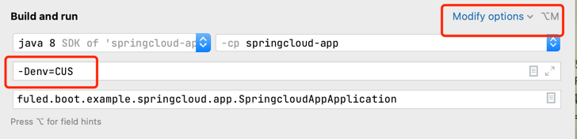
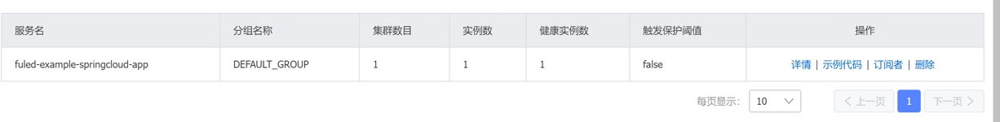
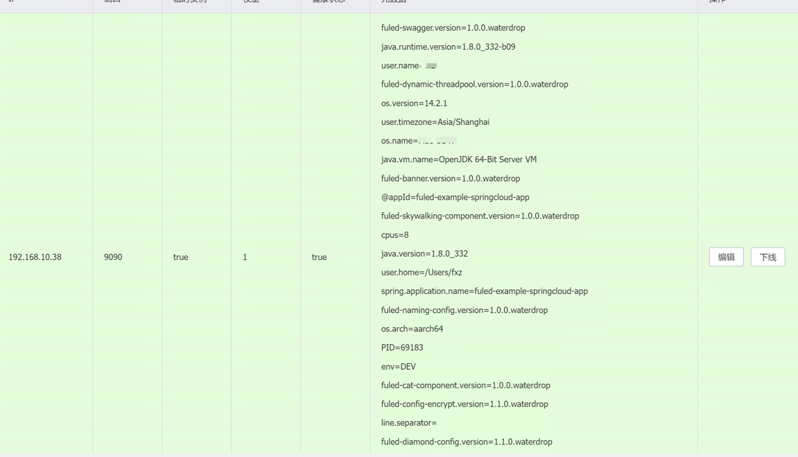

## 基本的springcloud app搭建

### 第一步
- 创建应用修改pom文件，如下
```html
 <parent>
        <groupId>com.fxz</groupId>
        <artifactId>fuled-boot-example</artifactId>
        <version>1.0.0.WaterDrop</version>
    </parent>
    <groupId>fuled.boot.example</groupId>
    <artifactId>springcloud-app</artifactId>
    <version>0.0.1-SNAPSHOT</version>
    <name>springcloud-app</name>
    <description>springcloud-app</description>
    <properties>
        <java.version>21</java.version>
    </properties>
    <dependencies>
        <dependency>
            <groupId>org.springframework.boot</groupId>
            <artifactId>spring-boot-starter</artifactId>
        </dependency>

        <dependency>
            <groupId>org.springframework.boot</groupId>
            <artifactId>spring-boot-starter-test</artifactId>
            <scope>test</scope>
        </dependency>
    </dependencies>

    <build>
        <plugins>
            <plugin>
                <groupId>org.springframework.boot</groupId>
                <artifactId>spring-boot-maven-plugin</artifactId>
            </plugin>
        </plugins>
    </build>

</project>

其实就是自动生成的springboot-starter 修改父pom即可
```

## 第二步
- 增加应用配置信息
增加 META-INF/app.properties
```html
#appId & appName 用于应用表示，与git仓库，配置中心，注册中心 CI/CD进行关联
一般机架会适应模板，应用直接从应用管理进行创建并下载模板，与之关联的
ci/cd 相关发布等也一并创建，只需在模板添加需要的组件和业务逻辑即可
app.name=fuled-example-springcloud-app
app.id=fuled-example-springcloud-app
```

## 第三部 
调试

- 根据要启动的环境配置启动参数，一般公司会固定一些最基本的环境信息，如
DEV，TEST，PRE，PRD等，直接添加vm option 参数如 -Denv=CUS 即可启动
如果需要指定自定义配置中心，注册中心，流控之类的可以配置-Denv=CUS，然后在
配置文件中添加对应的地址，一般这些基本的环境变量发布系统会自动注入

- 配置中心
配置中心的对应关系如下（nacos）
```html
namespace=env
groupId=app.name （自动转换为大写）
dataId=application.properties(默认，多个可自行配置 extends)

```

```log
/Library/Java/JavaVirtualMachines/zulu-8.jdk/Contents/Home/bin/java -agentlib:jdwp=transport=dt_socket,address=127.0.0.1:65206,suspend=y,server=n -Denv=DEV -XX:TieredStopAtLevel=1 -noverify -Dspring.output.ansi.enabled=always -Dcom.sun.management.jmxremote -Dspring.jmx.enabled=true -Dspring.liveBeansView.mbeanDomain -Dspring.application.admin.enabled=true -javaagent:/Users/fxz/Library/Caches/JetBrains/IntelliJIdea2022.2/captureAgent/debugger-agent.jar -Dfile.encoding=UTF-8 -classpath /Library/Java/JavaVirtualMachines/zulu-8.jdk/Contents/Home/jre/lib/charsets.jar:/Library/Java/JavaVirtualMachines/zulu-8.jdk/Contents/Home/jre/lib/ext/cldrdata.jar:/Library/Java/JavaVirtualMachines/zulu-8.jdk/Contents/Home/jre/lib/ext/dnsns.jar:/Library/Java/JavaVirtualMachines/zulu-8.jdk/Contents/Home/jre/lib/ext/jaccess.jar:/Library/Java/JavaVirtualMachines/zulu-8.jdk/Contents/Home/jre/lib/ext/legacy8ujsse.jar:/Library/Java/JavaVirtualMachines/zulu-8.jdk/Contents/Home/jre/lib/ext/localedata.jar:/Library/Java/JavaVirtualMachines/zulu-8.jdk/Contents/Home/jre/lib/ext/nashorn.jar:/Library/Java/JavaVirtualMachines/zulu-8.jdk/Contents/Home/jre/lib/ext/openjsse.jar:/Library/Java/JavaVirtualMachines/zulu-8.jdk/Contents/Home/jre/lib/ext/sunec.jar:/Library/Java/JavaVirtualMachines/zulu-8.jdk/Contents/Home/jre/lib/ext/sunjce_provider.jar:/Library/Java/JavaVirtualMachines/zulu-8.jdk/Contents/Home/jre/lib/ext/sunpkcs11.jar:/Library/Java/JavaVirtualMachines/zulu-8.jdk/Contents/Home/jre/lib/ext/zipfs.jar:/Library/Java/JavaVirtualMachines/zulu-8.jdk/Contents/Home/jre/lib/jce.jar:/Library/Java/JavaVirtualMachines/zulu-8.jdk/Contents/Home/jre/lib/jfr.jar:/Library/Java/JavaVirtualMachines/zulu-8.jdk/Contents/Home/jre/lib/jsse.jar:/Library/Java/JavaVirtualMachines/zulu-8.jdk/Contents/Home/jre/lib/management-agent.jar:/Library/Java/JavaVirtualMachines/zulu-8.jdk/Contents/Home/jre/lib/resources.jar:/Library/Java/JavaVirtualMachines/zulu-8.jdk/Contents/Home/jre/lib/rt.jar:/Users/fxz/workspace/fuled-component/fuled-boot-example/springcloud-app/target/classes:/Users/fxz/.m2/repository/org/springframework/boot/spring-boot-starter/2.3.2.RELEASE/spring-boot-starter-2.3.2.RELEASE.jar:/Users/fxz/.m2/repository/org/springframework/boot/spring-boot/2.3.2.RELEASE/spring-boot-2.3.2.RELEASE.jar:/Users/fxz/.m2/repository/org/springframework/spring-context/5.2.8.RELEASE/spring-context-5.2.8.RELEASE.jar:/Users/fxz/.m2/repository/org/springframework/spring-aop/5.2.8.RELEASE/spring-aop-5.2.8.RELEASE.jar:/Users/fxz/.m2/repository/org/springframework/spring-beans/5.2.8.RELEASE/spring-beans-5.2.8.RELEASE.jar:/Users/fxz/.m2/repository/org/springframework/spring-expression/5.2.8.RELEASE/spring-expression-5.2.8.RELEASE.jar:/Users/fxz/.m2/repository/org/springframework/boot/spring-boot-autoconfigure/2.3.2.RELEASE/spring-boot-autoconfigure-2.3.2.RELEASE.jar:/Users/fxz/.m2/repository/org/springframework/boot/spring-boot-starter-logging/2.3.2.RELEASE/spring-boot-starter-logging-2.3.2.RELEASE.jar:/Users/fxz/.m2/repository/ch/qos/logback/logback-classic/1.2.3/logback-classic-1.2.3.jar:/Users/fxz/.m2/repository/org/apache/logging/log4j/log4j-to-slf4j/2.13.3/log4j-to-slf4j-2.13.3.jar:/Users/fxz/.m2/repository/org/apache/logging/log4j/log4j-api/2.13.3/log4j-api-2.13.3.jar:/Users/fxz/.m2/repository/org/slf4j/jul-to-slf4j/1.7.30/jul-to-slf4j-1.7.30.jar:/Users/fxz/.m2/repository/jakarta/annotation/jakarta.annotation-api/1.3.5/jakarta.annotation-api-1.3.5.jar:/Users/fxz/.m2/repository/org/springframework/spring-core/5.2.8.RELEASE/spring-core-5.2.8.RELEASE.jar:/Users/fxz/.m2/repository/org/springframework/spring-jcl/5.2.8.RELEASE/spring-jcl-5.2.8.RELEASE.jar:/Users/fxz/.m2/repository/org/yaml/snakeyaml/1.26/snakeyaml-1.26.jar:/Users/fxz/.m2/repository/org/slf4j/slf4j-api/1.7.30/slf4j-api-1.7.30.jar:/Users/fxz/.m2/repository/net/bytebuddy/byte-buddy/1.10.13/byte-buddy-1.10.13.jar:/Users/fxz/.m2/repository/com/fxz/fuled-services-starter/1.1.0.WaterDrop/fuled-services-starter-1.1.0.WaterDrop.jar:/Users/fxz/workspace/fuled-component/fuled-common/target/classes:/Users/fxz/.m2/repository/com/google/code/gson/gson/2.8.6/gson-2.8.6.jar:/Users/fxz/.m2/repository/org/projectlombok/lombok/1.18.12/lombok-1.18.12.jar:/Users/fxz/.m2/repository/commons-io/commons-io/2.11.0/commons-io-2.11.0.jar:/Users/fxz/workspace/fuled-component/fuled-banner/target/classes:/Users/fxz/.m2/repository/com/nepxion/banner/1.0.2/banner-1.0.2.jar:/Users/fxz/.m2/repository/com/taobao/text/text-ui/0.0.2/text-ui-0.0.2.jar:/Users/fxz/workspace/fuled-component/fuled-config-starter/target/classes:/Users/fxz/.m2/repository/com/google/guava/guava/29.0-jre/guava-29.0-jre.jar:/Users/fxz/.m2/repository/com/google/guava/failureaccess/1.0.1/failureaccess-1.0.1.jar:/Users/fxz/.m2/repository/com/google/guava/listenablefuture/9999.0-empty-to-avoid-conflict-with-guava/listenablefuture-9999.0-empty-to-avoid-conflict-with-guava.jar:/Users/fxz/.m2/repository/com/google/code/findbugs/jsr305/3.0.2/jsr305-3.0.2.jar:/Users/fxz/.m2/repository/org/checkerframework/checker-qual/2.11.1/checker-qual-2.11.1.jar:/Users/fxz/.m2/repository/com/google/errorprone/error_prone_annotations/2.3.4/error_prone_annotations-2.3.4.jar:/Users/fxz/.m2/repository/com/google/j2objc/j2objc-annotations/1.3/j2objc-annotations-1.3.jar:/Users/fxz/.m2/repository/com/google/inject/guice/5.0.1/guice-5.0.1.jar:/Users/fxz/.m2/repository/javax/inject/javax.inject/1/javax.inject-1.jar:/Users/fxz/.m2/repository/aopalliance/aopalliance/1.0/aopalliance-1.0.jar:/Users/fxz/.m2/repository/com/alibaba/nacos/nacos-client/1.4.2/nacos-client-1.4.2.jar:/Users/fxz/.m2/repository/com/alibaba/nacos/nacos-common/1.4.2/nacos-common-1.4.2.jar:/Users/fxz/.m2/repository/org/apache/httpcomponents/httpasyncclient/4.1.4/httpasyncclient-4.1.4.jar:/Users/fxz/.m2/repository/org/apache/httpcomponents/httpcore/4.4.13/httpcore-4.4.13.jar:/Users/fxz/.m2/repository/org/apache/httpcomponents/httpcore-nio/4.4.13/httpcore-nio-4.4.13.jar:/Users/fxz/.m2/repository/org/apache/httpcomponents/httpclient/4.5.12/httpclient-4.5.12.jar:/Users/fxz/.m2/repository/com/alibaba/nacos/nacos-api/1.4.2/nacos-api-1.4.2.jar:/Users/fxz/.m2/repository/commons-codec/commons-codec/1.14/commons-codec-1.14.jar:/Users/fxz/.m2/repository/com/fasterxml/jackson/core/jackson-core/2.11.1/jackson-core-2.11.1.jar:/Users/fxz/.m2/repository/com/fasterxml/jackson/core/jackson-databind/2.11.1/jackson-databind-2.11.1.jar:/Users/fxz/.m2/repository/com/fasterxml/jackson/core/jackson-annotations/2.11.1/jackson-annotations-2.11.1.jar:/Users/fxz/.m2/repository/io/prometheus/simpleclient/0.5.0/simpleclient-0.5.0.jar:/Users/fxz/.m2/repository/org/springframework/cloud/spring-cloud-context/2.2.6.RELEASE/spring-cloud-context-2.2.6.RELEASE.jar:/Users/fxz/.m2/repository/org/springframework/security/spring-security-crypto/5.3.3.RELEASE/spring-security-crypto-5.3.3.RELEASE.jar:/Users/fxz/workspace/fuled-component/fuled-dynamic-threadpool-starter/target/classes:/Users/fxz/.m2/repository/com/alibaba/fastjson/1.2.75/fastjson-1.2.75.jar:/Users/fxz/workspace/fuled-component/fuled-name-starter/target/classes:/Users/fxz/.m2/repository/com/alibaba/cloud/spring-cloud-starter-alibaba-nacos-discovery/2.2.6.RELEASE/spring-cloud-starter-alibaba-nacos-discovery-2.2.6.RELEASE.jar:/Users/fxz/.m2/repository/com/alibaba/cloud/spring-cloud-alibaba-commons/2.2.6.RELEASE/spring-cloud-alibaba-commons-2.2.6.RELEASE.jar:/Users/fxz/.m2/repository/com/alibaba/spring/spring-context-support/1.0.10/spring-context-support-1.0.10.jar:/Users/fxz/.m2/repository/org/springframework/cloud/spring-cloud-commons/2.2.6.RELEASE/spring-cloud-commons-2.2.6.RELEASE.jar:/Users/fxz/.m2/repository/org/springframework/cloud/spring-cloud-starter-netflix-ribbon/2.2.6.RELEASE/spring-cloud-starter-netflix-ribbon-2.2.6.RELEASE.jar:/Users/fxz/.m2/repository/org/springframework/cloud/spring-cloud-starter/2.2.6.RELEASE/spring-cloud-starter-2.2.6.RELEASE.jar:/Users/fxz/.m2/repository/org/springframework/security/spring-security-rsa/1.0.9.RELEASE/spring-security-rsa-1.0.9.RELEASE.jar:/Users/fxz/.m2/repository/org/bouncycastle/bcpkix-jdk15on/1.64/bcpkix-jdk15on-1.64.jar:/Users/fxz/.m2/repository/org/bouncycastle/bcprov-jdk15on/1.64/bcprov-jdk15on-1.64.jar:/Users/fxz/.m2/repository/org/springframework/cloud/spring-cloud-netflix-ribbon/2.2.6.RELEASE/spring-cloud-netflix-ribbon-2.2.6.RELEASE.jar:/Users/fxz/.m2/repository/org/springframework/cloud/spring-cloud-netflix-archaius/2.2.6.RELEASE/spring-cloud-netflix-archaius-2.2.6.RELEASE.jar:/Users/fxz/.m2/repository/org/springframework/cloud/spring-cloud-starter-netflix-archaius/2.2.6.RELEASE/spring-cloud-starter-netflix-archaius-2.2.6.RELEASE.jar:/Users/fxz/.m2/repository/com/netflix/archaius/archaius-core/0.7.6/archaius-core-0.7.6.jar:/Users/fxz/.m2/repository/commons-configuration/commons-configuration/1.8/commons-configuration-1.8.jar:/Users/fxz/.m2/repository/com/netflix/ribbon/ribbon/2.3.0/ribbon-2.3.0.jar:/Users/fxz/.m2/repository/com/netflix/ribbon/ribbon-transport/2.3.0/ribbon-transport-2.3.0.jar:/Users/fxz/.m2/repository/io/reactivex/rxnetty-contexts/0.4.9/rxnetty-contexts-0.4.9.jar:/Users/fxz/.m2/repository/io/reactivex/rxnetty-servo/0.4.9/rxnetty-servo-0.4.9.jar:/Users/fxz/.m2/repository/com/netflix/hystrix/hystrix-core/1.5.18/hystrix-core-1.5.18.jar:/Users/fxz/.m2/repository/org/hdrhistogram/HdrHistogram/2.1.9/HdrHistogram-2.1.9.jar:/Users/fxz/.m2/repository/io/reactivex/rxnetty/0.4.9/rxnetty-0.4.9.jar:/Users/fxz/.m2/repository/com/netflix/ribbon/ribbon-core/2.3.0/ribbon-core-2.3.0.jar:/Users/fxz/.m2/repository/commons-lang/commons-lang/2.6/commons-lang-2.6.jar:/Users/fxz/.m2/repository/com/netflix/ribbon/ribbon-httpclient/2.3.0/ribbon-httpclient-2.3.0.jar:/Users/fxz/.m2/repository/commons-collections/commons-collections/3.2.2/commons-collections-3.2.2.jar:/Users/fxz/.m2/repository/com/sun/jersey/jersey-client/1.19.1/jersey-client-1.19.1.jar:/Users/fxz/.m2/repository/com/sun/jersey/jersey-core/1.19.1/jersey-core-1.19.1.jar:/Users/fxz/.m2/repository/javax/ws/rs/jsr311-api/1.1.1/jsr311-api-1.1.1.jar:/Users/fxz/.m2/repository/com/sun/jersey/contribs/jersey-apache-client4/1.19.1/jersey-apache-client4-1.19.1.jar:/Users/fxz/.m2/repository/com/netflix/servo/servo-core/0.12.21/servo-core-0.12.21.jar:/Users/fxz/.m2/repository/com/netflix/netflix-commons/netflix-commons-util/0.3.0/netflix-commons-util-0.3.0.jar:/Users/fxz/.m2/repository/com/netflix/ribbon/ribbon-loadbalancer/2.3.0/ribbon-loadbalancer-2.3.0.jar:/Users/fxz/.m2/repository/com/netflix/netflix-commons/netflix-statistics/0.1.1/netflix-statistics-0.1.1.jar:/Users/fxz/.m2/repository/io/reactivex/rxjava/1.3.8/rxjava-1.3.8.jar:/Users/fxz/workspace/fuled-component/fuled-logger-starter/target/classes:/Users/fxz/.m2/repository/org/springframework/boot/spring-boot-starter-aop/2.3.2.RELEASE/spring-boot-starter-aop-2.3.2.RELEASE.jar:/Users/fxz/.m2/repository/org/aspectj/aspectjweaver/1.9.6/aspectjweaver-1.9.6.jar:/Users/fxz/.m2/repository/ch/qos/logback/logback-core/1.2.3/logback-core-1.2.3.jar:/Users/fxz/.m2/repository/net/logstash/logback/logstash-logback-encoder/6.4/logstash-logback-encoder-6.4.jar:/Users/fxz/.m2/repository/org/codehaus/janino/janino/3.1.2/janino-3.1.2.jar:/Users/fxz/.m2/repository/org/codehaus/janino/commons-compiler/3.1.2/commons-compiler-3.1.2.jar:/Users/fxz/workspace/fuled-component/fuled-env-encryptor-starter/target/classes:/Users/fxz/workspace/fuled-component/fuled-cat-starter/target/classes:/Users/fxz/.m2/repository/com/dianping/cat/cat-client/3.0.0/cat-client-3.0.0.jar:/Users/fxz/.m2/repository/io/netty/netty-all/4.1.51.Final/netty-all-4.1.51.Final.jar:/Users/fxz/workspace/fuled-component/fuled-skywalking-starter/target/classes:/Users/fxz/.m2/repository/org/apache/skywalking/apm-toolkit-trace/8.3.0/apm-toolkit-trace-8.3.0.jar:/Users/fxz/workspace/fuled-component/fuled-dynamic-redis-starter/target/classes:/Users/fxz/.m2/repository/org/apache/commons/commons-pool2/2.8.0/commons-pool2-2.8.0.jar:/Users/fxz/workspace/fuled-component/fuled-swagger-starter/target/classes:/Users/fxz/.m2/repository/org/springframework/boot/spring-boot-starter-web/2.3.2.RELEASE/spring-boot-starter-web-2.3.2.RELEASE.jar:/Users/fxz/.m2/repository/org/springframework/boot/spring-boot-starter-json/2.3.2.RELEASE/spring-boot-starter-json-2.3.2.RELEASE.jar:/Users/fxz/.m2/repository/com/fasterxml/jackson/datatype/jackson-datatype-jdk8/2.11.1/jackson-datatype-jdk8-2.11.1.jar:/Users/fxz/.m2/repository/com/fasterxml/jackson/datatype/jackson-datatype-jsr310/2.11.1/jackson-datatype-jsr310-2.11.1.jar:/Users/fxz/.m2/repository/com/fasterxml/jackson/module/jackson-module-parameter-names/2.11.1/jackson-module-parameter-names-2.11.1.jar:/Users/fxz/.m2/repository/org/springframework/boot/spring-boot-starter-tomcat/2.3.2.RELEASE/spring-boot-starter-tomcat-2.3.2.RELEASE.jar:/Users/fxz/.m2/repository/org/apache/tomcat/embed/tomcat-embed-core/9.0.37/tomcat-embed-core-9.0.37.jar:/Users/fxz/.m2/repository/org/glassfish/jakarta.el/3.0.3/jakarta.el-3.0.3.jar:/Users/fxz/.m2/repository/org/apache/tomcat/embed/tomcat-embed-websocket/9.0.37/tomcat-embed-websocket-9.0.37.jar:/Users/fxz/.m2/repository/org/springframework/spring-web/5.2.8.RELEASE/spring-web-5.2.8.RELEASE.jar:/Users/fxz/.m2/repository/org/springframework/spring-webmvc/5.2.8.RELEASE/spring-webmvc-5.2.8.RELEASE.jar:/Users/fxz/.m2/repository/io/springfox/springfox-swagger2/2.9.2/springfox-swagger2-2.9.2.jar:/Users/fxz/.m2/repository/io/swagger/swagger-annotations/1.5.20/swagger-annotations-1.5.20.jar:/Users/fxz/.m2/repository/io/swagger/swagger-models/1.5.20/swagger-models-1.5.20.jar:/Users/fxz/.m2/repository/io/springfox/springfox-spi/2.9.2/springfox-spi-2.9.2.jar:/Users/fxz/.m2/repository/io/springfox/springfox-core/2.9.2/springfox-core-2.9.2.jar:/Users/fxz/.m2/repository/io/springfox/springfox-schema/2.9.2/springfox-schema-2.9.2.jar:/Users/fxz/.m2/repository/io/springfox/springfox-swagger-common/2.9.2/springfox-swagger-common-2.9.2.jar:/Users/fxz/.m2/repository/io/springfox/springfox-spring-web/2.9.2/springfox-spring-web-2.9.2.jar:/Users/fxz/.m2/repository/com/fasterxml/classmate/1.5.1/classmate-1.5.1.jar:/Users/fxz/.m2/repository/org/springframework/plugin/spring-plugin-core/1.2.0.RELEASE/spring-plugin-core-1.2.0.RELEASE.jar:/Users/fxz/.m2/repository/org/springframework/plugin/spring-plugin-metadata/1.2.0.RELEASE/spring-plugin-metadata-1.2.0.RELEASE.jar:/Users/fxz/.m2/repository/org/mapstruct/mapstruct/1.2.0.Final/mapstruct-1.2.0.Final.jar:/Users/fxz/.m2/repository/io/springfox/springfox-swagger-ui/2.9.2/springfox-swagger-ui-2.9.2.jar:/Users/fxz/workspace/fuled-component/fuled-sentinel-starter/target/classes:/Users/fxz/.m2/repository/com/alibaba/cloud/spring-cloud-starter-alibaba-sentinel/2.2.6.RELEASE/spring-cloud-starter-alibaba-sentinel-2.2.6.RELEASE.jar:/Users/fxz/.m2/repository/com/alibaba/csp/sentinel-transport-simple-http/1.8.1/sentinel-transport-simple-http-1.8.1.jar:/Users/fxz/.m2/repository/com/alibaba/csp/sentinel-transport-common/1.8.1/sentinel-transport-common-1.8.1.jar:/Users/fxz/.m2/repository/com/alibaba/csp/sentinel-annotation-aspectj/1.8.1/sentinel-annotation-aspectj-1.8.1.jar:/Users/fxz/.m2/repository/com/alibaba/csp/sentinel-core/1.8.1/sentinel-core-1.8.1.jar:/Users/fxz/.m2/repository/org/aspectj/aspectjrt/1.9.6/aspectjrt-1.9.6.jar:/Users/fxz/.m2/repository/com/alibaba/cloud/spring-cloud-circuitbreaker-sentinel/2.2.6.RELEASE/spring-cloud-circuitbreaker-sentinel-2.2.6.RELEASE.jar:/Users/fxz/.m2/repository/com/alibaba/csp/sentinel-reactor-adapter/1.8.1/sentinel-reactor-adapter-1.8.1.jar:/Users/fxz/.m2/repository/com/alibaba/csp/sentinel-spring-webflux-adapter/1.8.1/sentinel-spring-webflux-adapter-1.8.1.jar:/Users/fxz/.m2/repository/com/alibaba/csp/sentinel-spring-webmvc-adapter/1.8.1/sentinel-spring-webmvc-adapter-1.8.1.jar:/Users/fxz/.m2/repository/com/alibaba/csp/sentinel-parameter-flow-control/1.8.1/sentinel-parameter-flow-control-1.8.1.jar:/Users/fxz/.m2/repository/com/googlecode/concurrentlinkedhashmap/concurrentlinkedhashmap-lru/1.4.2/concurrentlinkedhashmap-lru-1.4.2.jar:/Users/fxz/.m2/repository/com/alibaba/csp/sentinel-cluster-server-default/1.8.1/sentinel-cluster-server-default-1.8.1.jar:/Users/fxz/.m2/repository/com/alibaba/csp/sentinel-cluster-common-default/1.8.1/sentinel-cluster-common-default-1.8.1.jar:/Users/fxz/.m2/repository/io/netty/netty-handler/4.1.51.Final/netty-handler-4.1.51.Final.jar:/Users/fxz/.m2/repository/io/netty/netty-common/4.1.51.Final/netty-common-4.1.51.Final.jar:/Users/fxz/.m2/repository/io/netty/netty-resolver/4.1.51.Final/netty-resolver-4.1.51.Final.jar:/Users/fxz/.m2/repository/io/netty/netty-buffer/4.1.51.Final/netty-buffer-4.1.51.Final.jar:/Users/fxz/.m2/repository/io/netty/netty-transport/4.1.51.Final/netty-transport-4.1.51.Final.jar:/Users/fxz/.m2/repository/io/netty/netty-codec/4.1.51.Final/netty-codec-4.1.51.Final.jar:/Users/fxz/.m2/repository/com/alibaba/csp/sentinel-cluster-client-default/1.8.1/sentinel-cluster-client-default-1.8.1.jar:/Users/fxz/.m2/repository/com/alibaba/cloud/spring-cloud-alibaba-sentinel-datasource/2.2.6.RELEASE/spring-cloud-alibaba-sentinel-datasource-2.2.6.RELEASE.jar:/Users/fxz/.m2/repository/com/alibaba/csp/sentinel-datasource-nacos/1.8.1/sentinel-datasource-nacos-1.8.1.jar:/Users/fxz/.m2/repository/com/alibaba/csp/sentinel-datasource-extension/1.8.1/sentinel-datasource-extension-1.8.1.jar:/Applications/IntelliJ IDEA.app/Contents/lib/idea_rt.jar fuled.boot.example.springcloud.app.SpringcloudAppApplication
Connected to the target VM, address: '127.0.0.1:65206', transport: 'socket'

___________    .__             .___                                             
\_   _____/_ __|  |   ____   __| _/                                             
 |    __)|  |  \  | _/ __ \ / __ |                                              
 |     \ |  |  /  |_\  ___// /_/ |                                              
 \___  / |____/|____/\___  >____ |                                              
                                                                                

Server:  FuledFrameWork                                                         
Version: 1.0.0.WaterDrop                                                        
GitHub:  https://github.com/fuxiuzhan/fuled-framework.git                       

2024-01-20 08:59:13.285  INFO 69183 --- [           main] com.fxz.fuled.common.utils.ConfigUtil    : App ID is set to fuled-example-springcloud-app by app.id property from /META-INF/app.properties

  .   ____          _            __ _ _
 /\\ / ___'_ __ _ _(_)_ __  __ _ \ \ \ \
( ( )\___ | '_ | '_| | '_ \/ _` | \ \ \ \
 \\/  ___)| |_)| | | | | || (_| |  ) ) ) )
  '  |____| .__|_| |_|_| |_\__, | / / / /
 =========|_|==============|___/=/_/_/_/
 :: Spring Boot ::        (v2.3.2.RELEASE)

2024-01-20 08:59:13.408  INFO 69183 --- [           main] c.f.f.c.s.n.p.NacosPropertySourceBuilder : get config from nacos server : dataId->fuled-example-springcloud-app,groupId->FULED-EXAMPLE-SPRINGCLOUD-APP,result->null
2024-01-20 08:59:13.410  WARN 69183 --- [           main] c.f.f.c.s.n.p.NacosPropertySourceBuilder : Ignore the empty nacos configuration and get it based on dataId[fuled-example-springcloud-app] & group[FULED-EXAMPLE-SPRINGCLOUD-APP]
2024-01-20 08:59:13.416  INFO 69183 --- [           main] c.f.f.c.s.n.p.NacosPropertySourceBuilder : get config from nacos server : dataId->fuled-example-springcloud-app.properties,groupId->FULED-EXAMPLE-SPRINGCLOUD-APP,result->null
2024-01-20 08:59:13.416  WARN 69183 --- [           main] c.f.f.c.s.n.p.NacosPropertySourceBuilder : Ignore the empty nacos configuration and get it based on dataId[fuled-example-springcloud-app.properties] & group[FULED-EXAMPLE-SPRINGCLOUD-APP]
2024-01-20 08:59:13.436  INFO 69183 --- [           main] c.f.f.c.s.n.p.NacosPropertySourceBuilder : get config from nacos server : dataId->application,groupId->FULED-EXAMPLE-SPRINGCLOUD-APP,result->null
2024-01-20 08:59:13.436  WARN 69183 --- [           main] c.f.f.c.s.n.p.NacosPropertySourceBuilder : Ignore the empty nacos configuration and get it based on dataId[application] & group[FULED-EXAMPLE-SPRINGCLOUD-APP]
2024-01-20 08:59:13.441  INFO 69183 --- [           main] c.f.f.c.s.n.p.NacosPropertySourceBuilder : get config from nacos server : dataId->application.properties,groupId->FULED-EXAMPLE-SPRINGCLOUD-APP,result->null
2024-01-20 08:59:13.441  WARN 69183 --- [           main] c.f.f.c.s.n.p.NacosPropertySourceBuilder : Ignore the empty nacos configuration and get it based on dataId[application.properties] & group[FULED-EXAMPLE-SPRINGCLOUD-APP]
2024-01-20 08:59:13.441  INFO 69183 --- [           main] b.c.PropertySourceBootstrapConfiguration : Located property source: [BootstrapPropertySource {name='bootstrapProperties-systemProperties'}, BootstrapPropertySource {name='bootstrapProperties-nacos-rewritable-properties'}, BootstrapPropertySource {name='bootstrapProperties-application.properties,FULED-EXAMPLE-SPRINGCLOUD-APP'}, BootstrapPropertySource {name='bootstrapProperties-application,FULED-EXAMPLE-SPRINGCLOUD-APP'}, BootstrapPropertySource {name='bootstrapProperties-fuled-example-springcloud-app.properties,FULED-EXAMPLE-SPRINGCLOUD-APP'}, BootstrapPropertySource {name='bootstrapProperties-fuled-example-springcloud-app,FULED-EXAMPLE-SPRINGCLOUD-APP'}]
2024-01-20 08:59:13.444  INFO 69183 --- [           main] f.b.e.s.app.SpringcloudAppApplication    : No active profile set, falling back to default profiles: default
```


- 注册中心


其中的meta信息可以用于公司级的应用信息统计，组件统计，负载策略，包括灰度，同机房等各种路由策略